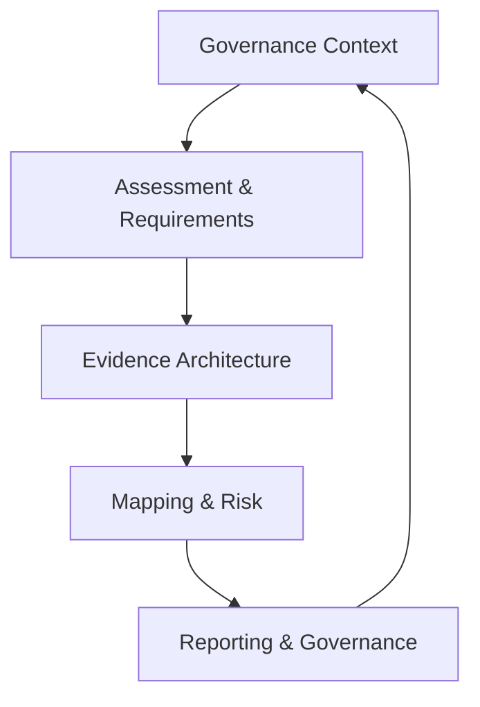
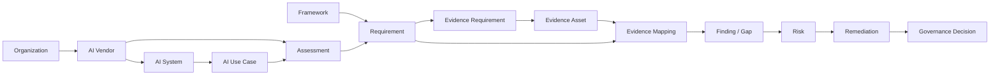
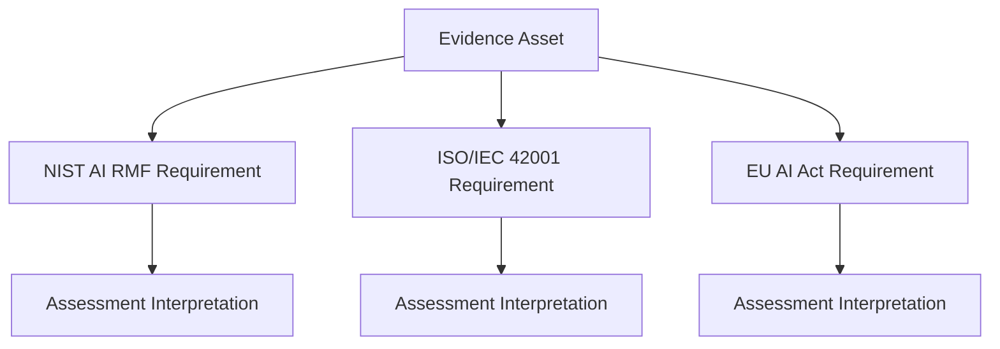
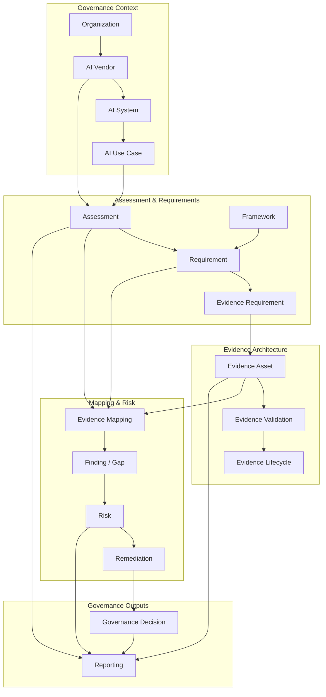
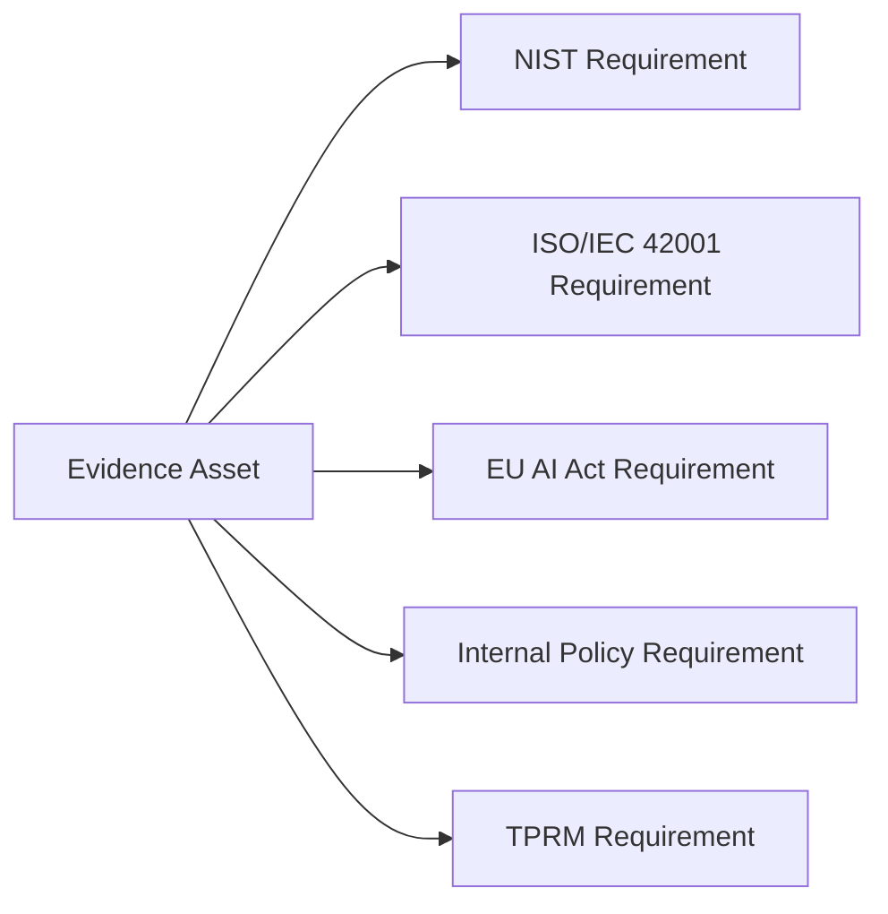
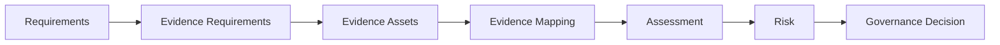

# ECF Components

**Status:** Reference Implementation
**Version:** 1.0
**Document Type:** Reference Architecture
**Last Updated:** August 2026

---

## 1. Purpose

The Evidence Convergence Framework (ECF) is implemented through a set of interconnected governance, evidence, assessment, mapping, risk, and reporting components.

This document defines the principal components of the ECF reference architecture and the relationships between them.

The objective is to establish a common architectural vocabulary before the repository introduces detailed data models, workbooks, mappings, and assessment artifacts.

The architecture is centered on one principle:

> **Evidence is the reusable governance asset that connects requirements, assessments, frameworks, findings, and risk decisions.**

---

# 2. ECF Reference Architecture

The ECF architecture can be represented through five logical layers:



These layers are logically distinct but operationally interconnected.

---

# 3. Architecture Layers

## 3.1 Governance Context Layer

The Governance Context Layer establishes the environment in which the assessment occurs.

It includes:

* Organization
* Business unit
* Business process
* AI governance program
* Vendor relationship
* AI use case
* Regulatory jurisdiction
* Applicable policies
* Risk appetite

This layer answers:

> **Why is the organization assessing this AI vendor and in what context?**

---

## 3.2 Assessment & Requirements Layer

This layer defines what must be evaluated.

It includes:

* AI vendor
* AI system
* Assessment
* Assessment scope
* Governance framework
* Framework requirement
* Internal requirement
* Evidence requirement

The fundamental relationship is:

```text
Framework / Policy
       ↓
Requirement
       ↓
Evidence Requirement
       ↓
Assessment
```

This layer answers:

> **What does the organization need to evaluate?**

---

## 3.3 Evidence Architecture Layer

This is the central layer of ECF.

It manages the governance evidence used to evaluate requirements.

It includes:

* Evidence Asset
* Evidence metadata
* Evidence source
* Evidence owner
* Evidence scope
* Evidence validation
* Evidence lifecycle
* Evidence status
* Evidence limitations

The core relationship is:

```text
Evidence Requirement
        ↓
Evidence Asset
        ↓
Validation
```

This layer answers:

> **What information demonstrates or supports the requirement, and can that information be trusted and reused?**

---

## 3.4 Mapping & Risk Layer

This layer interprets evidence in relation to governance requirements and translates deficiencies into risk-management activity.

It includes:

* Evidence Mapping
* Mapping rationale
* Framework coverage
* Gap
* Finding
* Risk
* Risk treatment
* Remediation

The relationship is:

```text
Evidence
   ↓
Requirement
   ↓
Assessment Interpretation
   ↓
Finding / Gap
   ↓
Risk
   ↓
Treatment
```

This layer answers:

> **What does the evidence tell us about the requirement, and what should the organization do about the resulting condition?**

---

## 3.5 Reporting & Governance Layer

This layer converts assessment and risk information into governance outputs.

It includes:

* Assessment report
* Executive summary
* Evidence coverage
* Framework coverage
* Risk summary
* Remediation status
* Governance decisions
* Management metrics

This layer answers:

> **What does management need to know, decide, or act upon?**

---

# 4. Core ECF Components

The reference architecture consists of the following core components.

| Component            | Purpose                                                 |
| -------------------- | ------------------------------------------------------- |
| Organization         | Establishes the governance context                      |
| Business Process     | Defines the business activity affected by the AI system |
| Vendor               | Identifies the third party being assessed               |
| AI System            | Identifies the AI capability being governed             |
| AI Use Case          | Defines the business purpose of the AI system           |
| Assessment           | Represents a defined governance evaluation              |
| Framework            | Defines the external governance structure               |
| Requirement          | Defines what must be evaluated                          |
| Evidence Requirement | Defines what evidence is needed                         |
| Evidence Asset       | Represents governed reusable evidence                   |
| Evidence Mapping     | Connects evidence to requirements                       |
| Finding / Gap        | Records an identified deficiency or condition           |
| Risk                 | Represents potential impact to objectives               |
| Remediation          | Represents action taken to address a deficiency or risk |
| Governance Decision  | Records the organizational decision                     |
| Report               | Communicates assessment and risk results                |

---

# 5. Component Relationships

The principal relationships are:



This relationship model deliberately separates the evidence object from the assessment interpretation.

---

# 6. The Evidence Asset as the Central Architectural Object

The Evidence Asset is the central reusable object in ECF.



This structure allows a common evidence asset to support multiple assessments without collapsing the requirements into one.

The evidence remains constant.

The interpretation may differ.

---

# 7. Evidence Architecture Boundary

ECF distinguishes between:

```text
Evidence
      │
      │
      ├── What exists
      │
      └── What can be demonstrated
```

and:

```text
Assessment
      │
      │
      ├── What the evidence means
      │
      └── Whether it sufficiently addresses a requirement
```

This separation is important for auditability.

An Evidence Asset should not be modified simply because an assessment produces a different conclusion.

---

# 8. Framework Components

The reference implementation uses three external governance instruments.

### NIST AI RMF

Used as a risk-management reference structure.

### ISO/IEC 42001

Used as a management-system reference structure.

### EU AI Act

Used as a regulatory reference structure.

These components remain independent.

ECF provides the evidence-management layer across them.

```text
              ECF Evidence Layer
                     │
        ┌────────────┼────────────┐
        ↓            ↓            ↓
      NIST          ISO          EU AI Act
      AI RMF       42001
```

The architecture does not imply that an evidence asset satisfies all three frameworks simply because it is mapped to each.

---

# 9. Assessment Component

An Assessment represents a defined evaluation performed against a defined scope.

A typical Assessment contains:

* Assessment ID
* Vendor
* AI system
* Use case
* Scope
* Assessment period
* Applicable requirements
* Evidence references
* Assessment results
* Findings
* Risk information
* Approval information

The Assessment is therefore a container for evaluation activity rather than a container for duplicated evidence.

---

# 10. Evidence Requirement Component

The Evidence Requirement acts as the intermediary between governance expectations and evidence collection.

```text
Requirement
     ↓
"What must be demonstrated?"
     ↓
Evidence Requirement
     ↓
"What evidence would demonstrate it?"
     ↓
Evidence Asset
```

This intermediary is important because different requirements may require different evidence while still sharing common evidence needs.

It also allows evidence collection to be designed independently of a particular questionnaire.

---

# 11. Evidence Mapping Component

Evidence Mapping establishes a controlled relationship between:

* Evidence Asset
* Requirement
* Framework
* Assessment

A mapping record should capture at minimum:

* Mapping ID
* Evidence ID
* Framework
* Requirement ID
* Assessment ID
* Mapping status
* Rationale
* Limitations
* Reviewer
* Review date

The mapping is an interpretation of the relationship.

It does not modify the Evidence Asset.

---

# 12. Finding and Gap Components

A Gap represents an identified deficiency relative to a requirement.

A Finding represents a documented observation or condition resulting from assessment activity.

They may be related but should remain distinguishable.

```text
Evidence
   ↓
Assessment
   ↓
Observation
   ↓
Finding
   ↓
Gap
   ↓
Risk
```

Not every finding is necessarily a gap.

Not every gap is necessarily a material risk.

---

# 13. Risk Component

Risk represents the potential effect of a condition on organizational objectives.

ECF should integrate with the organization's existing enterprise risk methodology rather than create a competing risk methodology.

The architecture therefore treats Risk as an integration point.

```text
ECF Assessment
      ↓
Finding / Gap
      ↓
Enterprise Risk Process
      ↓
Risk Decision
```

This allows ECF to operate within existing GRC and ERM environments.

---

# 14. Remediation Component

Remediation represents an action intended to address a finding, gap, or risk treatment requirement.

A remediation record may contain:

* Action ID
* Finding / Risk reference
* Action description
* Owner
* Target date
* Status
* Priority
* Verification method
* Closure evidence

Closure should itself be evidence-based where appropriate.

---

# 15. Governance Decision Component

A Governance Decision represents an authorized organizational decision based on assessment and risk information.

Examples include:

* Approve vendor
* Approve with conditions
* Require remediation
* Accept residual risk
* Restrict use
* Escalate
* Reject onboarding
* Reassess later

The decision should be traceable to:

```text
Requirement
   ↓
Evidence
   ↓
Assessment
   ↓
Finding / Risk
   ↓
Decision
```

---

# 16. Reporting Component

Reporting provides different views of the same underlying governance information.

Examples include:

### Executive View

* Overall vendor risk
* Material findings
* Residual risk
* Governance decision

### GRC View

* Requirement coverage
* Evidence status
* Mapping status
* Remediation

### Evidence View

* Evidence inventory
* Validation status
* Expiration
* Reuse eligibility

### Audit View

* Requirement-to-evidence traceability
* Evidence provenance
* Assessment interpretation
* Decision history

The architecture should avoid creating separate underlying datasets for each reporting audience.

---

# 17. Component Interaction Model

The complete ECF component interaction can be represented as:



---

# 18. Architectural Principle: Separate Data From Interpretation

The architecture maintains a deliberate separation between:

### Data

What the evidence actually contains.

### Interpretation

What the assessor determines the evidence demonstrates.

### Decision

What the organization decides to do based on the assessment.

The relationship is:

```text
Evidence
   ↓
Interpretation
   ↓
Risk
   ↓
Decision
```

This separation reduces the risk of altering evidence records to fit desired assessment outcomes.

---

# 19. Architectural Principle: One Evidence Asset, Multiple Uses

An Evidence Asset may support multiple requirements.



The number of mappings is not the objective.

Each mapping must be independently defensible.

---

# 20. Architectural Principle: Convergence Has Boundaries

Not every requirement should converge on common evidence.

The architecture must support:

```text
Common Evidence
       +
Framework-Specific Evidence
       +
Framework-Specific Assessment
```

Therefore:

> **ECF seeks appropriate convergence, not universal convergence.**

A high-quality implementation will explicitly demonstrate where evidence can be reused and where additional evidence remains necessary.

---

# 21. Architectural Principle: Traceability

Every material assessment conclusion should be traceable through the architecture.

A representative traceability chain is:

```text
Governance Requirement
        ↓
Evidence Requirement
        ↓
Evidence Asset
        ↓
Evidence Validation
        ↓
Evidence Mapping
        ↓
Assessment Interpretation
        ↓
Finding / Gap
        ↓
Risk
        ↓
Governance Decision
```

This chain should be demonstrable using the repository's reference artifacts.

---

# 22. Architectural Principle: Lifecycle Awareness

Every major component should have an appropriate lifecycle.

Examples:

### Evidence

```text
Requested
→ Received
→ Validated
→ Mapped
→ Reused
→ Reviewed
→ Updated
→ Archived
```

### Assessment

```text
Planned
→ In Progress
→ Under Review
→ Completed
→ Reassessment Required
```

### Finding

```text
Open
→ Remediation Planned
→ In Progress
→ Pending Validation
→ Closed
```

### Risk

```text
Identified
→ Assessed
→ Treated
→ Accepted / Mitigated
→ Monitored
→ Closed / Reassessed
```

---

# 23. Architectural Principle: Tool Independence

ECF is logically independent of a specific technology platform.

The architecture may be implemented using:

* Excel
* SharePoint
* ServiceNow
* RSA Archer
* GRC platforms
* Databases
* Document management systems
* Custom applications
* Integrated enterprise architectures

The logical data model should remain stable even when the technology implementation changes.

---

# 24. Architectural Principle: Enterprise Integration

ECF should integrate with existing governance capabilities where practical.

Potential integration points include:

```text
                    ECF
                     │
      ┌──────────────┼──────────────┐
      ↓              ↓              ↓
     TPRM           GRC            ERM
      │              │              │
      ↓              ↓              ↓
   Procurement   Compliance      Risk
```

Additional integrations may include:

* IAM
* Security
* Privacy
* Procurement
* Legal
* Internal Audit
* Vendor management
* AI inventory
* CMDB

ECF should complement these functions rather than duplicate them.

---

# 25. Architectural Summary

The ECF reference architecture can be reduced to six core relationships:

```text
1. Requirements define what must be evaluated.

2. Evidence Requirements define what must be demonstrated.

3. Evidence Assets provide the reusable basis for evaluation.

4. Evidence Mapping connects evidence to requirements.

5. Assessment interprets the evidence against those requirements.

6. Risk and governance processes determine what happens next.
```

The central architecture is therefore:



The architecture is intentionally evidence-centric.

The purpose is not to eliminate framework-specific governance activity.

The purpose is to eliminate unnecessary duplication while preserving the integrity, traceability, and distinct requirements of each governance framework.

