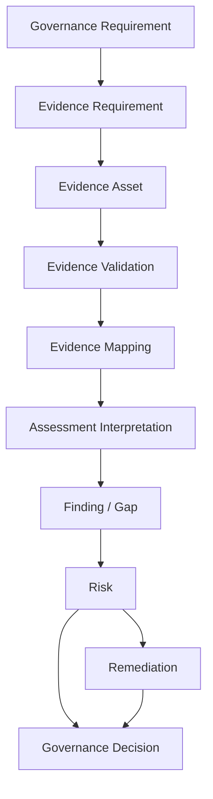
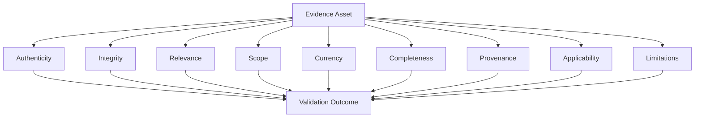
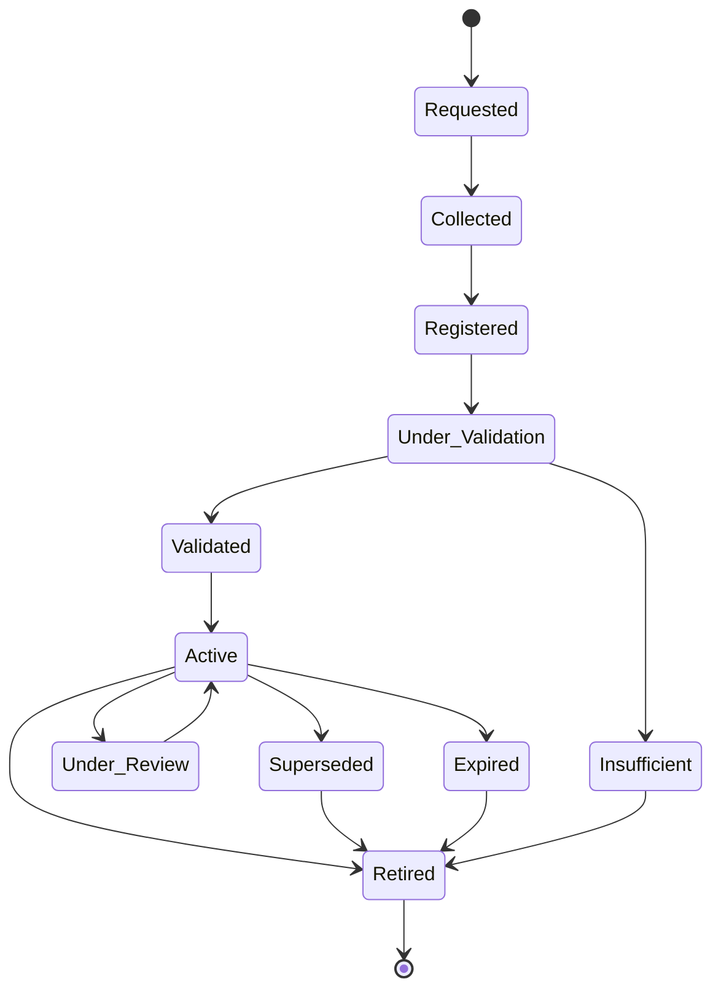
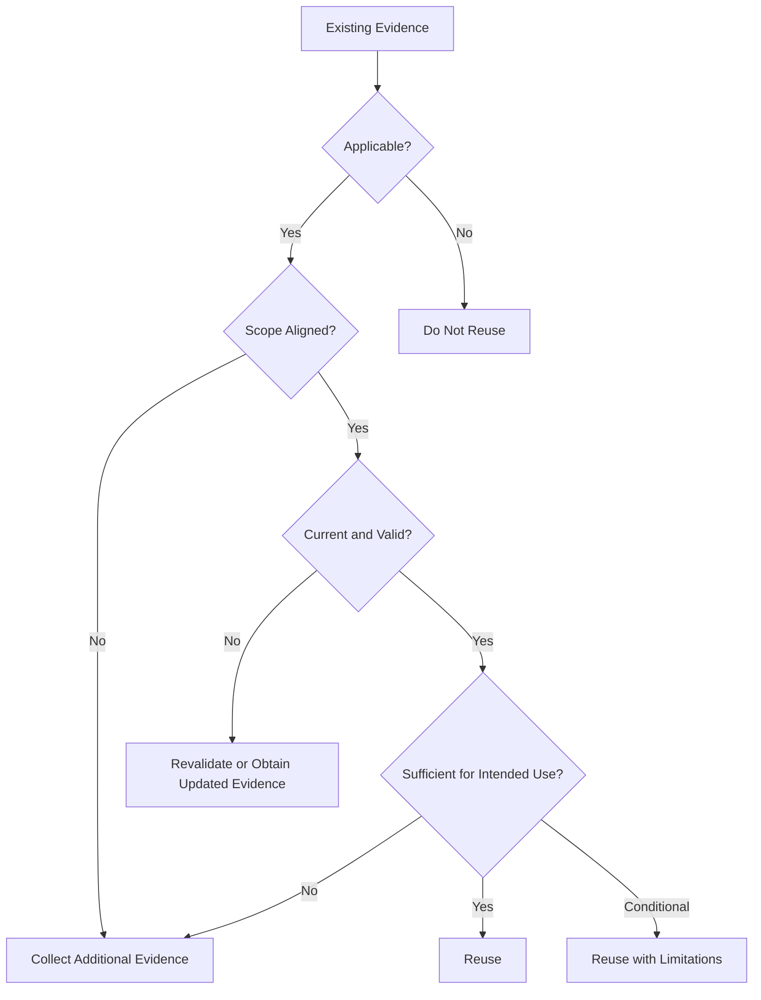
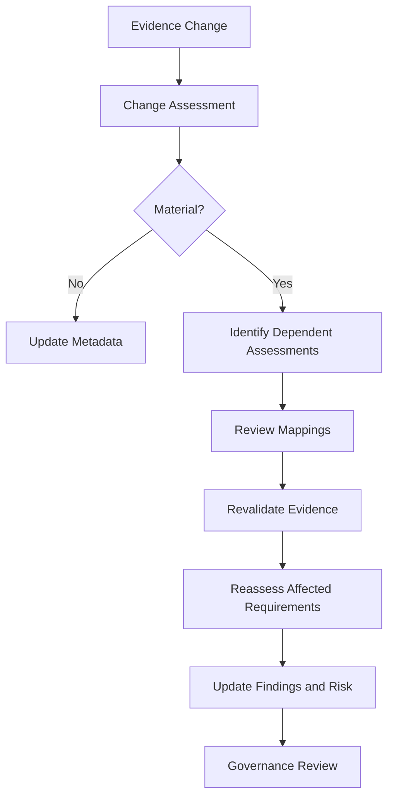
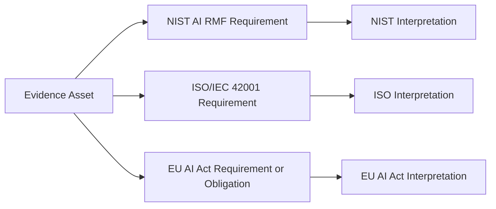
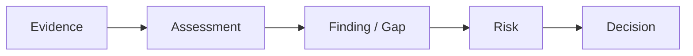
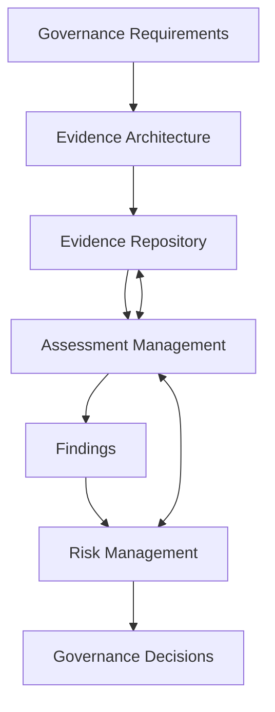
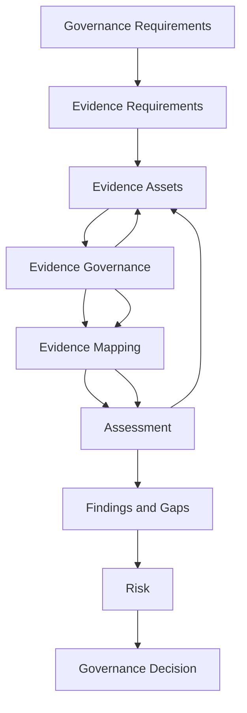

# Evidence Architecture

## Purpose

The Evidence Architecture defines how governance evidence is structured, identified, validated, mapped, reused, monitored, and governed within the Evidence Convergence Framework (ECF).

ECF is an operating model for AI vendor governance. It is not a competing governance framework and does not replace established frameworks, standards, regulations, or organizational governance processes.

The purpose of the Evidence Architecture is to establish a common evidence model that allows an organization to:

* Identify what evidence is required.
* Collect evidence systematically.
* Govern evidence as an enterprise asset.
* Validate evidence before relying upon it.
* Map evidence to applicable governance requirements.
* Reuse evidence where appropriate.
* Preserve framework-specific requirements and interpretation.
* Identify evidence gaps explicitly.
* Maintain traceability from requirements to governance decisions.
* Monitor evidence validity and change.
* Reduce unnecessary duplication without weakening assurance.

The architecture is based on the following principle:

> **Governance evidence should be designed once, governed as an enterprise asset, mapped across applicable requirements and frameworks, reused wherever appropriate, and supplemented where framework-specific evidence or interpretation is still required.**

---

# 1. ECF Evidence Architecture Model

The core ECF evidence architecture is:



This model deliberately separates the evidence lifecycle from the assessment and decision lifecycle.

An evidence asset is an input into governance assessment. It is not itself a compliance conclusion, risk rating, or governance decision.

---

# 2. Core Architecture Concepts

The ECF evidence model contains the following core concepts:

1. Governance Requirement
2. Evidence Requirement
3. Evidence Asset
4. Evidence Metadata
5. Evidence Identity
6. Evidence Scope
7. Evidence Provenance
8. Evidence Currency
9. Evidence Validation
10. Evidence Lifecycle
11. Evidence Mapping
12. Mapping Strength
13. Mapping Rationale
14. Evidence Reuse
15. Evidence Reuse Eligibility
16. Evidence Convergence
17. Framework-Specific Gaps
18. Evidence Lineage
19. Evidence Change Management
20. Evidence Ownership
21. Evidence Confidentiality
22. Evidence Retention
23. Evidence Quality
24. Assessment Relationships
25. Cross-Framework Relationships
26. GRC Integration
27. Architectural Controls
28. Traceability
29. Separation of Evidence, Interpretation, and Decision

These concepts collectively establish the evidence architecture used by ECF.

---

# 3. Governance Requirement

A **Governance Requirement** is the obligation, expectation, control objective, assessment criterion, or governance condition that must be evaluated.

A governance requirement may originate from:

* Internal policies
* Organizational standards
* Risk management requirements
* Contracts
* Customer requirements
* Regulatory obligations
* Industry standards
* Frameworks
* AI governance requirements
* Third-party risk requirements
* Internal audit criteria
* Management-defined requirements

Examples of governance contexts that may contribute requirements include:

* NIST AI RMF
* ISO/IEC 42001
* EU AI Act
* Organizational AI governance policies
* Third-party risk management standards

ECF does not assume that requirements from these sources are equivalent.

Each requirement retains its source and context.

---

# 4. Evidence Requirement

An **Evidence Requirement** defines the evidence needed to evaluate a governance requirement.

It answers:

> **What evidence would allow an assessor to evaluate this requirement?**

An Evidence Requirement should define characteristics such as:

| Attribute                 | Description                                           |
| ------------------------- | ----------------------------------------------------- |
| Evidence Requirement ID   | Unique identifier                                     |
| Governance Requirement ID | Parent requirement                                    |
| Evidence Type             | Expected category of evidence                         |
| Evidence Description      | What the evidence should demonstrate                  |
| Required Scope            | Organization, product, service, system, process, etc. |
| Currency Requirement      | How current the evidence should be                    |
| Validation Expectations   | Required validation characteristics                   |
| Confidentiality           | Expected handling classification                      |
| Owner                     | Responsible evidence or requirement owner             |
| Framework Context         | Applicable framework or governance context            |

The Evidence Requirement should not unnecessarily prescribe a single document when multiple evidence types could reasonably demonstrate the requirement.

---

# 5. Evidence Asset

An **Evidence Asset** is a specific, identifiable piece of evidence that has been collected and governed within the ECF evidence model.

Examples include:

* Approved policies
* Procedures
* Audit reports
* Certifications
* Attestations
* Risk assessments
* Control testing results
* Technical documentation
* System configurations
* Security reports
* Training records
* Contractual provisions
* Operational records
* Management statements
* Independent assurance reports

An Evidence Asset should have a persistent identity independent of an individual assessment where practical.

This allows the same asset to participate in multiple applicable assessments.

---

# 6. Evidence Identity

Every governed Evidence Asset should have a unique identity.

A conceptual Evidence ID may follow a structure such as:

```text
EVD-000001
EVD-000002
EVD-000003
```

The exact identifier format is an implementation decision.

The important architectural requirement is that an evidence asset can be uniquely distinguished from:

* Other evidence
* Previous versions
* Superseded evidence
* Assessment records
* Mapping records
* Findings
* Risk records

Evidence identity should persist throughout the evidence lifecycle.

---

# 7. Evidence Metadata

Evidence metadata provides the contextual information required to govern and interpret an evidence asset.

Typical metadata includes:

| Metadata             | Purpose                                      |
| -------------------- | -------------------------------------------- |
| Evidence ID          | Persistent identity                          |
| Evidence Title       | Human-readable description                   |
| Evidence Type        | Classification                               |
| Source               | Origin of evidence                           |
| Evidence Owner       | Accountability                               |
| Collection Date      | Establishes acquisition timing               |
| Effective Date       | Establishes applicability                    |
| Review Date          | Indicates next review                        |
| Expiration Date      | Indicates validity boundary where applicable |
| Version              | Distinguishes revisions                      |
| Scope                | Defines coverage                             |
| Applicability        | Defines intended environment                 |
| Provenance           | Establishes origin                           |
| Confidentiality      | Controls access                              |
| Validation Status    | Indicates suitability                        |
| Evidence Status      | Lifecycle state                              |
| Related Requirements | Establishes relationships                    |
| Related Assessments  | Establishes usage                            |
| Limitations          | Documents constraints                        |

Metadata is part of the evidence governance model.

A document without sufficient metadata may be difficult to validate, reuse, or interpret correctly.

---

# 8. Evidence Scope

Evidence scope defines what the evidence actually covers.

Scope may include:

* Enterprise
* Business unit
* Product
* AI system
* Application
* Vendor service
* Infrastructure
* Process
* Geographic region
* Legal entity
* Data environment
* Specific control population
* Specific assessment period

Scope is critical to evidence reuse.

For example, an enterprise-wide information security policy may provide useful evidence for a vendor assessment, but it does not automatically establish that a specific AI service implements every requirement addressed by the policy.

Therefore:

> **Evidence scope must be aligned with assessment scope before evidence is reused.**

---

# 9. Evidence Provenance

Evidence provenance establishes where evidence came from and how it entered the evidence environment.

Provenance may include:

* Source organization
* Source system
* Evidence owner
* Submission method
* Collection date
* Collector
* Certification or attestation source
* Independent assurance provider
* Chain of custody where relevant
* Version history
* Related evidence

Provenance supports:

* Authenticity
* Accountability
* Auditability
* Evidence quality
* Change management
* Investigation

Evidence without sufficient provenance may have reduced reuse eligibility.

---

# 10. Evidence Currency

Evidence currency represents whether evidence remains sufficiently current for its intended use.

Currency may depend on:

* Evidence age
* Defined review period
* Certification validity
* Policy version
* Control changes
* System changes
* Vendor changes
* Regulatory changes
* Assessment requirements
* Risk level

Currency should not be interpreted as a universal fixed number of days.

Different evidence types may require different review frequencies.

For example:

* A policy may have an annual review cycle.
* A penetration test may have a defined assessment period.
* A certification may have an explicit validity period.
* A system configuration may require event-driven validation.

---

# 11. Evidence Validation

Evidence validation determines whether an evidence asset is suitable for its intended governance use.

Validation may evaluate:

1. Authenticity
2. Integrity
3. Relevance
4. Scope
5. Currency
6. Completeness
7. Provenance
8. Applicability
9. Limitations

A conceptual validation model is:



Validation outcomes may include:

* Validated
* Validated with limitations
* Pending validation
* Insufficient
* Rejected
* Expired
* Superseded

Validation does **not** determine compliance.

---

# 12. Evidence Lifecycle

Evidence should be managed throughout its lifecycle rather than only at the time of collection.

A conceptual lifecycle is:



The lifecycle should support controlled transitions rather than informal document handling.

---

# 13. Evidence Status

Evidence status provides a current lifecycle state.

A conceptual status model includes:

| Status                     | Meaning                                               |
| -------------------------- | ----------------------------------------------------- |
| Requested                  | Evidence has been requested but not received          |
| Collected                  | Evidence has been received                            |
| Registered                 | Evidence has been entered into the evidence inventory |
| Under Validation           | Evidence is undergoing validation                     |
| Validated                  | Evidence is suitable for intended use                 |
| Validated with Limitations | Evidence is usable subject to documented constraints  |
| Insufficient               | Evidence does not adequately support intended use     |
| Expired                    | Evidence is no longer considered current              |
| Superseded                 | A newer evidence version has replaced it              |
| Retired                    | Evidence is no longer actively used                   |

The exact implementation status values may be adapted to organizational workflows.

---

# 14. Evidence Mapping

Evidence Mapping establishes a relationship between an Evidence Asset and a Governance Requirement.

A mapping should explain:

> **Why is this evidence relevant to this requirement?**

A mapping should not simply state that two records are related.

A conceptual mapping structure includes:

| Attribute         | Purpose                                      |
| ----------------- | -------------------------------------------- |
| Mapping ID        | Unique mapping identity                      |
| Evidence ID       | Evidence being mapped                        |
| Requirement ID    | Requirement being supported                  |
| Mapping Strength  | Degree of evidentiary support                |
| Mapping Rationale | Explanation of relationship                  |
| Scope Alignment   | Comparison of evidence and requirement scope |
| Limitations       | Known deficiencies                           |
| Framework Context | Assessment context                           |
| Mapping Owner     | Accountability                               |
| Review Date       | Mapping currency                             |
| Mapping Status    | Active or inactive                           |

---

# 15. Mapping Strength

ECF uses mapping strength to communicate the nature of the evidence relationship.

A conceptual model is:

### Strong

The evidence directly supports evaluation of the requirement within the relevant scope.

### Moderate

The evidence provides meaningful support but requires additional interpretation or corroboration.

### Weak

The evidence is relevant but insufficient to support the requirement independently.

### Not Applicable

The evidence does not meaningfully support the requirement.

Mapping strength is **not**:

* A compliance score
* A risk score
* A maturity score
* A probability
* A statement of regulatory compliance

It describes the evidentiary relationship.

---

# 16. Mapping Rationale

Every meaningful cross-requirement mapping should have a rationale.

A mapping rationale should explain:

1. What aspect of the evidence is relevant.
2. Which part of the requirement it supports.
3. Whether the evidence covers the required scope.
4. Whether additional interpretation is required.
5. Whether limitations exist.
6. Whether supplemental evidence is required.

For example:

> The vendor's approved incident response policy provides governance-level evidence supporting the requirement for documented incident management processes. The policy does not independently demonstrate operational effectiveness; testing or operational evidence may therefore be required.

This is preferable to simply recording:

```text
Evidence EVD-001 → Requirement R-004
```

without explanation.

---

# 17. Evidence Reuse

Evidence reuse is the controlled use of an existing Evidence Asset in a subsequent assessment.

Reuse provides one of the primary efficiency benefits of ECF.

Without reuse:

```text
Assessment A → Request Evidence
Assessment B → Request Same Evidence
Assessment C → Request Same Evidence
```

With governed reuse:

```text
                 Evidence Asset
                      │
          ┌───────────┼───────────┐
          ↓           ↓           ↓
     Assessment A Assessment B Assessment C
```

The evidence asset remains singular while its assessment relationships remain distinct.

---

# 18. Evidence Reuse Eligibility

Evidence should not automatically become reusable simply because it exists in the Evidence Register.

Reuse eligibility should consider:

* Evidence identity
* Evidence scope
* Requirement scope
* Applicability
* Currency
* Provenance
* Validation status
* Evidence quality
* Version
* Known limitations
* Framework context
* Assessment objective
* Material changes
* Regulatory or geographic context
* Required corroboration

A conceptual reuse decision is:



This makes reuse a governed decision rather than an assumption.

---

# 19. Evidence Convergence

**Evidence Convergence** is the ability of one governed evidence asset to support evaluation across multiple applicable governance requirements.

The architecture can be represented as:

```text
                       Evidence Asset
                            │
              ┌─────────────┼─────────────┐
              ↓             ↓             ↓
        Requirement A  Requirement B  Requirement C
              │             │             │
              ↓             ↓             ↓
        Assessment A   Assessment B   Assessment C
```

Evidence convergence can reduce:

* Duplicate evidence requests
* Vendor response burden
* Assessment cycle time
* Repeated evidence validation
* Administrative overhead

However, convergence must not eliminate the distinct requirements or assessment contexts.

---

# 20. Evidence Convergence vs. Requirement Convergence

These concepts must remain separate.

### Evidence Convergence

The same evidence asset can support multiple requirements where appropriate.

### Requirement Convergence

Different requirements are treated as equivalent or interchangeable.

ECF supports **Evidence Convergence**.

ECF does not assume **Requirement Convergence**.

Therefore:

```text
One Evidence Asset
        │
        ├── Requirement A
        │      └── Interpretation A
        │
        ├── Requirement B
        │      └── Interpretation B
        │
        └── Requirement C
               └── Interpretation C
```

The evidence can converge while the requirements and interpretations remain distinct.

---

# 21. Framework-Specific Gaps

Framework-specific gaps must remain visible even when evidence is reused.

For example, an evidence asset may provide useful support for:

* A governance requirement under NIST AI RMF
* A related requirement under ISO/IEC 42001
* A related obligation or assessment criterion associated with the EU AI Act

However, the evidence may not independently address every aspect required in each context.

The ECF architecture therefore records:

```text
Evidence Reuse
      ↓
Framework-Specific Evaluation
      ↓
Additional Evidence / Interpretation
      ↓
Framework-Specific Gap where necessary
```

A framework-specific gap is not evidence architecture failure.

It is an expected outcome when requirements legitimately differ.

---

# 22. Evidence Lineage

Evidence lineage records the relationships between evidence and the governance activities that depend upon it.

A lineage chain may be:

```text
Governance Requirement
        ↓
Evidence Requirement
        ↓
Evidence Asset
        ↓
Validation
        ↓
Mapping
        ↓
Assessment
        ↓
Finding / Gap
        ↓
Risk
        ↓
Decision
```

Lineage should support both forward and backward traceability.

### Forward

Requirement → Evidence → Assessment → Risk → Decision

### Backward

Decision → Risk → Finding → Assessment → Evidence → Requirement

Lineage is important for:

* Internal audit
* External audit
* Regulatory examination
* Risk reviews
* Management reporting
* Vendor reassessment
* Evidence change impact analysis

---

# 23. Evidence Change Management

Evidence is not static.

Changes may occur because:

* Policies are revised.
* Procedures change.
* Systems are redesigned.
* AI models change.
* Vendors change operating environments.
* New subprocessors are introduced.
* Organizations merge or restructure.
* Certifications change.
* Control environments change.
* Regulatory requirements change.

Material changes should trigger evaluation of downstream dependencies.

A conceptual model is:



This establishes an important property of ECF:

> **Evidence reuse creates efficiency, but evidence dependencies create change-management obligations.**

---

# 24. Evidence Ownership

Evidence ownership establishes accountability for maintaining an evidence asset.

Ownership may be assigned to:

* Vendor security teams
* AI product owners
* Control owners
* Compliance teams
* Information security teams
* Legal teams
* Risk teams
* Procurement teams
* TPRM teams

The evidence owner is not necessarily the person who stores the evidence.

A distinction may exist between:

* **Evidence Owner** — accountable for the evidence and its validity.
* **Evidence Custodian** — responsible for storage and administrative management.
* **Assessor** — responsible for interpretation.
* **Risk Owner** — responsible for risk decisions.

This separation supports accountability without conflating operational roles.

---

# 25. Evidence Confidentiality

Evidence may contain sensitive information.

Examples include:

* Security architecture
* Vulnerability information
* Customer information
* Contract terms
* Internal control details
* Security test results
* Proprietary AI documentation
* Personal information

Evidence governance should therefore include appropriate confidentiality classification and access controls.

Possible classifications include:

* Public
* Internal
* Confidential
* Restricted

The exact classification scheme should align with the organization's existing information classification standard.

Evidence reuse must not override confidentiality or contractual restrictions.

---

# 26. Evidence Retention

Evidence retention should align with:

* Organizational retention policies
* Legal requirements
* Regulatory obligations
* Contractual requirements
* Audit requirements
* Litigation hold requirements
* Risk management needs

Retirement from active use does not necessarily mean immediate deletion.

Historical evidence may need to remain available to reconstruct past:

* Assessments
* Findings
* Risks
* Decisions
* Audit trails

Retention and deletion should therefore be governed independently from active evidence status.

---

# 27. Evidence Quality

Evidence quality represents the degree to which an evidence asset is suitable for its intended governance purpose.

Quality may depend on:

* Authenticity
* Reliability
* Completeness
* Accuracy
* Relevance
* Currency
* Scope
* Provenance
* Independence
* Consistency

Evidence quality is contextual.

An evidence asset that is appropriate for one assessment may be insufficient for another.

Therefore:

> **Evidence quality should be evaluated in relation to the requirement and intended use rather than treated as a universal property.**

---

# 28. Assessment Relationships

Evidence assets may have relationships with multiple assessments.

A conceptual model is:

```text
Evidence Asset
      │
      ├──────── Assessment A
      │             └── Requirement A
      │
      ├──────── Assessment B
      │             └── Requirement B
      │
      └──────── Assessment C
                    └── Requirement C
```

Each relationship should preserve:

* Assessment context
* Requirement
* Mapping rationale
* Evidence scope
* Assessment interpretation
* Limitations
* Finding or conclusion

This allows evidence to be reused without collapsing separate assessment records.

---

# 29. Cross-Framework Relationships

ECF is designed to support evidence relationships across governance frameworks.

A conceptual example is:



The same evidence may be relevant across these contexts.

However, each framework relationship requires independent interpretation.

The architecture therefore avoids creating a universal crosswalk in which evidence automatically becomes compliance with every mapped framework requirement.

---

# 30. Evidence and Risk Relationships

Evidence does not directly become risk.

The relationship is mediated by assessment interpretation.

```text
Evidence
   ↓
Assessment Interpretation
   ↓
Finding / Gap
   ↓
Risk Analysis
   ↓
Risk
```

This separation is important because:

* Evidence may be valid but reveal a control weakness.
* Evidence may be insufficient without proving that a control is absent.
* Evidence may indicate a gap that has low business impact.
* Evidence may identify a gap that creates significant regulatory or operational exposure.

Risk therefore requires contextual analysis.

---

# 31. Evidence and Governance Decisions

Governance decisions should remain traceable to the evidence and risk information supporting them.

A conceptual relationship is:



Possible decisions may include:

* Approve
* Approve with conditions
* Require remediation
* Accept risk
* Restrict use
* Defer decision
* Escalate
* Reject

ECF does not prescribe the organization's risk appetite or decision authority.

It provides the evidence architecture necessary to support traceable decisions.

---

# 32. GRC Integration

ECF should integrate with existing governance, risk, and compliance capabilities where available.

Potential systems include:

* GRC platforms
* TPRM platforms
* Vendor management systems
* Document repositories
* Audit management platforms
* Risk registers
* AI governance platforms
* Contract management systems
* Compliance management platforms

A conceptual integration model is:



ECF does not require an organization to replace an existing GRC platform.

The architecture can instead operate as an evidence-centric layer within the broader governance ecosystem.

---

# 33. Minimum Viable Implementation

ECF can be implemented without sophisticated technology.

A minimum viable implementation requires:

1. Governance Requirement Catalog
2. Evidence Requirement Catalog
3. Evidence Register
4. Evidence Mapping Matrix
5. Evidence repository
6. Evidence validation process
7. Assessment workbook
8. Finding and gap register
9. Risk register
10. Governance decision record

A spreadsheet-based implementation can demonstrate the core architecture if it maintains:

* Unique IDs
* Clear relationships
* Evidence metadata
* Validation status
* Mapping rationale
* Reuse eligibility
* Assessment traceability
* Risk linkage

The objective is to establish the architecture first.

Automation can be introduced later.

---

# 34. Enterprise Implementation

A mature enterprise implementation may add:

* Centralized evidence repository
* Automated evidence intake
* Workflow orchestration
* Role-based access control
* Evidence versioning
* Evidence expiration monitoring
* Requirement libraries
* Framework mappings
* Automated reuse recommendations
* Change-triggered reassessments
* GRC integrations
* Vendor lifecycle integration
* Contract integrations
* Risk integrations
* Reporting and dashboards
* API integrations
* Audit trails
* Dependency analysis
* Automated notifications

Automation should improve evidence management without replacing human assessment judgment.

---

# 35. Architectural Controls

The following controls help preserve the integrity of the ECF evidence architecture.

| Architectural Control    | Objective                                                                    |
| ------------------------ | ---------------------------------------------------------------------------- |
| Unique Evidence Identity | Prevent ambiguity between evidence assets                                    |
| Metadata Standards       | Establish consistent evidence context                                        |
| Scope Definition         | Prevent inappropriate evidence reuse                                         |
| Provenance Tracking      | Establish evidence origin                                                    |
| Validation Status        | Distinguish usable evidence from unvalidated evidence                        |
| Version Control          | Preserve evidence history                                                    |
| Currency Controls        | Prevent indefinite reliance on stale evidence                                |
| Mapping Rationale        | Explain evidence-to-requirement relationships                                |
| Reuse Eligibility        | Prevent uncontrolled reuse                                                   |
| Dependency Tracking      | Identify assessments relying on evidence                                     |
| Change Management        | Assess impact of material evidence changes                                   |
| Access Control           | Protect sensitive evidence                                                   |
| Retention Controls       | Preserve required historical records                                         |
| Audit Trail              | Establish accountability                                                     |
| Role Separation          | Separate evidence ownership, assessment, risk, and decision responsibilities |
| Traceability             | Link decisions back to underlying evidence                                   |

---

# 36. Traceability Model

ECF should maintain traceability across the entire governance chain.

The target relationship is:


This enables an organization to answer:

* What requirement led to this evidence request?
* Which evidence supported this assessment?
* Was the evidence validated?
* Why was the evidence mapped to the requirement?
* What limitations existed?
* Which finding resulted?
* What risk was identified?
* What decision was made?
* Which other assessments depend on this evidence?

---

# 37. Separation of Evidence, Interpretation, and Decision

One of the most important architectural controls in ECF is separation between evidence and the conclusions derived from it.

The model is:

```text
Evidence
   ≠
Assessment Interpretation
   ≠
Finding
   ≠
Risk
   ≠
Governance Decision
```

These relationships should be explicit.

### Evidence

What was provided or observed?

### Validation

Can the evidence reasonably be relied upon for its intended use?

### Mapping

Which requirement does the evidence support, and why?

### Assessment Interpretation

What does the evidence mean in the context of the requirement?

### Finding

What conclusion or deficiency resulted from the assessment?

### Risk

What is the significance of the finding?

### Decision

What action should the organization take?

This separation prevents the evidence repository from becoming a simplistic compliance engine.

---

# 38. Evidence Architecture Operating Model

The evidence architecture can be summarized as:



The architecture creates a controlled relationship between reusable evidence and assessment-specific interpretation.

---

# 39. Conceptual Model vs. Implementation

The ECF evidence architecture is conceptual.

The eventual repository implementation will demonstrate the architecture using practical artifacts such as:

* Evidence Requirement Catalog
* Evidence Register
* Evidence Mapping Matrix
* Vendor Inventory
* Vendor Assessment Workbook
* Crosswalk documentation
* Risk Register
* Assessment Report
* Synthetic evidence
* Illustrative assessment records

These artifacts are a **reference implementation**, not a mandatory technology or data model.

The repository should therefore distinguish between:

### Conceptual ECF Model

The architecture, principles, relationships, and operating model.

### Reference Implementation

A practical demonstration of how those concepts can be implemented.

### Synthetic Data

Illustrative data used to demonstrate the implementation.

The implementation should not be interpreted as an authoritative organizational governance standard.

---

# 40. Design Implications for AI Vendor Governance

AI vendor governance creates particular evidence challenges because evidence may span:

* Organizational governance
* AI system governance
* Security
* Privacy
* Model management
* Data governance
* Risk management
* Human oversight
* Monitoring
* Incident management
* Third-party dependencies
* Regulatory obligations

The ECF evidence architecture is designed to prevent these domains from becoming disconnected evidence silos.

For example:

```text
AI Vendor
   │
   ├── Security Evidence
   ├── Privacy Evidence
   ├── AI Governance Evidence
   ├── Risk Evidence
   ├── Assurance Evidence
   ├── Contractual Evidence
   └── Operational Evidence
             │
             ▼
       Evidence Register
             │
             ▼
       Evidence Mapping
             │
      ┌──────┼──────┐
      ↓      ↓      ↓
    NIST    ISO    EU AI Act
      │      │      │
      └──────┼──────┘
             ↓
      Assessment Interpretation
             ↓
          Risk / Gap
             ↓
      Governance Decision
```

This enables convergence at the evidence layer while retaining distinction at the requirement and assessment layers.

---

# 41. What ECF Does Not Claim

The Evidence Architecture deliberately does not claim that:

* One evidence asset automatically satisfies multiple requirements.
* Similar requirements are equivalent.
* A framework crosswalk establishes regulatory compliance.
* Evidence reuse eliminates assessment judgment.
* Evidence validation establishes compliance.
* Evidence mapping establishes conformity.
* A centralized evidence repository eliminates governance risk.
* Automation can replace accountable decision-makers.
* Every evidence asset should be reused.
* Every framework requirement can be supported through shared evidence.
* A vendor's certification automatically demonstrates compliance with every customer requirement.

These limitations are essential to maintaining the credibility of the ECF model.

---

# 42. Architectural Benefits

When implemented effectively, the Evidence Architecture can provide:

### Reduced Duplication

Evidence can be reused instead of repeatedly requested and validated.

### Improved Traceability

Requirements, evidence, assessments, risks, and decisions can be linked.

### Better Evidence Governance

Evidence has defined ownership, scope, provenance, currency, and lifecycle.

### Improved Assessment Efficiency

Assessors can identify potentially reusable evidence before initiating new requests.

### Reduced Vendor Burden

Vendors may avoid repeatedly supplying materially identical evidence.

### Better Gap Visibility

Framework-specific evidence requirements remain visible.

### Improved Change Management

Material evidence changes can be traced to dependent assessments.

### Stronger Auditability

Evidence lineage supports reconstruction of assessment and decision history.

### Better Governance Decisions

Decision-makers receive a clearer relationship between evidence, findings, risk, and action.

---

# 43. Architectural Limitations

ECF does not eliminate the inherent limitations of governance evidence.

Evidence may still be:

* Incomplete
* Inaccurate
* Outdated
* Misinterpreted
* Mis-scoped
* Biased
* Self-attested
* Difficult to independently verify

Evidence convergence therefore does not eliminate assurance risk.

The architecture reduces unnecessary duplication while preserving the need for:

* Professional judgment
* Independent assurance where appropriate
* Supplemental evidence
* Control testing
* Risk analysis
* Framework-specific interpretation
* Governance oversight

---

# 44. Relationship to Evidence Flow

The Evidence Architecture defines the **structure and governance of evidence**.

The Evidence Flow defines **how evidence moves through that architecture**.

The distinction is:

| Artifact                   | Primary Question                                          |
| -------------------------- | --------------------------------------------------------- |
| `ECF-Components.md`        | What are the major ECF components?                        |
| `Evidence-Architecture.md` | How is evidence structured, governed, mapped, and reused? |
| `Evidence-Flow.md`         | How does evidence move through the governance lifecycle?  |

The three artifacts therefore form a progressive architectural layer:

```text
ECF Components
      ↓
Evidence Architecture
      ↓
Evidence Flow
      ↓
Implementation / Operational Artifacts
```

The Evidence Architecture should be treated as the reference model against which subsequent implementation artifacts are evaluated.

---

# 45. Summary

The ECF Evidence Architecture establishes an evidence-centric governance model in which:

1. Governance requirements define what must be evaluated.
2. Evidence requirements define what evidence is needed.
3. Evidence assets are collected and governed as identifiable enterprise assets.
4. Evidence metadata provides the context required for governance.
5. Evidence scope determines where evidence can appropriately be used.
6. Provenance establishes evidence origin and accountability.
7. Currency prevents indefinite reliance on stale evidence.
8. Validation establishes whether evidence is suitable for intended use.
9. Mapping establishes explicit evidence-to-requirement relationships.
10. Mapping strength communicates the nature of evidentiary support.
11. Mapping rationale explains why a relationship exists.
12. Evidence reuse reduces unnecessary duplication.
13. Reuse eligibility prevents uncontrolled reuse.
14. Evidence convergence allows one evidence asset to support multiple applicable requirements.
15. Evidence convergence does not imply requirement convergence.
16. Framework-specific gaps remain visible.
17. Evidence lineage preserves traceability.
18. Evidence changes can trigger downstream review.
19. Ownership establishes accountability.
20. Confidentiality and retention protect evidence throughout its lifecycle.
21. Evidence quality is evaluated in relation to intended use.
22. Assessment relationships remain distinct even when evidence is reused.
23. Risk is derived through assessment interpretation rather than directly from evidence.
24. Governance decisions remain accountable and traceable.
25. The architecture can integrate with existing GRC capabilities.
26. The architecture can be implemented incrementally, from spreadsheets to enterprise platforms.
27. The conceptual ECF model remains distinct from the synthetic reference implementation.

The central architectural principle is:

> **Design governance evidence once, govern it as an enterprise asset, map it across applicable requirements, reuse it where appropriate, and explicitly identify what still requires additional evidence or framework-specific evaluation.**
