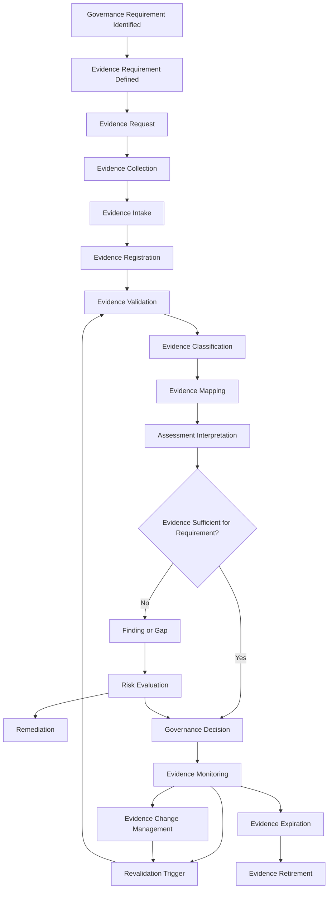
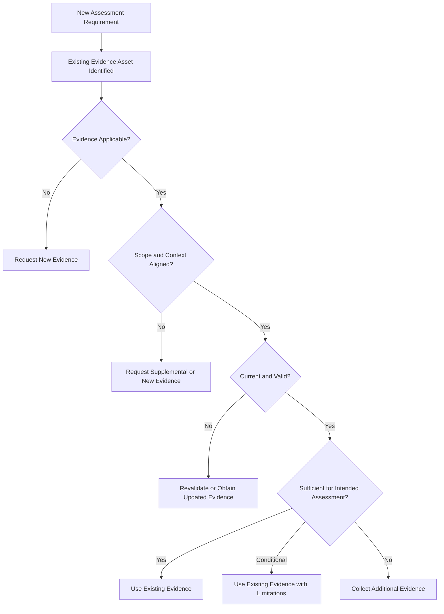
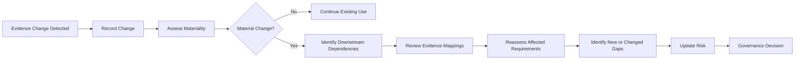
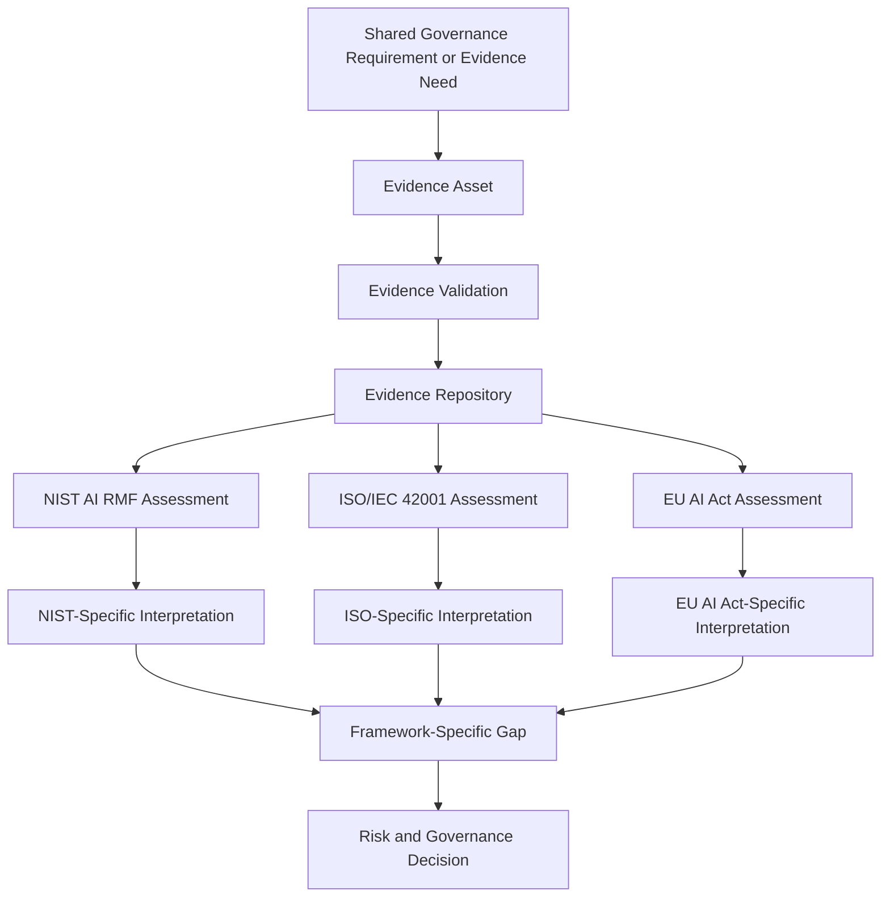
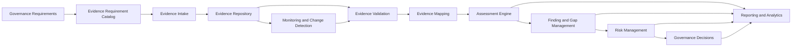

# Evidence Flow

## Purpose

The Evidence Flow describes how governance evidence moves through the Evidence Convergence Framework (ECF) operating lifecycle.

While the **Evidence Architecture** defines how evidence is structured, governed, validated, mapped, and reused, the Evidence Flow defines the operational movement of evidence from an identified governance requirement through collection, validation, assessment, reuse, gap identification, risk evaluation, decision-making, monitoring, revalidation, change management, and eventual retirement.

The flow is designed around the ECF operating principle:

> **Assessment → Evidence → Mapping → Reuse → Gap Identification → Risk → Decision**

Evidence is treated as a governed enterprise asset rather than as a disposable attachment to an individual assessment.

The flow therefore separates:

* The **requirement** that must be evaluated
* The **evidence requirement** needed to evaluate that requirement
* The **evidence asset** supplied by an organization or vendor
* The **validation** of that evidence
* The **mapping** between evidence and applicable requirements
* The **assessment interpretation** performed by qualified personnel
* The resulting **finding or gap**
* The associated **risk**
* The resulting **remediation or governance decision**

ECF does not establish that a single evidence asset automatically satisfies multiple frameworks. Reuse is conditional on evidence scope, applicability, validity, currency, provenance, quality, and the interpretation required by the receiving assessment.

---

## 1. Evidence Flow Principles

The Evidence Flow is governed by the following principles.

### 1.1 Evidence follows requirements

Evidence should be collected because a defined governance requirement, control objective, assessment criterion, or decision requires it.

Evidence collection should not begin with an undifferentiated request for every possible document.

### 1.2 Evidence is an enterprise asset

Evidence should be registered, classified, governed, and maintained independently from any single assessment where practical.

An evidence asset may subsequently support multiple assessments.

### 1.3 Collection is not assessment

Collecting a document does not establish that a requirement has been satisfied.

The flow separates:

**Evidence Collection → Evidence Validation → Evidence Mapping → Assessment Interpretation → Finding / Gap**

### 1.4 Validation is not compliance determination

Evidence validation establishes whether an evidence asset is sufficiently authentic, attributable, relevant, current, complete, and otherwise suitable for its intended use.

Validation does not by itself determine compliance or conformity.

### 1.5 Mapping is not equivalence

An evidence-to-requirement mapping indicates that an evidence asset provides relevant support for evaluating a requirement.

It does not establish that:

* Two framework requirements are equivalent
* One evidence asset fully satisfies two requirements
* A framework obligation has been discharged
* A regulatory obligation has been met

Assessment interpretation remains necessary.

### 1.6 Reuse is conditional

Evidence may be reused when its characteristics remain appropriate for the receiving requirement.

Reuse eligibility should consider factors such as:

* Scope
* Applicability
* Evidence type
* Provenance
* Currency
* Validity period
* Control or process coverage
* System or product coverage
* Organizational coverage
* Geographic or regulatory context
* Framework-specific interpretation
* Material changes since the evidence was produced
* Known limitations or exceptions

### 1.7 Framework-specific gaps remain visible

ECF seeks evidence convergence, not requirement convergence.

Where an evidence asset cannot adequately support a framework-specific requirement, the gap remains explicit.

### 1.8 Evidence has a lifecycle

Evidence should not remain permanently reusable simply because it was once accepted.

Evidence may become:

* Stale
* Superseded
* Invalid
* Out of scope
* Incomplete
* Inapplicable
* Restricted
* Retired

### 1.9 Evidence changes can trigger downstream review

A material change to an evidence asset, its source, its scope, or the underlying control environment may affect assessments that previously relied upon it.

Evidence change management therefore requires downstream impact analysis.

### 1.10 Decisions remain accountable

ECF supports governance decisions; it does not make governance accountability disappear.

The final decision remains attributable to the appropriate risk owner, control owner, governance body, or delegated decision-maker.

---

# 2. End-to-End Evidence Lifecycle

The ECF evidence lifecycle can be represented as:



The lifecycle is not necessarily strictly linear.

An evidence asset may:

* Return to validation
* Be remapped
* Support a new assessment
* Trigger reassessment after a material change
* Require supplemental evidence
* Be superseded by a newer version
* Remain valid while a separate framework-specific gap is addressed

The lifecycle should therefore be understood as a controlled flow rather than a one-time sequence.

---

# 3. Evidence Requirement Identification

The flow begins with a governance requirement.

A governance requirement may originate from:

* An internal policy
* A risk assessment criterion
* A control objective
* A contractual obligation
* A customer requirement
* A regulatory obligation
* A recognized framework
* An internal governance standard
* A third-party risk requirement
* An AI governance process
* A management decision requiring evidence

The requirement should be translated into an **Evidence Requirement** before evidence is requested.

An Evidence Requirement defines what evidence is needed to support an assessment.

### Example

A governance requirement may require an organization to evaluate whether an AI vendor maintains an appropriate mechanism for managing security incidents involving the AI service.

The corresponding Evidence Requirement might identify:

| Attribute                | Example                                                        |
| ------------------------ | -------------------------------------------------------------- |
| Requirement              | Incident management capability                                 |
| Evidence needed          | Incident response policy and relevant procedural documentation |
| Evidence characteristics | Current, approved, applicable to the assessed service          |
| Expected scope           | AI service and supporting operational environment              |
| Evidence owner           | Vendor security or compliance function                         |
| Assessment use           | Evaluate incident management governance                        |
| Potential mappings       | Multiple applicable security or AI governance requirements     |

The evidence requirement should be specific enough to guide collection without prematurely assuming that a particular document is the only acceptable evidence type.

---

# 4. Evidence Request

Once an Evidence Requirement has been defined, the appropriate evidence source is identified and a request is issued.

The request should communicate:

* Requirement being evaluated
* Evidence requested
* Expected scope
* Applicable time period
* Required evidence characteristics
* Submission method
* Confidentiality expectations
* Requested response date
* Contact or evidence owner
* Any accepted alternatives

Evidence requests should avoid unnecessary duplication.

Where an existing evidence asset is already registered and potentially reusable, the process should first determine whether that asset can support the new requirement.

This creates the first opportunity for evidence reuse.

---

# 5. Evidence Collection

Evidence collection is the acquisition of evidence from an authorized source.

Potential evidence sources include:

* AI vendors
* Internal control owners
* Product owners
* Security teams
* Legal or compliance teams
* Internal audit
* External assurance providers
* Independent assessors
* Governance repositories
* Contract repositories
* System-generated records
* Configuration repositories
* Monitoring systems

Evidence may take many forms, including:

* Policies
* Procedures
* Standards
* Reports
* Certifications
* Attestations
* Audit reports
* Test results
* Configuration evidence
* System records
* Meeting records
* Risk assessments
* Training records
* Contractual documents
* Technical documentation

The ECF model does not assume that a particular evidence type is universally sufficient.

Evidence suitability depends on the requirement and assessment context.

---

# 6. Evidence Intake

Evidence intake is the controlled entry of evidence into the governance process.

At intake, the evidence should be checked for basic usability before it becomes part of the governed evidence inventory.

Typical intake activities include:

1. Confirming the evidence source.
2. Confirming the submission relates to the requested requirement.
3. Checking file integrity or accessibility.
4. Recording the submission date.
5. Recording the evidence owner or source.
6. Identifying confidentiality restrictions.
7. Identifying obvious scope limitations.
8. Detecting duplicate or previously registered evidence.
9. Assigning an initial evidence identifier where appropriate.

Intake does not constitute evidence validation.

---

# 7. Evidence Registration

Once accepted into the evidence process, the evidence asset should be registered in the Evidence Register.

Registration creates the persistent identity required to govern the evidence throughout its lifecycle.

At minimum, registration should establish:

* Evidence ID
* Evidence title
* Evidence type
* Evidence owner
* Evidence source
* Collection date
* Effective date
* Expiration or review date where applicable
* Scope
* Applicability
* Provenance
* Confidentiality classification
* Current status
* Version
* Related requirements
* Validation status

Evidence registration enables the evidence asset to exist independently of a particular assessment.

---

# 8. Evidence Validation

Evidence validation determines whether an evidence asset is suitable for its intended assessment use.

Validation should evaluate characteristics such as:

| Validation Dimension | Question                                                                                |
| -------------------- | --------------------------------------------------------------------------------------- |
| Authenticity         | Can the source and origin of the evidence be established?                               |
| Integrity            | Is the evidence sufficiently intact and reliable for its intended use?                  |
| Relevance            | Does it address the requirement being evaluated?                                        |
| Scope                | Does the evidence cover the relevant organization, system, service, process, or period? |
| Currency             | Is the evidence sufficiently current?                                                   |
| Completeness         | Is enough information available to support the intended assessment?                     |
| Provenance           | Can the evidence's origin and chain of custody be understood?                           |
| Applicability        | Does the evidence apply to the assessed environment?                                    |
| Limitations          | Are exclusions, assumptions, or constraints documented?                                 |

Validation outcomes may include:

* Validated
* Validated with limitations
* Pending validation
* Insufficient
* Rejected
* Expired
* Superseded

Validation should be documented separately from the ultimate compliance or risk conclusion.

---

# 9. Evidence Classification

Validated evidence should be classified so that it can be managed and reused appropriately.

Classification may include:

### Evidence Type

Examples:

* Policy
* Procedure
* Standard
* Technical configuration
* Independent assurance
* Internal assessment
* Risk assessment
* Contractual evidence
* Operational record
* Training record

### Evidence Scope

Examples:

* Enterprise-wide
* Business unit
* Product
* AI system
* Application
* Vendor service
* Infrastructure
* Process
* Geographic region

### Evidence Status

Examples:

* Active
* Pending review
* Restricted
* Superseded
* Expired
* Retired

### Evidence Sensitivity

Examples:

* Public
* Internal
* Confidential
* Restricted

Classification supports controlled retrieval and reuse.

---

# 10. Evidence Mapping

Evidence mapping establishes relationships between an evidence asset and one or more governance requirements.

A mapping should contain enough information to explain why the relationship exists.

A useful mapping structure includes:

| Mapping Attribute | Purpose                                                      |
| ----------------- | ------------------------------------------------------------ |
| Evidence ID       | Identifies the evidence asset                                |
| Requirement ID    | Identifies the requirement                                   |
| Mapping strength  | Indicates how directly the evidence supports the requirement |
| Mapping rationale | Explains the relationship                                    |
| Scope alignment   | Identifies relevant scope                                    |
| Limitations       | Documents deficiencies or constraints                        |
| Framework context | Identifies the assessment context                            |
| Mapping owner     | Establishes accountability                                   |
| Mapping status    | Indicates whether the mapping remains valid                  |
| Last reviewed     | Supports ongoing governance                                  |

### Mapping Strength

A mapping strength model may use:

* **Strong** — Evidence directly supports evaluation of the requirement within the relevant scope.
* **Moderate** — Evidence provides meaningful support but requires additional interpretation or corroboration.
* **Weak** — Evidence is relevant but insufficient to support the requirement independently.
* **Not Applicable** — The evidence does not meaningfully support the requirement.

The mapping strength does not represent a compliance score.

---

# 11. Assessment Use

Assessment interpretation occurs after evidence has been validated and appropriately mapped.

The assessor determines what the evidence means in the context of the requirement.

This is a critical separation within ECF:

> **Evidence is an input to an assessment; evidence is not itself the assessment conclusion.**

The assessor may determine that the evidence:

* Supports the requirement
* Partially supports the requirement
* Does not support the requirement
* Is insufficient to reach a conclusion
* Requires corroborating evidence
* Requires framework-specific interpretation

The assessment conclusion should remain traceable to:

**Requirement → Evidence Requirement → Evidence Asset → Validation → Mapping → Assessment Interpretation**

---

# 12. Evidence Reuse

Evidence reuse occurs when an existing evidence asset is considered for use in another assessment or requirement.

The reuse decision should evaluate whether the existing evidence remains appropriate.

A simplified decision flow is:



Evidence reuse should therefore be treated as a governed decision, not an assumption.

---

# 13. Evidence Reuse Eligibility

An evidence asset may be eligible for reuse when:

* The underlying requirement remains materially comparable.
* The evidence scope includes the receiving assessment scope.
* The evidence remains current.
* The evidence source remains authoritative.
* The underlying control or process has not materially changed.
* The evidence has not been superseded.
* The evidence remains valid for the relevant jurisdiction or operating context.
* Known limitations do not invalidate the intended use.
* Required framework-specific interpretation can still be performed.
* Any required corroborating evidence is available.

Reuse should not occur solely because two requirements appear to use similar language.

---

# 14. Assessment-Specific Limitations

An evidence asset may be reusable while still being insufficient to independently satisfy the receiving requirement.

For example:

> A vendor's enterprise-wide information security policy may be relevant to multiple assessments, but a framework-specific requirement may also require evidence about implementation, operational effectiveness, AI-specific governance, or a particular organizational scope.

In such cases, ECF should record:

1. The reused evidence.
2. The limitation.
3. The additional evidence required.
4. The assessment-specific interpretation.
5. The resulting gap, if any.

This preserves evidence convergence without creating false equivalence.

---

# 15. Gap Identification

A gap is identified when the available evidence does not provide sufficient support for the applicable requirement.

Common causes include:

* No evidence exists.
* Evidence is incomplete.
* Evidence is outdated.
* Evidence does not cover the required scope.
* Evidence is not applicable.
* Evidence has material limitations.
* The requirement requires additional evidence.
* The requirement is framework-specific.
* The available evidence requires corroboration.
* The underlying control does not operate as expected.

The gap should reference the evidence that was evaluated where applicable.

A gap should not simply state:

> "Vendor failed requirement."

Instead, the assessment should establish the traceable relationship between the requirement, evidence, interpretation, and conclusion.

---

# 16. Supplemental Evidence Collection

When an evidence asset is insufficient, ECF should first determine whether:

* Existing evidence can be supplemented.
* A more appropriate existing evidence asset is available.
* Additional evidence can be requested.
* A framework-specific interpretation can resolve the uncertainty.
* The requirement genuinely remains unsupported.

Supplemental evidence may include:

* Technical evidence
* Operational records
* Independent assurance
* Management attestation
* Control testing
* Contracts
* Procedures
* System configuration
* Incident records
* Risk assessments
* AI-specific documentation

Supplemental evidence should be linked to the original Evidence Requirement and assessment context.

---

# 17. Risk Escalation

Evidence gaps do not automatically equal material risk.

The assessment must evaluate the significance of the gap within the applicable risk context.

Risk evaluation may consider:

* Impact
* Likelihood
* Exposure
* Data sensitivity
* AI system criticality
* Regulatory relevance
* Business criticality
* Customer impact
* Dependency concentration
* Control maturity
* Compensating controls
* Duration of the gap
* Existing remediation
* Risk acceptance criteria

The resulting risk should remain traceable to the assessment finding and underlying evidence.

The relationship is:

```text
Evidence
   ↓
Assessment Interpretation
   ↓
Finding / Gap
   ↓
Risk Analysis
   ↓
Risk Decision
```

---

# 18. Remediation

Where remediation is required, the remediation action should address the underlying issue rather than merely produce another document.

Potential remediation actions include:

* Implementing a missing control
* Updating a policy
* Expanding control scope
* Improving monitoring
* Correcting a process deficiency
* Obtaining additional assurance
* Restricting use of an AI service
* Adding contractual requirements
* Implementing compensating controls
* Reassessing the vendor
* Escalating the issue to governance

Remediation evidence should itself enter the evidence lifecycle.

---

# 19. Governance Decision

Evidence ultimately supports a governance decision.

Depending on the context, decisions may include:

* Approve
* Approve with conditions
* Approve with remediation requirements
* Accept risk
* Transfer risk
* Restrict use
* Defer decision
* Reject
* Require additional assessment
* Escalate to a governance committee

The decision should identify:

* Decision owner
* Decision date
* Decision rationale
* Relevant risk
* Applicable findings
* Required remediation
* Conditions or exceptions
* Review date

ECF does not prescribe a universal decision methodology. Organizations should align decision authority with their existing governance model.

---

# 20. Evidence Monitoring

Evidence monitoring determines whether previously accepted evidence remains appropriate.

Monitoring may be:

* Time-based
* Event-driven
* Change-driven
* Risk-based
* Assessment-driven

Potential monitoring triggers include:

* Evidence nearing expiration
* Material control changes
* Vendor organizational changes
* AI system changes
* Changes to service architecture
* Significant incidents
* Regulatory changes
* Contract changes
* New assessment requirements
* Changes in evidence ownership
* Audit findings
* Material exceptions

Monitoring prevents evidence reuse from becoming uncontrolled evidence perpetuation.

---

# 21. Revalidation

Revalidation determines whether an existing evidence asset remains suitable for continued use.

Revalidation may confirm:

* Source remains authoritative.
* Evidence remains current.
* Scope remains appropriate.
* Underlying controls remain materially unchanged.
* Existing mappings remain valid.
* Known limitations remain accurate.
* Evidence remains relevant to downstream assessments.

Revalidation does not necessarily require collecting an entirely new evidence asset.

Depending on the circumstances, it may involve:

* Confirming continued validity
* Obtaining a current attestation
* Reviewing change records
* Updating metadata
* Performing targeted testing
* Obtaining a newer version
* Re-performing assessment interpretation

---

# 22. Evidence Change Management

Changes to evidence should be treated as potentially consequential governance events.

Examples include:

* Policy revision
* Control redesign
* System migration
* AI model change
* Vendor acquisition
* Organizational restructuring
* New subprocessors
* Material incident
* Certification status change
* Scope change
* Contractual change
* Regulatory change

The evidence change should trigger an impact analysis.



This is an important architectural property of ECF:

> **Evidence is reusable, but evidence-dependent decisions remain change-sensitive.**

---

# 23. Evidence Expiration

Evidence may have an explicit or implicit validity period.

Expiration criteria may be based on:

* Defined review date
* Certification validity
* Assessment cycle
* Contract period
* Policy version
* Regulatory change
* Material system change
* Risk-based review frequency

Expiration should not necessarily mean that the underlying evidence is false.

It means that the organization no longer considers the evidence sufficiently current for the intended governance use without additional review or validation.

---

# 24. Evidence Retirement

Evidence should be retired when it is no longer appropriate for active governance use.

Retirement may occur because:

* It has been superseded.
* The associated system or vendor relationship ended.
* The evidence is obsolete.
* The requirement no longer applies.
* The evidence was replaced with a more authoritative version.
* The evidence cannot be sufficiently validated.
* The retention period has ended.

Retired evidence should remain subject to applicable retention and legal requirements.

Retirement should preserve appropriate lineage so that historical assessment decisions can still be reconstructed where required.

---

# 25. Exception Handling

Evidence flow exceptions should be explicitly recorded rather than silently bypassing normal controls.

Examples include:

* Evidence unavailable
* Vendor refuses to provide evidence
* Evidence cannot be independently validated
* Evidence is restricted
* Evidence is expired but temporarily required
* Framework-specific evidence unavailable
* Compensating evidence accepted
* Risk accepted despite an evidence gap
* Assessment deadline requires controlled exception handling

An exception record should identify:

* Exception ID
* Related requirement
* Related evidence
* Reason
* Business justification
* Risk impact
* Compensating controls
* Approver
* Expiration or review date
* Required remediation

Exceptions should have an owner and an explicit lifecycle.

---

# 26. Roles and Responsibilities

ECF does not require one universal organizational structure. Responsibilities should be assigned according to the organization's governance model.

A typical operating model may include:

| Role                   | Primary Responsibility                                       |
| ---------------------- | ------------------------------------------------------------ |
| Requirement Owner      | Defines the governance requirement and assessment intent     |
| Evidence Owner         | Maintains the source evidence and confirms its applicability |
| Evidence Custodian     | Registers, stores, classifies, and manages evidence          |
| Assessor               | Interprets evidence against applicable requirements          |
| TPRM / GRC Team        | Coordinates assessments, mappings, findings, and workflow    |
| AI Governance Function | Provides AI-specific governance interpretation and oversight |
| Risk Owner             | Evaluates and accepts or escalates resulting risk            |
| Control Owner          | Owns remediation and control effectiveness                   |
| Governance Committee   | Makes or ratifies decisions within delegated authority       |
| Internal Audit         | Provides independent assurance where applicable              |

One individual may perform multiple roles in smaller organizations, provided that appropriate independence and segregation requirements are maintained.

---

# 27. Traceability

Traceability is a core property of the Evidence Flow.

A complete trace should allow an organization to move from a governance decision back through the evidence chain.

The target relationship is:

```text
Governance Decision
        ↓
Risk
        ↓
Finding / Gap
        ↓
Assessment Interpretation
        ↓
Evidence Mapping
        ↓
Evidence Validation
        ↓
Evidence Asset
        ↓
Evidence Requirement
        ↓
Governance Requirement
```

Traceability should work in both directions.

### Forward Traceability

Requirement → Evidence → Assessment → Risk → Decision

### Reverse Traceability

Decision → Risk → Finding → Assessment → Evidence → Requirement

This allows governance teams and auditors to answer questions such as:

* Why was this decision made?
* Which evidence supported the decision?
* Was the evidence valid at the time?
* Which requirements depended on this evidence?
* What other assessments reused the evidence?
* What happens if the evidence changes?
* Which risks originated from an evidence gap?

---

# 28. Cross-Framework Evidence Flow

ECF supports multiple governance frameworks through evidence convergence.

The flow is:



The architecture deliberately allows the same evidence asset to enter multiple assessment flows.

However, each assessment retains its own:

* Requirement
* Framework context
* Interpretation
* Mapping rationale
* Scope
* Limitations
* Finding
* Risk implication

This prevents evidence convergence from becoming requirement convergence.

---

# 29. Evidence Convergence vs. Requirement Convergence

These concepts must remain distinct.

### Evidence Convergence

Multiple requirements may be supported, in whole or in part, by the same evidence asset.

### Requirement Convergence

Different requirements are treated as if they are equivalent or interchangeable.

ECF supports the former and does not assume the latter.

For example:

```text
                    Evidence Asset
                         │
             ┌───────────┼───────────┐
             ↓           ↓           ↓
        Requirement A Requirement B Requirement C
             │           │           │
             ↓           ↓           ↓
        Interpretation Interpretation Interpretation
             │           │           │
             ↓           ↓           ↓
          Finding     Finding       Finding
```

The evidence can converge while the assessment interpretations remain distinct.

---

# 30. AI Vendor Governance Example

The following example illustrates the flow without representing a real organization or vendor.

### Scenario

An organization is evaluating an AI vendor that provides an AI-enabled enterprise application.

The organization needs to evaluate the vendor against multiple governance requirements.

One requirement concerns the vendor's approach to managing security incidents.

### Flow

#### Step 1 — Requirement Identification

The organization identifies an incident-management governance requirement.

#### Step 2 — Evidence Requirement

The Evidence Requirement specifies that evidence should demonstrate how incident management responsibilities, escalation, response, and governance are established for the relevant service.

#### Step 3 — Evidence Request

The vendor is asked to provide relevant incident-management documentation.

#### Step 4 — Collection and Registration

The vendor submits an incident response policy.

The evidence is registered with:

* Evidence ID
* Vendor
* Evidence owner
* Scope
* Version
* Effective date
* Source
* Confidentiality
* Review date

#### Step 5 — Validation

The assessor confirms that:

* The document originates from the vendor.
* The document is current.
* The scope includes the relevant service.
* The document is approved.
* Limitations are understood.

#### Step 6 — Mapping

The evidence is mapped to applicable requirements where the relationship is defensible.

#### Step 7 — Assessment Interpretation

The assessor determines that the policy provides governance-level evidence but does not demonstrate operational effectiveness.

#### Step 8 — Gap Identification

A gap is recorded where operational evidence is required.

#### Step 9 — Supplemental Evidence

The organization requests additional evidence such as incident testing records, response metrics, or independent assurance, depending on the applicable requirement.

#### Step 10 — Risk Evaluation

The gap is evaluated in the context of the organization's exposure to the vendor.

#### Step 11 — Governance Decision

The organization may approve the vendor with remediation conditions, require additional controls, accept the risk, or escalate the decision.

#### Step 12 — Monitoring

If the vendor materially changes its incident-management process or service architecture, the evidence may require revalidation and affected assessments may need to be revisited.

This example demonstrates that **one evidence asset can initiate multiple assessment activities without becoming a universal compliance artifact**.

---

# 31. Evidence Flow Across Multiple Assessments

An evidence asset may participate in multiple assessments over time.

For example:

```text
Evidence Asset E-001
       │
       ├── Assessment A
       │      └── Requirement A-01
       │
       ├── Assessment B
       │      └── Requirement B-07
       │
       └── Assessment C
              └── Requirement C-14
```

The evidence asset remains singular.

The assessment relationships remain separate.

If E-001 changes materially:

```text
Evidence Change
      ↓
Identify Dependencies
      ↓
Assessment A Review
Assessment B Review
Assessment C Review
      ↓
Revalidation / Reassessment
      ↓
Updated Findings and Risk
```

This dependency model is one of the primary operational benefits of an evidence-centric architecture.

---

# 32. Minimum Viable Evidence Flow

A small or resource-constrained organization does not need a sophisticated GRC platform to implement the core ECF flow.

A minimum viable implementation can use:

1. Evidence Requirement Catalog
2. Evidence Register
3. Evidence Mapping Matrix
4. Assessment workbook
5. Basic evidence repository
6. Defined validation criteria
7. Defined evidence status values
8. Manual review and revalidation process
9. Finding and risk register
10. Governance decision record

The minimum flow is:

```text
Requirement
    ↓
Evidence Request
    ↓
Evidence Register
    ↓
Validation
    ↓
Mapping
    ↓
Assessment
    ↓
Gap
    ↓
Risk
    ↓
Decision
    ↓
Review / Revalidation
```

The objective is not automation for its own sake.

The objective is to establish controlled evidence reuse and traceability.

---

# 33. Mature / Enterprise Evidence Flow

A mature implementation may integrate ECF into existing GRC and enterprise systems.

Potential capabilities include:

* Central evidence repository
* Evidence identity management
* Automated metadata extraction
* Evidence version control
* Requirement libraries
* Framework mappings
* Automated reuse recommendations
* Evidence expiration alerts
* Change-triggered reassessment
* Workflow automation
* Role-based access control
* Segregation of duties
* Audit trails
* Risk integration
* Vendor lifecycle integration
* Contract management integration
* AI governance workflow integration
* Dashboarding
* Evidence dependency analysis
* API-based integrations
* Automated notification
* Exception management

A mature architecture may look like:



Technology can improve speed and consistency, but automation should not eliminate human judgment where assessment interpretation or governance accountability is required.

---

# 34. Flow Metrics and KPIs

ECF metrics should measure both **efficiency** and **assurance quality**.

Optimizing only for evidence reuse could create an incentive to over-reuse weak evidence.

Useful metrics include:

| Metric                         | Purpose                                                                                    |
| ------------------------------ | ------------------------------------------------------------------------------------------ |
| Evidence Reuse Rate            | Measures the proportion of assessment evidence requirements supported by existing evidence |
| Evidence Validation Cycle Time | Measures time required to validate submitted evidence                                      |
| Evidence Request Cycle Time    | Measures time from request to usable evidence                                              |
| Evidence Mapping Coverage      | Measures the proportion of applicable requirements with documented evidence mappings       |
| Evidence Freshness             | Measures the age or currency of active evidence                                            |
| Evidence Gap Rate              | Measures requirements lacking sufficient evidence                                          |
| Supplemental Evidence Rate     | Identifies how frequently reused evidence requires additional evidence                     |
| Evidence Expiration Rate       | Identifies evidence reaching review or expiration thresholds                               |
| Revalidation Completion Rate   | Measures timely completion of required revalidation                                        |
| Downstream Impact Rate         | Measures how often evidence changes trigger affected assessment reviews                    |
| Assessment Cycle Time          | Measures the time required to complete assessments                                         |
| Traceability Coverage          | Measures the proportion of findings and decisions with complete evidence lineage           |

Metrics should be interpreted together.

For example, a high Evidence Reuse Rate combined with a high Evidence Gap Rate may indicate overly aggressive reuse rather than mature convergence.

---

# 35. Architectural Controls

The Evidence Flow should be supported by architectural controls that preserve evidence integrity and governance quality.

### 35.1 Unique Evidence Identity

Each governed evidence asset should have a persistent identifier.

### 35.2 Version Control

Material evidence changes should create distinguishable versions or otherwise preserve version history.

### 35.3 Access Control

Evidence access should be based on appropriate authorization and confidentiality requirements.

### 35.4 Provenance

Evidence origin and relevant collection information should be recorded.

### 35.5 Validation Status

Evidence should have a defined validation state.

### 35.6 Scope Control

Evidence scope should be explicit enough to prevent inappropriate reuse.

### 35.7 Currency Control

Evidence should have appropriate review or expiration mechanisms.

### 35.8 Mapping Governance

Evidence mappings should have documented rationale and ownership.

### 35.9 Reuse Eligibility

Evidence should not be reusable by default simply because it exists in the repository.

### 35.10 Dependency Tracking

Downstream assessments that depend on an evidence asset should be identifiable where practical.

### 35.11 Change Impact Analysis

Material evidence changes should trigger review of dependent mappings and assessments.

### 35.12 Audit Trail

Material changes to evidence metadata, mappings, validation status, findings, and decisions should be attributable.

### 35.13 Separation of Concerns

The architecture should preserve separation between:

* Evidence
* Validation
* Interpretation
* Finding
* Risk
* Decision

This prevents the evidence repository from becoming a de facto compliance determination engine.

---

# 36. Evidence Flow Control Points

The lifecycle contains several important control points.

| Control Point          | Primary Question                                                   |
| ---------------------- | ------------------------------------------------------------------ |
| Requirement Definition | What must be evaluated?                                            |
| Evidence Requirement   | What evidence is needed?                                           |
| Intake                 | Has the requested evidence been received and identified correctly? |
| Registration           | Can the evidence be governed as an identifiable asset?             |
| Validation             | Is the evidence suitable for intended use?                         |
| Classification         | How should the evidence be governed?                               |
| Mapping                | Which requirements does the evidence support, and why?             |
| Assessment             | What does the evidence mean in this assessment context?            |
| Reuse Decision         | Can the evidence legitimately be reused?                           |
| Gap Review             | What remains unsupported?                                          |
| Risk Review            | What is the significance of the gap?                               |
| Decision               | What governance action is appropriate?                             |
| Monitoring             | Has anything changed?                                              |
| Revalidation           | Does the evidence remain suitable?                                 |
| Retirement             | Should the evidence remain active?                                 |

These control points provide natural locations for workflow controls, approval gates, automation, and audit evidence.

---

# 37. Evidence Flow and GRC Integration

ECF can operate as an evidence-centric layer within an existing GRC ecosystem.

A conceptual integration model is:

```text
                Governance Requirements
                         │
                         ▼
              Evidence Requirement Catalog
                         │
                         ▼
                  Evidence Register
                         │
          ┌──────────────┼──────────────┐
          ▼              ▼              ▼
      Assessments     Mappings       Vendors
          │              │              │
          └──────────────┼──────────────┘
                         ▼
                   Findings / Gaps
                         │
                         ▼
                    Risk Register
                         │
                         ▼
                Governance Decisions
```

The ECF model does not require organizations to replace existing GRC platforms.

Instead, the evidence architecture can complement capabilities already present in:

* GRC platforms
* TPRM platforms
* Document management systems
* Audit management systems
* Compliance platforms
* AI governance platforms
* Enterprise risk systems

The implementation should preserve existing system-of-record responsibilities where appropriate.

---

# 38. Separation of Evidence, Interpretation, and Decision

A central architectural safeguard is maintaining separation between the evidence asset and the conclusions derived from it.

The same evidence may produce different assessment conclusions because:

* Requirements differ.
* Scopes differ.
* Framework contexts differ.
* Assessment objectives differ.
* Additional evidence may be available.
* Risk tolerance differs.
* Applicable laws or contractual obligations differ.

Therefore:

```text
Evidence
   ≠
Compliance Conclusion
   ≠
Risk Rating
   ≠
Governance Decision
```

The relationships between these elements should be explicit and traceable.

---

# 39. Operating Characteristics of the ECF Evidence Flow

A mature ECF implementation should demonstrate the following characteristics.

### Evidence is reusable

An evidence asset can support multiple applicable assessments.

### Evidence is not infinitely reusable

Reuse depends on evidence characteristics and receiving assessment requirements.

### Evidence is traceable

Users can determine where evidence came from, how it was validated, where it was mapped, and which decisions depend upon it.

### Evidence is change-sensitive

Material changes can trigger downstream review.

### Evidence is time-sensitive

Evidence can expire or require revalidation.

### Evidence is contextual

Evidence scope and applicability matter.

### Evidence is interpreted

Assessment conclusions require interpretation rather than simple document matching.

### Evidence gaps remain visible

ECF does not hide framework-specific evidence requirements.

### Evidence supports decisions

The ultimate purpose of the flow is improved governance decision-making, not merely evidence collection.

---

# 40. Relationship to the Evidence Architecture

The Evidence Flow operationalizes the structures defined in `Evidence-Architecture.md`.

The relationship can be summarized as:

| Evidence Architecture      | Evidence Flow                        |
| -------------------------- | ------------------------------------ |
| Governance Requirement     | Requirement Identification           |
| Evidence Requirement       | Evidence Requirement Definition      |
| Evidence Asset             | Collection and Registration          |
| Evidence Metadata          | Registration and Classification      |
| Evidence Scope             | Validation and Reuse Decision        |
| Evidence Provenance        | Intake and Validation                |
| Evidence Currency          | Validation, Monitoring, Revalidation |
| Evidence Validation        | Validation Stage                     |
| Evidence Mapping           | Mapping Stage                        |
| Mapping Strength           | Reuse and Assessment Evaluation      |
| Evidence Reuse             | Reuse Stage                          |
| Evidence Convergence       | Cross-Framework Flow                 |
| Framework-Specific Gaps    | Gap Identification                   |
| Evidence Lineage           | Traceability                         |
| Evidence Change Management | Change Management                    |
| Evidence Ownership         | Roles and Responsibilities           |
| Evidence Quality           | Validation and Monitoring            |
| Assessment Relationships   | Assessment Use                       |
| Risk Relationships         | Risk Escalation                      |
| Governance Decision        | Decision Stage                       |

The Evidence Architecture therefore defines the **structure and governance model**, while the Evidence Flow defines the **movement and operational lifecycle**.

---

# 41. Summary

The ECF Evidence Flow establishes a controlled lifecycle for governance evidence:

```text
Requirement
    ↓
Evidence Requirement
    ↓
Request
    ↓
Collection
    ↓
Intake
    ↓
Registration
    ↓
Validation
    ↓
Classification
    ↓
Mapping
    ↓
Assessment Interpretation
    ↓
Finding / Gap
    ↓
Risk
    ↓
Remediation
    ↓
Governance Decision
    ↓
Monitoring
    ↓
Revalidation
    ↓
Change / Expiration / Retirement
```

The flow reinforces several fundamental ECF principles:

1. Evidence collection is not assessment.
2. Evidence validation is not compliance determination.
3. Evidence mapping is not compliance equivalence.
4. Evidence reuse is conditional.
5. Evidence convergence does not eliminate framework-specific requirements.
6. Evidence can support multiple assessments throughout its lifecycle.
7. Material evidence changes can trigger downstream assessment review.
8. Evidence gaps remain explicit.
9. Evidence lineage supports auditability and governance.
10. Evidence ultimately supports risk and governance decisions.

The operating objective is not to eliminate assessment work.

It is to eliminate unnecessary duplication while preserving the integrity of each assessment.

> **Design governance evidence once, govern it as an enterprise asset, map it across applicable requirements, reuse it where appropriate, and explicitly identify what still requires additional evidence or framework-specific evaluation.**


