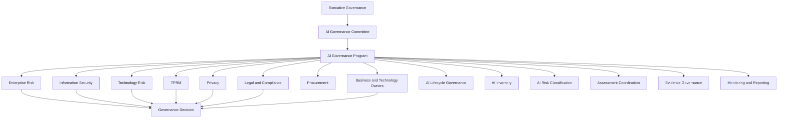
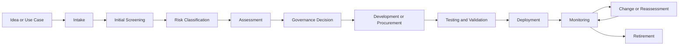
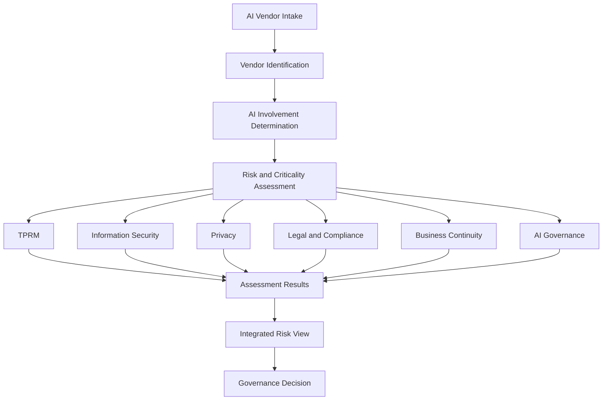
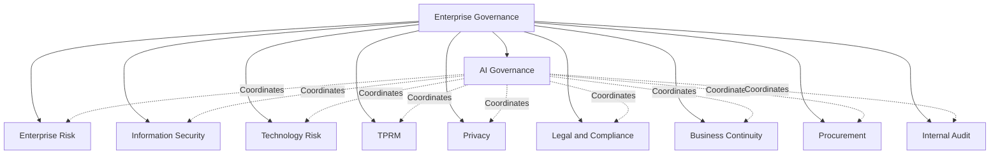
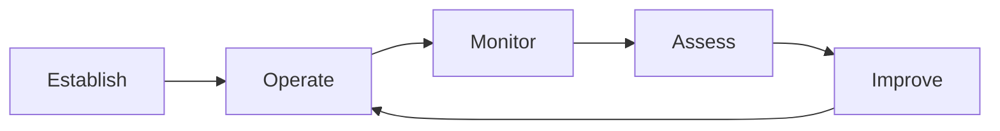
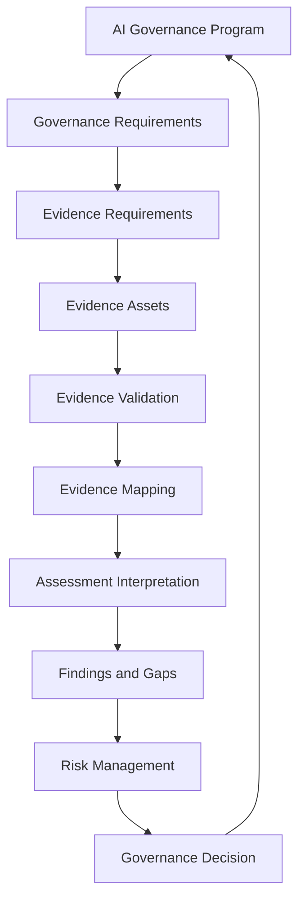

# AI Governance Program

## NovaTide Logistics

> **Status:** Synthetic reference implementation
> **Purpose:** Define the AI Governance Program operating model for NovaTide Logistics
> **Relationship to ECF:** ECF provides the evidence operating model supporting the program; it does not replace the AI Governance Program.

---

## 1. Purpose

The NovaTide Logistics AI Governance Program establishes the organizational structure, processes, accountability, and decision mechanisms used to govern the organization's use of artificial intelligence.

The program is intended to enable NovaTide to adopt and use AI in a manner that is:

* Risk-based
* Proportionate
* Accountable
* Evidence-based
* Traceable
* Secure
* Privacy-aware
* Operationally resilient
* Consistent with applicable legal and regulatory obligations
* Aligned with organizational risk appetite

The program coordinates AI governance activities across existing enterprise functions rather than creating a separate governance structure that duplicates them.

The **Evidence Convergence Framework (ECF)** supports this program by providing an evidence-centric operating model for identifying, governing, validating, mapping, and reusing governance evidence.

ECF is therefore a supporting operating model within the broader AI Governance Program.

---

## 2. Program Objectives

The AI Governance Program has the following objectives.

### 2.1 Establish Accountability

Ensure that every material AI use case has identifiable ownership and appropriate governance accountability.

### 2.2 Maintain AI Visibility

Establish and maintain an inventory of AI systems, AI-enabled services, and material AI use cases.

### 2.3 Apply Risk-Based Governance

Classify AI use cases according to their potential impact and apply governance requirements proportionate to their risk.

### 2.4 Coordinate Assessments

Coordinate security, privacy, legal, TPRM, technology risk, business continuity, and AI-specific assessments where applicable.

### 2.5 Govern Evidence

Ensure that material governance conclusions are supported by appropriate evidence and that evidence is governed throughout its lifecycle.

### 2.6 Manage AI Risk

Identify, assess, treat, monitor, and escalate AI-related risks in accordance with enterprise risk practices.

### 2.7 Support Responsible AI Adoption

Enable business units to adopt useful AI capabilities while maintaining appropriate governance safeguards.

### 2.8 Enable Defensible Decisions

Provide decision-makers with sufficient information to understand:

* What AI capability is being considered
* What risks have been identified
* What evidence supports the assessment
* What gaps remain
* What controls or mitigations exist
* Who owns the residual risk
* What decision is being requested

### 2.9 Support Continuous Governance

Account for changes to AI systems, vendors, evidence, risks, business use cases, and applicable requirements throughout the AI lifecycle.

---

## 3. Program Scope

The AI Governance Program applies to AI systems and AI-enabled capabilities that are developed, procured, integrated, operated, or materially relied upon by NovaTide.

The scope includes, where applicable:

* Internally developed AI
* Third-party AI services
* AI-enabled SaaS applications
* Generative AI services
* AI development platforms
* Embedded AI capabilities
* Machine learning models
* Predictive analytics
* Optimization systems
* AI-assisted decision support
* AI-enabled customer services
* AI-assisted software development
* AI systems processing NovaTide information
* AI systems materially affecting customers, employees, or business operations

The level of governance applied to a particular AI system is determined by its characteristics and risk rather than by the mere fact that it uses AI.

---

## 4. Governance Principles

NovaTide's AI Governance Program follows the following principles.

### 4.1 Accountability

AI systems must have identifiable business, technology, and governance ownership appropriate to their role and risk.

### 4.2 Proportionality

Governance requirements should be proportionate to the potential impact, risk, and criticality of the AI use case.

### 4.3 Risk-Based Decision Making

AI governance should support informed decisions based on identified risks, available evidence, applicable requirements, and organizational risk appetite.

### 4.4 Evidence-Based Governance

Material governance conclusions should be supported by evidence that is relevant, sufficiently reliable, appropriately scoped, and current for its intended use.

### 4.5 Traceability

Material decisions should be traceable to the requirements, evidence, assessments, findings, risks, and approvals supporting them.

### 4.6 Human Accountability

AI does not replace organizational accountability. Humans remain responsible for governance decisions and risk ownership.

### 4.7 Security and Privacy by Design

Security and privacy considerations should be incorporated into AI lifecycle activities rather than addressed only after deployment.

### 4.8 Transparency Appropriate to Context

NovaTide should maintain sufficient information about AI systems to support appropriate oversight, risk assessment, and stakeholder understanding.

### 4.9 Continuous Oversight

Governance should continue after initial approval and should account for material changes in AI systems, vendors, data, risks, and operating environments.

### 4.10 Explicit Uncertainty

Where evidence is incomplete, unavailable, ambiguous, or subject to limitations, those limitations should remain visible to decision-makers.

### 4.11 No Automatic Evidence Equivalence

Evidence that supports one requirement should not automatically be treated as satisfying another requirement merely because the subject matter appears similar.

---

## 5. AI Governance Operating Model

NovaTide's AI Governance Program operates as a coordinating layer across existing enterprise governance functions.

The program does not assume that all governance activities are performed by the AI Governance function.

Instead, it coordinates the appropriate subject-matter functions based on the AI system, vendor, data, business process, and risk profile.

---

## 6. AI Lifecycle Governance

AI governance applies throughout the AI lifecycle.

A simplified NovaTide lifecycle is:

### 6.1 AI Use Case Identification

Business or technology stakeholders identify a proposed AI capability and provide sufficient information for initial governance screening.

### 6.2 Intake

The proposed use case is recorded in the appropriate AI inventory or intake mechanism.

Initial information may include:

* Business purpose
* AI capability
* Business owner
* Technology owner
* Vendor involvement
* Data categories
* Intended users
* Business process
* Degree of automation
* Expected impact

### 6.3 Initial Screening

The AI Governance function determines whether the proposed capability falls within program scope and identifies the governance processes that may be required.

### 6.4 Risk Classification

The use case receives an initial AI risk classification based on relevant risk factors.

### 6.5 Assessment

Applicable assessments are coordinated based on the risk and characteristics of the AI system.

### 6.6 Governance Decision

The appropriate decision authority reviews the assessment results, identified gaps, residual risks, and mitigation plans.

### 6.7 Deployment

Approved systems proceed through applicable technical, security, operational, contractual, and implementation processes.

### 6.8 Monitoring

The system is monitored for material changes, incidents, performance issues, risk changes, vendor changes, and other governance triggers.

### 6.9 Reassessment

Material changes may trigger reassessment.

Examples include:

* Significant model changes
* Changes in intended use
* Changes in data
* New geographic deployment
* New customer impact
* Material vendor changes
* Significant subprocessor changes
* New regulatory requirements
* Material security or privacy incidents

### 6.10 Retirement

AI systems should be retired through an appropriate process addressing:

* Data retention
* Access removal
* Vendor termination
* Model or service decommissioning
* Evidence retention
* Contractual obligations
* Residual risk
* Governance records

---

## 7. AI Inventory

NovaTide maintains an AI inventory to provide organizational visibility into AI systems and AI-enabled services.

The inventory should identify, as appropriate:

| Attribute                | Purpose                                       |
| ------------------------ | --------------------------------------------- |
| AI System / Use Case     | Identifies the capability                     |
| Business Owner           | Establishes business accountability           |
| Technology Owner         | Establishes technical accountability          |
| AI System Owner          | Establishes operational AI accountability     |
| Vendor                   | Identifies external dependency                |
| Business Process         | Identifies operational context                |
| AI Purpose               | Describes intended use                        |
| Data Categories          | Identifies information involved               |
| Users / Affected Parties | Identifies potential impact                   |
| AI Risk Tier             | Determines governance intensity               |
| Regulatory Relevance     | Identifies potentially applicable obligations |
| Assessment Status        | Tracks governance progress                    |
| Approval Status          | Tracks governance decision                    |
| Monitoring Status        | Supports lifecycle oversight                  |
| Material Changes         | Supports reassessment                         |

The AI inventory should be treated as a governance record rather than merely a technology asset list.

---

## 8. AI Risk Classification

NovaTide uses the following conceptual risk tiers.

| Tier   | Description                                | Illustrative Treatment                         |
| ------ | ------------------------------------------ | ---------------------------------------------- |
| Tier 1 | Low-impact AI use                          | Standard governance                            |
| Tier 2 | Moderate business or operational impact    | Enhanced assessment                            |
| Tier 3 | High-impact or material risk               | Comprehensive assessment and governance review |
| Tier 4 | Potentially unacceptable or prohibited use | Executive, legal, and risk review              |

Risk classification should consider factors including:

* Intended purpose
* Business criticality
* Customer impact
* Employee impact
* Data sensitivity
* Degree of automation
* Human oversight
* Operational dependency
* Regulatory exposure
* Vendor dependency
* Model characteristics
* Potential harm
* Ability to detect and correct errors

The risk tier is not necessarily permanent.

Changes to the use case, system, data, vendor, operating environment, or applicable requirements may require reassessment.

Detailed scoring methodology is intentionally maintained outside this program-level document.

---

## 9. AI Vendor Governance

AI vendors are governed through integration with NovaTide's existing TPRM and enterprise governance processes.

An AI vendor may require:

* TPRM assessment
* Information security assessment
* Privacy assessment
* Legal and contractual review
* Business continuity review
* AI governance assessment
* Technology risk assessment

The exact combination depends on the vendor's role and risk profile.

### AI Vendor Governance Model

AI vendor governance should account for:

* Vendor criticality
* Data access
* AI functionality
* Model dependency
* Service availability
* Subprocessors
* Data retention
* Model training practices
* Security controls
* Privacy practices
* Contractual commitments
* Geographic processing
* Business continuity
* Concentration risk
* Fourth-party dependencies

---

## 10. Third-Party Integration

AI Governance does not replace NovaTide's TPRM process.

Instead, AI Governance introduces additional AI-specific considerations into the existing third-party governance lifecycle.

### Integration Points

| TPRM Activity          | AI Governance Contribution                                      |
| ---------------------- | --------------------------------------------------------------- |
| Vendor Intake          | Identify AI involvement                                         |
| Criticality Assessment | Consider AI-enabled business dependency                         |
| Data Assessment        | Identify AI-related data processing                             |
| Security Assessment    | Consider AI-specific security characteristics                   |
| Privacy Review         | Evaluate AI-related privacy implications                        |
| Contract Review        | Identify relevant AI contractual considerations                 |
| Subprocessor Review    | Identify downstream AI dependencies                             |
| Business Continuity    | Assess dependency on AI service availability                    |
| Risk Assessment        | Consider AI-specific risk factors                               |
| Ongoing Monitoring     | Monitor material AI-related changes                             |
| Reassessment           | Trigger reassessment where AI characteristics materially change |

The integration objective is coordination, not duplication.

---

## 11. Evidence Governance

Evidence is a foundational component of NovaTide's AI Governance Program.

Governance activities may rely on evidence such as:

* Vendor responses
* Policies
* Procedures
* Certifications
* Independent assessment reports
* Contracts
* Technical documentation
* Model documentation
* Data flow documentation
* Testing records
* Monitoring records
* Incident records
* Business continuity documentation
* Internal assessment records
* Governance approvals

NovaTide should govern evidence according to characteristics such as:

* Identity
* Scope
* Provenance
* Currency
* Ownership
* Confidentiality
* Quality
* Validation status
* Intended use
* Retention requirements
* Limitations

### ECF Integration

ECF provides the evidence operating model used to support these activities.

The relationship is:

ECF supports the governance program by helping NovaTide:

* Define evidence requirements
* Identify evidence assets
* Govern evidence metadata
* Validate evidence
* Map evidence to requirements
* Determine evidence reuse eligibility
* Identify evidence gaps
* Preserve evidence lineage
* Support traceable assessments

ECF does not determine the substantive risk decision by itself.

---

## 12. Assessment Coordination

NovaTide seeks to coordinate assessments so that each function performs the work necessary for its mandate without unnecessarily repeating work performed elsewhere.

Assessment coordination should identify:

1. Which requirement is being evaluated.
2. Which evidence is required.
3. Whether relevant evidence already exists.
4. Whether the existing evidence is applicable.
5. Whether additional validation is required.
6. Whether the evidence is sufficiently current.
7. Whether the evidence has adequate scope.
8. Whether the evidence supports the intended conclusion.
9. What framework-specific analysis remains necessary.
10. Who owns the resulting assessment conclusion.

### Conditional Reuse

Evidence reuse is permitted only where eligibility conditions are satisfied.

An evidence asset may be reusable when its:

* Scope is appropriate
* Currency is sufficient
* Provenance is known
* Quality is adequate
* Intended use is compatible
* Assurance characteristics are appropriate
* Limitations are understood

Reuse should not be based solely on matching keywords or subject matter.

---

## 13. Risk Management

AI-related risks identified through the governance process should integrate with NovaTide's enterprise risk management practices.

Potential risk categories include:

* Information security risk
* Privacy risk
* Operational risk
* Technology risk
* Third-party risk
* Model risk
* Compliance risk
* Legal risk
* Business continuity risk
* Reputational risk
* Customer impact risk

The AI Governance Program should support:

* Risk identification
* Risk assessment
* Risk treatment
* Risk ownership
* Risk acceptance
* Risk monitoring
* Risk escalation

The risk record should remain distinct from the evidence supporting the risk assessment.

Evidence supports the assessment.

The assessment informs the risk determination.

The risk determination supports a governance decision.

---

## 14. Issue Management

AI governance findings should be recorded and managed through an appropriate issue management process.

Illustrative issue attributes include:

| Attribute          | Purpose                         |
| ------------------ | ------------------------------- |
| Issue ID           | Unique identification           |
| AI System / Vendor | Identifies affected subject     |
| Requirement        | Identifies governance basis     |
| Evidence           | Identifies supporting evidence  |
| Finding            | Describes observed condition    |
| Risk               | Describes potential consequence |
| Severity           | Indicates relative significance |
| Owner              | Assigns accountability          |
| Remediation        | Defines corrective action       |
| Due Date           | Establishes target completion   |
| Status             | Tracks progress                 |
| Validation         | Confirms remediation            |
| Closure Authority  | Establishes closure decision    |

Issues should not be closed merely because an additional document has been uploaded.

Closure should consider whether the underlying governance concern has been adequately addressed.

---

## 15. Exception Management

NovaTide may permit exceptions where a governance requirement cannot be fully implemented within the expected timeframe or operating conditions.

An exception process should include:

* Requirement being excepted
* Reason for exception
* Affected AI system or vendor
* Risk assessment
* Compensating controls
* Exception owner
* Expiration date
* Approval authority
* Monitoring requirements
* Reassessment conditions

Exceptions should be time-bound where appropriate.

An exception is not evidence that a requirement has been satisfied.

It is a documented governance decision to permit a deviation under specified conditions.

---

## 16. Monitoring

AI governance monitoring should address both the AI system and the governance environment.

### System-Level Monitoring

Examples include:

* Material model changes
* Performance changes
* Unexpected outputs
* Security incidents
* Privacy incidents
* Availability issues
* Data changes
* Changes in intended use
* Human oversight effectiveness

### Vendor-Level Monitoring

Examples include:

* Material service changes
* Security incidents
* Subprocessor changes
* Ownership changes
* Contract changes
* Service outages
* Material changes to AI functionality
* Changes to data handling
* Changes to model training practices

### Governance-Level Monitoring

Examples include:

* Expired evidence
* Overdue assessments
* Open high-risk findings
* Unapproved AI systems
* Exceptions approaching expiration
* Reassessment triggers
* Evidence quality issues
* Vendor concentration concerns

---

## 17. Reporting

The AI Governance Program should provide reporting appropriate to different management levels.

### Operational Reporting

May include:

* AI inventory status
* Assessment status
* Evidence status
* Open findings
* Remediation progress
* Expiring evidence
* Pending approvals

### Risk Reporting

May include:

* AI risk distribution
* High-risk AI systems
* Material vendor dependencies
* Significant findings
* Risk acceptance decisions
* Exceptions
* Emerging risks

### Executive Reporting

May include:

* Material AI deployments
* Significant AI risks
* High-impact use cases
* Material third-party dependencies
* Regulatory exposure
* Significant unresolved governance gaps
* Risk acceptance requiring executive attention

### Committee Reporting

The AI Governance Committee should receive information sufficient to exercise its decision and escalation responsibilities.

---

## 18. Governance Committee

The AI Governance Committee serves as the cross-functional governance body for material AI-related decisions.

### Illustrative Membership

The committee may include representatives from:

* AI Governance
* Information Security
* Enterprise Risk
* Technology Risk
* TPRM
* Privacy
* Legal / Compliance
* Technology
* Business leadership

Membership may vary according to the decision being considered.

### Committee Responsibilities

The committee may:

* Review material AI use cases
* Review higher-risk AI deployments
* Review significant findings
* Review unresolved governance gaps
* Consider risk acceptance recommendations
* Review material exceptions
* Resolve cross-functional governance conflicts
* Escalate matters to executive leadership
* Provide governance direction

The committee should not become the operational owner of every AI system.

---

## 19. Decision Rights

Decision rights should remain aligned to organizational authority and risk ownership.

A simplified decision model is:

| Decision                        | Primary Authority                              |
| ------------------------------- | ---------------------------------------------- |
| AI use case sponsorship         | Business Owner                                 |
| Technical implementation        | Technology Owner                               |
| AI system operation             | AI System Owner                                |
| Security assessment conclusion  | Information Security / designated assessor     |
| Privacy assessment conclusion   | Privacy                                        |
| Vendor risk assessment          | TPRM                                           |
| Enterprise risk determination   | Enterprise Risk / designated risk owner        |
| Legal interpretation            | Legal                                          |
| AI governance recommendation    | AI Governance                                  |
| Material AI governance decision | AI Governance Committee or delegated authority |
| Risk acceptance                 | Appropriate risk owner / delegated authority   |
| Internal assurance              | Internal Audit                                 |

The precise delegation should be documented within NovaTide's enterprise governance framework.

---

## 20. Escalation

Escalation should occur where an AI-related matter exceeds defined risk thresholds, authority, or tolerance.

Potential escalation triggers include:

* Tier 3 or Tier 4 AI use
* Material customer impact
* Significant unresolved security risk
* Significant privacy concern
* Potentially prohibited use
* Material legal uncertainty
* Significant regulatory exposure
* Material vendor dependency
* Critical evidence gaps
* Expired material evidence
* Significant model uncertainty
* Major AI-related incident
* Risk acceptance beyond delegated authority
* Disagreement between governance functions

Escalation should preserve the underlying evidence and assessment lineage.

---

## 21. Regulatory and Standards Alignment

NovaTide's AI Governance Program is designed to support consideration of multiple governance contexts.

The ECF reference implementation demonstrates relationships involving:

* NIST AI RMF
* ISO/IEC 42001
* EU AI Act

These should be treated as distinct governance contexts.

The program should not interpret alignment with one framework as automatic compliance with another.

Instead, NovaTide should:

1. Identify applicable requirements.
2. Determine the evidence needed to evaluate them.
3. Assess available evidence.
4. Preserve requirement-specific interpretation.
5. Identify gaps.
6. Determine applicable risk implications.
7. Make governance decisions based on the relevant context.

Where regulatory requirements are applicable, NovaTide should rely on authoritative legal and regulatory sources for current interpretation.

This repository's synthetic implementation is not a substitute for legal advice or formal regulatory analysis.

---

## 22. Relationship to Existing Enterprise Governance

The AI Governance Program operates within NovaTide's existing governance environment.

The program is therefore a coordinating governance capability rather than a replacement for existing control functions.

This distinction reduces the risk of creating parallel governance structures that produce conflicting assessments or unclear accountability.

---

## 23. Minimum Viable AI Governance Program

NovaTide's minimum viable program should establish enough structure to govern material AI use without requiring a fully mature operating model.

### Minimum Capabilities

| Capability              | Minimum Requirement                          |
| ----------------------- | -------------------------------------------- |
| AI Inventory            | Central record of material AI systems        |
| Ownership               | Named business and technology accountability |
| Risk Classification     | Initial AI risk tiering                      |
| Governance Intake       | Defined mechanism for new AI use cases       |
| Assessment Coordination | Identification of applicable reviews         |
| Vendor Integration      | AI involvement incorporated into TPRM        |
| Evidence Management     | Controlled governance evidence               |
| Issue Management        | Tracking of material findings                |
| Risk Management         | Integration with enterprise risk processes   |
| Decision Authority      | Defined approval and escalation paths        |
| Monitoring              | Basic reassessment triggers                  |
| Committee Oversight     | Governance forum for material decisions      |

A minimum viable program does not require sophisticated automation.

A controlled inventory, defined accountability, documented assessment process, and traceable governance decisions provide the foundation for maturity.

---

## 24. Mature AI Governance Program

A mature NovaTide AI Governance Program may evolve toward:

* Automated AI inventory discovery
* Integrated GRC workflows
* Automated assessment orchestration
* Centralized evidence management
* Evidence metadata standards
* Conditional evidence reuse
* Automated evidence expiry monitoring
* Continuous vendor monitoring
* AI system monitoring
* Integrated risk analytics
* Regulatory change monitoring
* Automated reassessment triggers
* Executive dashboards
* Advanced lineage and traceability
* Quantitative risk analysis
* Formal model validation
* Enterprise-wide AI dependency mapping

Maturity should focus on improving governance effectiveness rather than simply increasing process automation.

Automation that accelerates poor evidence or weak decision-making can increase governance risk rather than reduce it.

---

## 25. Program Metrics

NovaTide should use metrics that measure governance effectiveness rather than merely activity volume.

### 25.1 Coverage Metrics

Examples:

* Percentage of identified AI systems inventoried
* Percentage of material AI systems risk classified
* Percentage of AI vendors identified
* Percentage of material AI systems with assigned owners

### 25.2 Assessment Metrics

Examples:

* Assessment completion rate
* Average assessment cycle time
* Percentage of assessments requiring additional evidence
* Percentage of material AI systems with current assessments

### 25.3 Evidence Metrics

Examples:

* Evidence reuse rate
* Evidence validation rate
* Percentage of evidence with complete metadata
* Percentage of evidence approaching expiration
* Evidence gap rate
* Percentage of mappings with documented rationale

Evidence reuse should not be treated as a success metric in isolation.

A high reuse rate can be problematic if evidence is reused outside its valid scope.

### 25.4 Risk Metrics

Examples:

* Number of Tier 3 and Tier 4 AI systems
* Open high-severity AI findings
* Risk acceptance volume
* Exception volume
* Overdue remediation items
* Material vendor concentration

### 25.5 Governance Effectiveness Metrics

Examples:

* Percentage of material AI decisions with traceable supporting evidence
* Percentage of reassessment triggers addressed within target timeframes
* Percentage of material findings independently validated before closure
* Number of governance decisions affected by evidence limitations
* Number of material AI systems operating outside approved governance status

---

## 26. Program Lifecycle

The AI Governance Program itself should be periodically reviewed and improved.

A simplified program lifecycle is:

### Establish

Define:

* Scope
* Roles
* Risk methodology
* Governance processes
* Decision rights
* Evidence expectations

### Operate

Execute:

* Intake
* Inventory
* Assessment
* Evidence management
* Risk management
* Approval
* Monitoring

### Monitor

Track:

* AI systems
* Vendors
* Risks
* Findings
* Exceptions
* Evidence
* Changes

### Assess

Evaluate:

* Program effectiveness
* Governance gaps
* Control effectiveness
* Emerging risks
* Stakeholder feedback

### Improve

Update:

* Processes
* Roles
* Technology
* Evidence practices
* Risk methodology
* Reporting
* Governance requirements

---

## 27. ECF Integration

ECF integrates with the AI Governance Program at the point where governance requirements must be supported by evidence.

The relationship can be represented as:

### ECF Supports the Program By

* Structuring evidence requirements
* Establishing evidence identity and metadata
* Supporting evidence validation
* Mapping evidence to requirements
* Supporting conditional evidence reuse
* Preserving evidence lineage
* Identifying evidence gaps
* Supporting cross-framework assessment
* Improving traceability
* Supporting defensible governance decisions

### ECF Does Not Replace

ECF does not replace:

* AI risk classification
* Enterprise risk management
* TPRM
* Security assessment
* Privacy assessment
* Legal review
* Business continuity analysis
* Model validation
* Governance decision-making
* Risk acceptance
* Internal audit

ECF provides the evidence operating layer supporting these processes.

---

## 28. Evidence Convergence Within the Program

NovaTide distinguishes **evidence convergence** from **requirement convergence**.

### Evidence Convergence

Evidence convergence occurs when a governed evidence asset can appropriately support evaluation of multiple applicable requirements.

This may reduce:

* Repeated evidence collection
* Duplicate storage
* Repeated validation
* Assessment effort

### Requirement Convergence

Requirement convergence would imply that different requirements are substantively equivalent or interchangeable.

NovaTide does **not** assume this.

Different requirements may require:

* Different interpretations
* Different scope
* Different assurance
* Different testing
* Different organizational context
* Different conclusions

Therefore:

> Evidence may converge without requirements converging.

This distinction is fundamental to the AI Governance Program's use of ECF.

---

## 29. Governance Decision Model

NovaTide's AI Governance Program uses a decision process in which evidence informs assessment, assessment informs risk, and risk informs decisions.

The decision-maker should be able to understand:

* What requirement was evaluated
* What evidence was considered
* What evidence limitations exist
* What interpretation was applied
* What gap was identified
* What risk resulted
* What remediation is proposed
* Who owns the risk
* What decision is being requested

This supports traceability without assuming that the evidence itself determines the decision.

---

## 30. Program Governance Boundaries

The AI Governance Program maintains several important boundaries.

### 30.1 Governance vs Technology

The program establishes governance expectations but does not replace technical architecture or engineering ownership.

### 30.2 Governance vs Risk Ownership

AI Governance may coordinate and recommend, while risk ownership remains with the designated accountable risk owner.

### 30.3 Evidence vs Assessment

Evidence is an input to an assessment. It is not itself the assessment conclusion.

### 30.4 Assessment vs Decision

An assessment provides analysis and recommendations. The appropriate decision authority determines whether to approve, reject, remediate, accept risk, or escalate.

### 30.5 ECF vs AI Governance

ECF supports evidence management and convergence. It does not constitute the entire AI Governance Program.

### 30.6 Framework Alignment vs Compliance

Mapping an evidence asset to a framework requirement does not automatically establish compliance.

---

## 31. Program Maturity Considerations

NovaTide's program maturity can be considered across several dimensions.

| Dimension           | Foundational      | Developing               | Mature                                             |
| ------------------- | ----------------- | ------------------------ | -------------------------------------------------- |
| AI Inventory        | Manual inventory  | Centralized inventory    | Integrated and continuously updated                |
| Risk Classification | Basic tiers       | Standardized methodology | Dynamic risk-based classification                  |
| Assessment          | Function-specific | Coordinated              | Integrated and risk-adaptive                       |
| Evidence            | Distributed       | Centralized              | Governed enterprise evidence assets                |
| Evidence Reuse      | Ad hoc            | Controlled               | Conditional and traceable                          |
| Vendor Governance   | TPRM integration  | AI-specific requirements | Continuous AI vendor governance                    |
| Monitoring          | Periodic          | Defined triggers         | Continuous monitoring                              |
| Reporting           | Manual            | Standard dashboards      | Risk-based executive intelligence                  |
| Decisioning         | Committee-driven  | Defined delegation       | Risk-based automated workflow with human authority |
| Lineage             | Limited           | Documented               | End-to-end traceability                            |

The maturity model is illustrative and does not establish a mandatory implementation sequence for every organization.

---

## 32. Implementation Considerations for NovaTide

NovaTide should prioritize governance capabilities that provide meaningful risk reduction and decision support.

Initial implementation should focus on:

1. Establishing a reliable AI inventory.
2. Assigning accountable owners.
3. Defining risk classification.
4. Integrating AI governance with TPRM.
5. Establishing assessment coordination.
6. Governing evidence.
7. Defining escalation and decision rights.
8. Recording findings and risks.
9. Establishing monitoring triggers.
10. Applying ECF to selected material AI vendor scenarios.

More advanced automation should follow once the underlying governance processes and evidence structures are stable.

---

## 33. Summary

The NovaTide Logistics AI Governance Program establishes a coordinated operating model for governing AI across the organization.

The program:

* Establishes AI governance accountability
* Maintains visibility into AI systems
* Applies risk-based classification
* Coordinates assessments
* Integrates AI vendor governance with TPRM
* Governs evidence
* Manages findings and risks
* Supports exceptions
* Establishes monitoring
* Provides governance reporting
* Defines decision rights
* Supports escalation
* Coordinates multiple governance functions
* Provides a foundation for continuous improvement

ECF operates within this program as an **evidence operating model**.

Its purpose is to improve how NovaTide collects, validates, maps, reuses, and governs evidence without weakening the distinction between requirements, evidence, interpretation, findings, risk, and decisions.

The intended operating relationship is:

> **AI Governance Program → Governance Requirements → Evidence → Assessment → Risk → Decision**

with ECF providing the evidence-centric mechanisms that make the evidence portion of that lifecycle more structured, reusable, traceable, and governable.

NovaTide's AI Governance Program is therefore broader than ECF, while ECF provides a specific capability that strengthens the program's evidence and assessment operating model.

