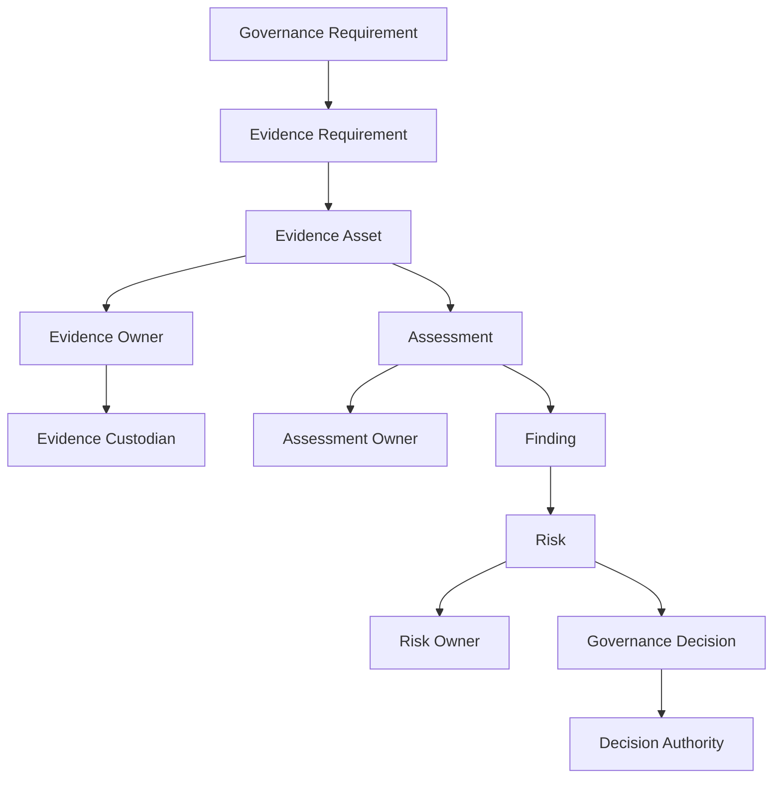
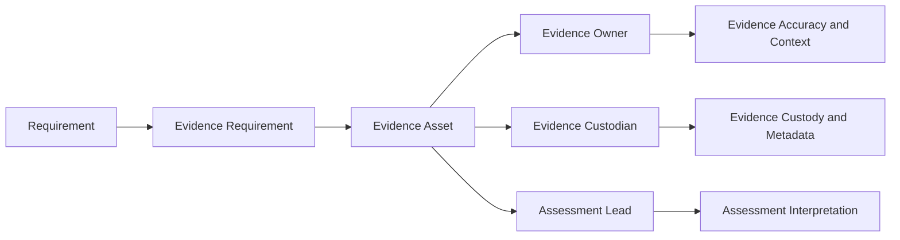
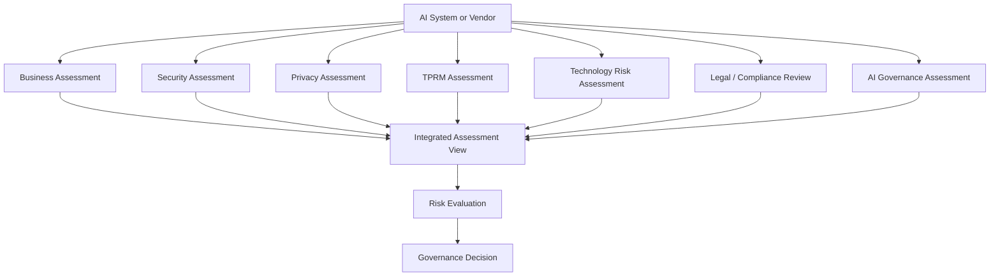
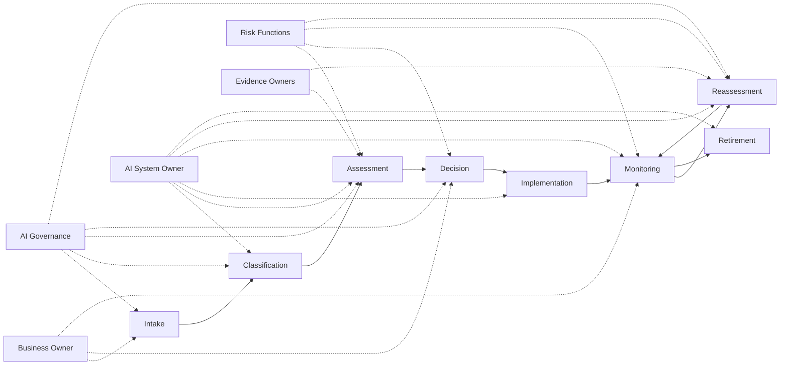
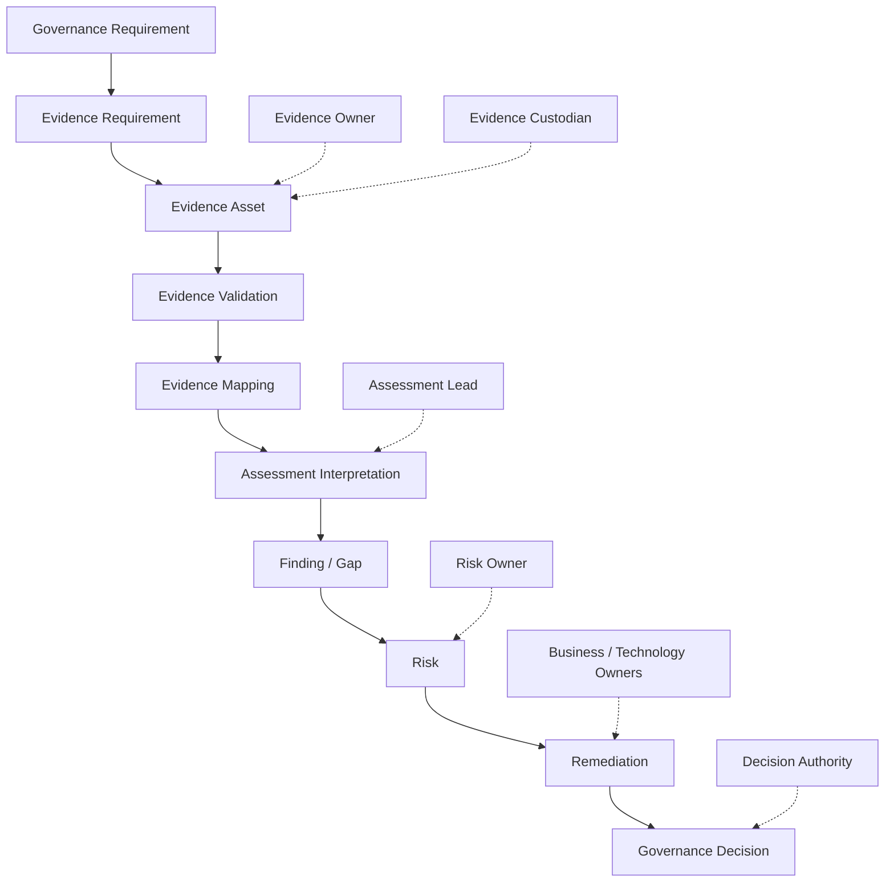

# Roles and Responsibilities

## NovaTide Logistics

> **Status:** Synthetic reference implementation
> **Purpose:** Define AI Governance roles, accountability, responsibilities, and decision rights for NovaTide Logistics
> **Relationship to ECF:** ECF requires clear accountability for evidence, assessments, findings, risks, and decisions. This document defines the organizational roles that provide that accountability.

---

## 1. Purpose

This document defines the roles and responsibilities supporting AI Governance at NovaTide Logistics.

The objective is to establish clear accountability across the AI governance lifecycle while preventing responsibility from becoming concentrated within a single function.

NovaTide's AI Governance Program operates across existing organizational functions, including:

* AI Governance
* Information Security
* Enterprise Risk Management
* Technology Risk
* Third-Party Risk Management
* Privacy
* Legal and Compliance
* Procurement
* Business Operations
* Technology
* Internal Audit

The operating model distinguishes four accountability concepts that are particularly important to ECF:

> **Evidence Ownership ≠ Assessment Ownership ≠ Risk Ownership ≠ Decision Authority**

A person or function may hold more than one responsibility in a particular scenario, but the responsibilities should remain conceptually distinct.

---

## 2. Accountability Model

NovaTide uses the following accountability model.

### 2.1 Evidence Owner

The **Evidence Owner** is accountable for the substantive accuracy, applicability, and continued validity of an evidence asset within its area of responsibility.

The Evidence Owner does not necessarily store the evidence or perform the assessment that consumes it.

### 2.2 Evidence Custodian

The **Evidence Custodian** manages the controlled storage, metadata, access, retention, and retrieval of evidence.

The Evidence Custodian does not become the substantive owner of the evidence merely by maintaining the repository.

### 2.3 Assessment Owner

The **Assessment Owner** is accountable for determining whether available evidence sufficiently supports the applicable assessment requirement.

The Assessment Owner is responsible for interpretation within the assessment context.

### 2.4 Risk Owner

The **Risk Owner** is accountable for managing the identified risk and determining, within delegated authority, whether the risk should be treated, transferred, mitigated, or accepted.

The Risk Owner is not necessarily the person who identified the risk.

### 2.5 Decision Authority

The **Decision Authority** is the individual or governance body authorized to make the relevant governance decision.

The Decision Authority considers the assessment, evidence, findings, risks, and recommendations but does not automatically inherit ownership of those underlying items.

---

## 3. Role Inventory

NovaTide's AI Governance operating model includes the following primary roles.

| Role                                          | Primary Accountability                                               |
| --------------------------------------------- | -------------------------------------------------------------------- |
| AI Governance Lead                            | Coordinates the AI Governance Program                                |
| AI Governance Committee                       | Provides cross-functional governance and material decision oversight |
| CISO / Information Security                   | Information security governance and security risk                    |
| Enterprise Risk                               | Enterprise risk methodology and risk aggregation                     |
| Technology Risk                               | Technology risk assessment and oversight                             |
| TPRM                                          | Third-party risk assessment and vendor governance                    |
| Privacy                                       | Privacy risk and privacy assessment                                  |
| Legal / Compliance                            | Legal interpretation and compliance obligations                      |
| Procurement                                   | Commercial and sourcing governance                                   |
| Business Owner                                | Business accountability for the AI use case                          |
| Technology Owner                              | Technical accountability for the supporting environment              |
| AI System Owner                               | Operational accountability for the AI system                         |
| Vendor Manager                                | Day-to-day vendor relationship management                            |
| Evidence Owner                                | Substantive accountability for evidence                              |
| Evidence Custodian / Repository Administrator | Evidence repository administration                                   |
| Assessment Lead                               | Coordination and execution of an assessment                          |
| Internal Audit                                | Independent assurance                                                |

These roles may be performed by different individuals or combined in smaller organizational environments, provided conflicts of interest and accountability gaps are appropriately managed.

---

# 4. AI Governance Lead

## Role Purpose

The AI Governance Lead manages the AI Governance Program and coordinates governance activities across organizational functions.

The role provides the operating connection between AI governance requirements, business and technology stakeholders, risk functions, and the AI Governance Committee.

## Core Responsibilities

* Maintain the AI Governance Program.
* Define and maintain AI governance processes.
* Coordinate AI governance intake.
* Coordinate AI inventory processes.
* Facilitate AI risk classification.
* Coordinate cross-functional assessments.
* Establish governance requirements.
* Coordinate AI Governance Committee activities.
* Monitor material AI governance issues.
* Coordinate reporting.
* Identify governance process gaps.
* Support governance escalation.
* Maintain alignment between AI governance and enterprise governance.

## Decision Rights

The AI Governance Lead may:

* Determine whether a proposed use case enters the AI governance workflow.
* Coordinate required assessments.
* Request additional evidence.
* Escalate unresolved governance issues.
* Recommend governance decisions.

The AI Governance Lead does not automatically have authority to:

* Accept enterprise risk
* Override Information Security conclusions
* Override Privacy conclusions
* Provide legal interpretations
* Approve contractual terms
* Approve every AI deployment

## Evidence Responsibilities

* Define evidence expectations for AI governance processes.
* Coordinate evidence requirements.
* Support evidence mapping.
* Monitor evidence gaps.
* Ensure evidence limitations are visible to decision-makers.

## Assessment Responsibilities

* Coordinate cross-functional assessments.
* Track assessment status.
* Ensure appropriate subject-matter functions participate.
* Consolidate assessment outcomes without overriding functional conclusions.

## Risk Responsibilities

* Facilitate identification and escalation of AI risks.
* Coordinate risk reporting.
* Ensure material risks reach the appropriate risk owner.

## Escalation Responsibilities

Escalate matters where:

* Risk exceeds delegated authority.
* Material evidence gaps remain.
* Functions disagree on a material issue.
* Potentially prohibited or unacceptable use is identified.
* Material governance decisions require committee or executive attention.

---

# 5. AI Governance Committee

## Role Purpose

The AI Governance Committee provides cross-functional oversight and decision-making for material AI-related matters.

## Core Responsibilities

* Review material AI use cases.
* Review higher-risk AI systems.
* Review significant governance gaps.
* Review material exceptions.
* Consider risk acceptance recommendations.
* Resolve cross-functional governance issues where appropriate.
* Escalate matters requiring executive attention.
* Provide governance direction.

## Decision Rights

The committee may, within its delegated authority:

* Approve or reject material AI use cases.
* Require additional assessment.
* Require remediation before deployment.
* Require compensating controls.
* Escalate material risk.
* Approve designated exceptions.
* Recommend or authorize risk acceptance where delegated.

The committee does not replace the accountable owner of the AI system, vendor, evidence, assessment, or risk.

## Evidence Responsibilities

* Review material evidence supporting governance decisions.
* Consider evidence limitations.
* Require additional evidence where necessary.

## Assessment Responsibilities

* Review assessment outcomes.
* Challenge significant conclusions where appropriate.
* Request additional analysis.

## Risk Responsibilities

* Review material AI risks.
* Challenge risk treatment recommendations.
* Consider residual risk and risk acceptance.

## Escalation Responsibilities

Escalate matters exceeding committee authority to the appropriate executive or enterprise governance body.

---

# 6. CISO / Information Security

## Role Purpose

The CISO and Information Security function provide security governance and oversight for AI systems, services, vendors, and supporting technology.

## Core Responsibilities

* Establish information security requirements.
* Conduct or oversee security assessments.
* Evaluate AI-related security risks.
* Review vendor security evidence.
* Assess security architecture where required.
* Establish security controls.
* Monitor significant security risks.
* Support incident response.
* Escalate material security concerns.

## Decision Rights

Information Security may determine whether security requirements have been adequately addressed within its delegated authority.

Information Security does not automatically determine overall AI business approval.

## Evidence Responsibilities

* Own or maintain security-related evidence within its mandate.
* Validate security evidence where appropriate.
* Define security evidence requirements.
* Assess the scope and currency of vendor security evidence.

## Assessment Responsibilities

* Own security assessment conclusions.
* Identify security findings.
* Recommend security remediation.

## Risk Responsibilities

* Identify and assess information security risk.
* Escalate material security risks.
* Provide security risk input to enterprise risk decisions.

---

# 7. Enterprise Risk

## Role Purpose

Enterprise Risk provides the enterprise risk methodology, aggregation, challenge, and oversight required to integrate AI risks into NovaTide's broader risk management environment.

## Core Responsibilities

* Maintain enterprise risk methodology.
* Establish risk assessment expectations.
* Support aggregation of AI-related risks.
* Challenge risk assessments where appropriate.
* Monitor material enterprise risk exposure.
* Support risk reporting.
* Escalate risks exceeding risk appetite.

## Decision Rights

Enterprise Risk may provide independent risk challenge and determine whether risk processes have been appropriately followed.

Risk acceptance remains with the designated Risk Owner or delegated authority unless organizational policy assigns otherwise.

## Evidence Responsibilities

* Define evidence expectations for risk assessments.
* Maintain risk-related governance records.

## Assessment Responsibilities

* Provide risk methodology and challenge.
* Review material risk assessments.

## Risk Responsibilities

* Support enterprise-level risk identification and aggregation.
* Challenge risk ratings and treatment where appropriate.

---

# 8. Technology Risk

## Role Purpose

Technology Risk provides independent oversight of technology-related risks associated with AI systems and their supporting environments.

## Core Responsibilities

* Assess technology risk.
* Evaluate technology dependencies.
* Review control effectiveness.
* Identify technology resilience concerns.
* Coordinate with Information Security and Technology.
* Support risk reporting.

## Evidence Responsibilities

* Define technology-risk evidence requirements.
* Evaluate technical evidence within scope.
* Maintain technology-risk assessment records.

## Assessment Responsibilities

* Lead or support technology-risk assessments.
* Document technology-related findings.

## Risk Responsibilities

* Identify technology risks.
* Recommend treatment.
* Escalate material technology risks.

---

# 9. Third-Party Risk Management

## Role Purpose

TPRM manages third-party risk associated with vendors that provide services to NovaTide.

AI vendor governance is integrated into the existing TPRM operating model.

## Core Responsibilities

* Identify material vendors.
* Assess vendor criticality.
* Conduct vendor risk assessments.
* Evaluate vendor security and operational evidence.
* Review subcontractor and subprocessor dependencies.
* Monitor vendor risk.
* Coordinate vendor remediation.
* Support vendor reassessment.

## Decision Rights

TPRM may determine the vendor risk assessment outcome within its delegated authority.

TPRM does not independently approve the business use of an AI capability unless specifically delegated.

## Evidence Responsibilities

* Define TPRM evidence requirements.
* Validate vendor evidence within scope.
* Maintain vendor assessment records.
* Identify evidence gaps.

## Assessment Responsibilities

* Own TPRM assessment conclusions.
* Coordinate relevant vendor assessments.

## Risk Responsibilities

* Identify third-party risks.
* Recommend vendor risk treatment.
* Escalate material vendor risks.

---

# 10. Privacy

## Role Purpose

Privacy provides governance and oversight for privacy risks associated with AI systems and services.

## Core Responsibilities

* Assess AI-related privacy implications.
* Review data processing activities.
* Evaluate personal information handling.
* Assess privacy risks.
* Review relevant vendor privacy practices.
* Advise on data minimization and appropriate use.
* Support privacy incident management.

## Decision Rights

Privacy may determine whether privacy requirements have been adequately addressed within its delegated authority.

Privacy conclusions should remain distinct from broader AI approval decisions.

## Evidence Responsibilities

* Define privacy evidence requirements.
* Review privacy documentation.
* Validate relevant privacy evidence.

## Assessment Responsibilities

* Own privacy assessment conclusions.
* Identify privacy findings.

## Risk Responsibilities

* Identify privacy risks.
* Recommend privacy risk treatment.
* Escalate material privacy concerns.

---

# 11. Legal / Compliance

## Role Purpose

Legal and Compliance provide legal interpretation, regulatory analysis, contractual guidance, and compliance oversight.

## Core Responsibilities

* Identify applicable legal and regulatory considerations.
* Interpret contractual obligations.
* Review AI-related contractual terms.
* Advise on regulatory exposure.
* Support assessment of potentially restricted use cases.
* Advise on intellectual property considerations.
* Support regulatory change management.

## Decision Rights

Legal provides legal interpretation within its professional mandate.

Compliance provides compliance guidance within its organizational mandate.

Neither function automatically owns the business decision to deploy an AI system.

## Evidence Responsibilities

* Define legal or compliance evidence requirements where applicable.
* Maintain relevant legal and compliance records.

## Assessment Responsibilities

* Lead legal or compliance reviews where required.
* Document legal and compliance conclusions.

## Risk Responsibilities

* Identify legal and compliance risks.
* Escalate material regulatory or contractual concerns.

---

# 12. Procurement

## Role Purpose

Procurement manages sourcing and commercial processes associated with AI vendors.

## Core Responsibilities

* Coordinate vendor sourcing.
* Support vendor due diligence.
* Manage commercial negotiations.
* Coordinate contract workflows.
* Ensure required governance functions participate in procurement.
* Maintain vendor commercial records.
* Support vendor onboarding and termination.

## Decision Rights

Procurement may manage commercial decisions within delegated authority.

Procurement does not independently determine AI security, privacy, or enterprise risk acceptance.

## Evidence Responsibilities

* Maintain procurement and contractual records.
* Provide relevant vendor documentation to governance functions.

## Assessment Responsibilities

* Coordinate vendor due diligence activities.
* Track completion of required reviews.

## Risk Responsibilities

* Identify procurement and commercial risks.
* Escalate material contractual concerns.

---

# 13. Business Owner

## Role Purpose

The Business Owner is accountable for the business purpose, value, and operational consequences of an AI use case.

## Core Responsibilities

* Define intended business use.
* Sponsor the AI use case.
* Identify business requirements.
* Confirm expected business outcomes.
* Ensure appropriate business resources.
* Participate in risk assessment.
* Support remediation.
* Monitor business impact.
* Ensure the AI system remains aligned with its intended purpose.

## Decision Rights

The Business Owner may:

* Sponsor the use case.
* Request deployment.
* Recommend continued use.
* Recommend retirement.

Approval remains subject to applicable governance requirements and delegated authority.

## Evidence Responsibilities

* Provide business-context evidence.
* Confirm business process information.
* Validate evidence relating to intended use.

## Assessment Responsibilities

* Participate in business impact assessment.
* Provide information required for assessment.

## Risk Responsibilities

* Identify business risks.
* Support risk treatment.
* Own business risks where formally assigned.

---

# 14. Technology Owner

## Role Purpose

The Technology Owner is accountable for the technical environment supporting the AI system.

## Core Responsibilities

* Maintain technical architecture.
* Implement technical controls.
* Manage system integration.
* Support security and resilience.
* Manage technical changes.
* Maintain technical documentation.
* Support monitoring and incident response.
* Coordinate technical remediation.

## Decision Rights

The Technology Owner may make technical implementation decisions within delegated authority.

Technical ownership does not automatically confer authority to approve business use.

## Evidence Responsibilities

* Maintain technical architecture and configuration evidence.
* Provide technical documentation.
* Support evidence validation.

## Assessment Responsibilities

* Participate in technical assessments.
* Address technical findings.

## Risk Responsibilities

* Identify technology risks.
* Implement technical mitigations.
* Support risk treatment.

---

# 15. AI System Owner

## Role Purpose

The AI System Owner is accountable for the operational governance of a specific AI system throughout its lifecycle.

## Core Responsibilities

* Maintain AI system information.
* Ensure intended use remains documented.
* Maintain system documentation.
* Coordinate AI lifecycle activities.
* Support risk classification.
* Coordinate required reassessments.
* Monitor material changes.
* Maintain system-level governance records.
* Coordinate remediation.

## Decision Rights

The AI System Owner may manage operational decisions within delegated authority.

The role does not automatically have authority to accept material enterprise risk or override governance requirements.

## Evidence Responsibilities

* Maintain system-specific evidence.
* Ensure evidence remains current.
* Notify governance functions of material changes.

## Assessment Responsibilities

* Coordinate system-level assessment activities.
* Respond to assessment requests.
* Track remediation.

## Risk Responsibilities

* Identify operational AI risks.
* Support risk treatment.
* Escalate material changes and incidents.

---

# 16. Vendor Manager

## Role Purpose

The Vendor Manager manages the operational relationship between NovaTide and an external AI or technology vendor.

## Core Responsibilities

* Maintain vendor relationship.
* Coordinate vendor communications.
* Track contractual obligations.
* Coordinate vendor requests.
* Monitor vendor performance.
* Track vendor changes.
* Coordinate reassessments.
* Escalate vendor issues.

## Evidence Responsibilities

* Obtain vendor evidence.
* Track evidence requests.
* Coordinate evidence updates.
* Provide evidence to the appropriate Evidence Owner or Assessment Lead.

The Vendor Manager is not automatically the Evidence Owner.

## Assessment Responsibilities

* Coordinate vendor responses.
* Track assessment requests.
* Support remediation activities.

## Risk Responsibilities

* Identify vendor relationship risks.
* Escalate material vendor changes.

---

# 17. Evidence Owner

## Role Purpose

The Evidence Owner is accountable for the substantive reliability and applicability of an evidence asset.

Evidence ownership should be assigned according to the subject matter and source of the evidence.

## Core Responsibilities

* Confirm evidence accuracy.
* Confirm evidence scope.
* Confirm applicability.
* Support evidence validation.
* Identify evidence limitations.
* Monitor material changes.
* Support evidence renewal.
* Confirm appropriate retention requirements.

## Decision Rights

The Evidence Owner may determine whether evidence remains substantively valid within the owner's area of responsibility.

The Evidence Owner does not automatically determine whether the evidence satisfies a specific assessment requirement.

That determination belongs to the relevant Assessment Owner.

## Assessment Responsibilities

* Provide evidence to assessments.
* Explain evidence context.
* Clarify limitations.

## Risk Responsibilities

Evidence Owners do not automatically own risks arising from assessment conclusions.

Risk ownership should be separately assigned.

---

# 18. Evidence Custodian / Repository Administrator

## Role Purpose

The Evidence Custodian manages the controlled repository and administrative lifecycle of evidence assets.

## Core Responsibilities

* Store evidence securely.
* Maintain evidence metadata.
* Manage access controls.
* Track versions.
* Support retention requirements.
* Manage evidence retrieval.
* Support evidence disposition.
* Maintain repository integrity.
* Support evidence lineage.

## Decision Rights

The Evidence Custodian may enforce repository administration requirements.

The role does not determine:

* Whether evidence is substantively accurate
* Whether evidence satisfies a requirement
* Whether a risk should be accepted
* Whether an AI system should be approved

## Evidence Responsibilities

The Evidence Custodian is accountable for evidence custody, not substantive evidence ownership.

This distinction is essential.

---

# 19. Assessment Lead

## Role Purpose

The Assessment Lead coordinates and, where appropriate, performs an assessment against defined governance requirements.

## Core Responsibilities

* Define assessment scope.
* Identify applicable requirements.
* Identify evidence requirements.
* Coordinate evidence collection.
* Review evidence.
* Document assessment interpretation.
* Identify findings and gaps.
* Document limitations.
* Coordinate assessment review.
* Issue assessment conclusions.

## Decision Rights

The Assessment Lead may determine assessment conclusions within the defined assessment methodology and delegated authority.

The Assessment Lead does not automatically own the underlying risk or final governance decision.

## Evidence Responsibilities

* Determine whether available evidence is relevant to the assessment.
* Evaluate evidence scope and quality.
* Document evidence limitations.
* Identify additional evidence requirements.

## Risk Responsibilities

* Identify risks resulting from assessment findings.
* Provide risk input to the appropriate Risk Owner.

---

# 20. Internal Audit

## Role Purpose

Internal Audit provides independent assurance over governance processes, controls, and risk management.

## Core Responsibilities

* Evaluate governance design and effectiveness.
* Assess control effectiveness.
* Review evidence governance processes.
* Test selected governance activities.
* Report deficiencies.
* Provide independent assurance.
* Track audit remediation.

## Decision Rights

Internal Audit provides independent assurance and recommendations.

It should not become the operational owner of the controls or governance processes it audits.

## Evidence Responsibilities

* Obtain and evaluate audit evidence.
* Maintain audit workpapers.
* Assess evidence sufficiency for audit purposes.

## Assessment Responsibilities

Internal Audit conducts independent assurance activities rather than serving as the operational owner of management assessments.

## Risk Responsibilities

* Identify audit observations.
* Communicate risk implications.
* Escalate significant findings through established audit governance.

---

# 21. Responsibility Boundaries

Several responsibility boundaries are deliberately maintained.

## 21.1 Evidence Ownership vs Evidence Custody

| Responsibility                  | Evidence Owner | Evidence Custodian |
| ------------------------------- | -------------: | -----------------: |
| Substantive accuracy            |            Yes |                 No |
| Business / technical context    |            Yes |                 No |
| Scope confirmation              |            Yes |            Support |
| Repository storage              |             No |                Yes |
| Metadata administration         |        Support |                Yes |
| Access administration           |             No |                Yes |
| Retention administration        |        Support |                Yes |
| Evidence retrieval              |        Support |                Yes |
| Evidence validity determination |            Yes |                 No |

The person storing an evidence asset does not automatically become accountable for its substantive accuracy.

---

## 21.2 Evidence Ownership vs Assessment Ownership

| Responsibility                         | Evidence Owner | Assessment Owner |
| -------------------------------------- | -------------: | ---------------: |
| Maintain source evidence               |            Yes |               No |
| Confirm evidence context               |            Yes |          Support |
| Determine requirement applicability    |             No |              Yes |
| Interpret evidence against requirement |             No |              Yes |
| Determine evidence sufficiency         |        Support |              Yes |
| Identify assessment gap                |             No |              Yes |
| Maintain assessment conclusion         |             No |              Yes |

An Evidence Owner provides evidence.

The Assessment Owner determines how that evidence should be interpreted within the assessment context.

---

## 21.3 Assessment Ownership vs Risk Ownership

| Responsibility                  | Assessment Owner |            Risk Owner |
| ------------------------------- | ---------------: | --------------------: |
| Conduct assessment              |              Yes |               Support |
| Document finding                |              Yes |               Support |
| Determine assessment conclusion |              Yes |                    No |
| Evaluate business consequence   |          Support |                   Yes |
| Determine risk treatment        |        Recommend |                   Yes |
| Monitor remediation             |          Support |                   Yes |
| Accept risk                     |               No | Yes, within authority |
| Escalate risk                   |          Support |                   Yes |

An Assessment Owner may identify a significant risk without becoming the Risk Owner.

---

## 21.4 Risk Ownership vs Decision Authority

| Responsibility               |        Risk Owner |  Decision Authority |
| ---------------------------- | ----------------: | ------------------: |
| Own risk                     |               Yes |                  No |
| Recommend treatment          |               Yes |            Consider |
| Accept risk within authority | Yes, if delegated | Yes, where required |
| Approve AI use               |   Not necessarily |                 Yes |
| Require remediation          |         Recommend |                 Yes |
| Escalate beyond authority    |               Yes |                 Yes |
| Determine governance outcome |             Input |                 Yes |

A governance committee may decide whether an AI system can proceed while the underlying risk remains owned by an accountable business or risk owner.

---

# 22. AI Governance RACI

The following RACI matrix provides an illustrative responsibility model for NovaTide.

**RACI definitions**

* **R — Responsible:** Performs or coordinates the activity.
* **A — Accountable:** Ultimately accountable for the outcome.
* **C — Consulted:** Provides subject-matter input.
* **I — Informed:** Receives relevant information.

> The matrix is illustrative. Actual delegation should be aligned with NovaTide's organizational authority structure.

| Activity                        | AI Gov. Lead | AI Gov. Committee | Business Owner | AI System Owner | Technology Owner | InfoSec | TPRM | Privacy | Legal / Compliance | Enterprise Risk | Evidence Owner | Assessment Lead | Internal Audit |
| ------------------------------- | -----------: | ----------------: | -------------: | --------------: | ---------------: | ------: | ---: | ------: | -----------------: | --------------: | -------------: | --------------: | -------------: |
| AI Governance Program           |          A/R |                 I |              C |               I |                C |       C |    C |       C |                  C |               C |              I |               I |              I |
| AI Use Case Intake              |          A/R |                 I |              R |               C |                C |       C |    C |       C |                  C |               I |              I |               I |              I |
| AI Inventory                    |            A |                 I |              R |               R |                C |       C |    C |       C |                  C |               I |              I |               I |              I |
| AI Risk Classification          |          A/R |                 I |              C |               C |                C |       C |    C |       C |                  C |               C |              I |               C |              I |
| Business Impact Assessment      |            C |                 I |            A/R |               R |                C |       C |    C |       C |                  C |               C |              C |               R |              I |
| Security Assessment             |            C |                 I |              C |               C |                C |     A/R |    C |       I |                  I |               C |              C |               R |              I |
| TPRM Assessment                 |            C |                 I |              C |               C |                C |       C |  A/R |       C |                  C |               C |              C |               R |              I |
| Privacy Assessment              |            C |                 I |              C |               C |                C |       C |    C |     A/R |                  C |               C |              C |               R |              I |
| Legal / Compliance Review       |            C |                 I |              C |               C |                C |       C |    C |       C |                A/R |               C |              C |               R |              I |
| Evidence Requirement Definition |            A |                 I |              C |               C |                C |       C |    C |       C |                  C |               C |              C |               R |              I |
| Evidence Collection             |            A |                 I |              R |               R |                R |       R |    R |       R |                  R |               C |            A/R |               R |              I |
| Evidence Validation             |            A |                 I |              C |               C |                C |       R |    R |       R |                  R |               C |            A/R |               R |              I |
| Evidence Mapping                |            A |                 I |              C |               C |                C |       C |    C |       C |                  C |               C |              C |             A/R |              I |
| Assessment Interpretation       |            A |                 I |              C |               C |                C |       C |    C |       C |                  C |               C |              C |             A/R |              I |
| Finding Identification          |            A |                 I |              C |               C |                C |       R |    R |       R |                  R |               C |              C |             A/R |              I |
| Risk Assessment                 |            C |                 I |              C |               C |                C |       C |    C |       C |                  C |             A/R |              C |               R |              I |
| Risk Treatment                  |            C |                 I |            A/R |               R |                R |       R |    R |       R |                  C |               C |              C |               C |              I |
| Risk Acceptance                 |            C |                 A |              R |               C |                C |       C |    C |       C |                  C |               C |              I |               C |              I |
| AI Governance Decision          |            R |                 A |              C |               C |                C |       C |    C |       C |                  C |               C |              I |               C |              I |
| Exception Approval              |            R |                 A |              C |               C |                C |       C |    C |       C |                  C |               C |              I |               C |              I |
| Ongoing Monitoring              |            A |                 I |              R |               R |                R |       R |    R |       R |                  C |               C |              C |               C |              I |
| Material Change Reassessment    |          A/R |                 I |              R |               R |                R |       C |    C |       C |                  C |               C |              C |               R |              I |
| Governance Reporting            |          A/R |                 I |              C |               C |                C |       C |    C |       C |                  C |               C |              I |               C |              I |
| Independent Assurance           |            I |                 I |              I |               I |                I |       C |    C |       C |                  C |               C |              I |               C |            A/R |

---

# 23. Evidence Responsibility Model

The ECF implementation requires evidence responsibilities to remain explicit.

A simplified evidence accountability chain is:

### Evidence Owner

Accountable for the substantive evidence.

### Evidence Custodian

Accountable for controlled custody and repository administration.

### Assessment Lead

Accountable for interpreting the evidence within the assessment.

### Risk Owner

Accountable for the resulting risk.

### Decision Authority

Accountable for the governance decision.

These responsibilities should not be collapsed simply because a small organization may assign multiple roles to one individual.

---

# 24. Assessment Responsibility Model

Assessments should remain aligned to the relevant subject-matter authority.

The integrated assessment view should consolidate conclusions without erasing the ownership and methodology of individual assessments.

---

# 25. Risk Responsibility Model

Risk ownership should be assigned based on the nature and organizational location of the risk.

Examples include:

| Risk                             | Potential Risk Owner                         |
| -------------------------------- | -------------------------------------------- |
| Business process risk            | Business Owner                               |
| AI operational risk              | AI System Owner / Business Owner             |
| Information security risk        | Designated Security Risk Owner               |
| Technology risk                  | Technology Risk Owner                        |
| Vendor risk                      | Designated Business / Vendor Risk Owner      |
| Privacy risk                     | Designated Privacy Risk Owner                |
| Legal / regulatory risk          | Appropriate Business or Executive Risk Owner |
| Enterprise-level aggregated risk | Designated Enterprise Risk Owner             |

The specific Risk Owner should be determined according to NovaTide's enterprise risk management policy.

AI Governance does not automatically become the owner of every AI-related risk.

---

# 26. Decision Authority Model

Decision authority should be proportionate to the significance of the AI use case and risk.

| Decision Type                              | Illustrative Authority                             |
| ------------------------------------------ | -------------------------------------------------- |
| Low-impact operational AI use              | Delegated Business Authority                       |
| Moderate-risk AI use                       | Business + Relevant Governance Functions           |
| High-impact / material AI use              | AI Governance Committee                            |
| Potentially unacceptable or prohibited use | Executive / Legal / Risk Review                    |
| Material risk acceptance                   | Authorized Risk Owner / Executive Authority        |
| Material exception                         | AI Governance Committee or Delegated Authority     |
| Enterprise-level risk                      | Appropriate Executive / Enterprise Governance Body |

The exact thresholds are organizational decisions and should be aligned with NovaTide's risk appetite and delegation framework.

---

# 27. Escalation Responsibilities

Escalation should occur when a matter exceeds an individual's authority, risk tolerance, or functional mandate.

### AI Governance Lead

Escalates:

* Cross-functional disputes
* Material evidence gaps
* Unresolved governance issues
* High-risk AI use cases

### Functional Risk Owners

Escalate:

* Risks exceeding delegated authority
* Material unresolved findings
* Significant control deficiencies

### Business Owner

Escalates:

* Material business impacts
* Significant changes in intended use
* Business decisions exceeding delegated authority

### AI System Owner

Escalates:

* Material system changes
* Significant incidents
* Unexpected AI behavior
* Loss of required controls

### TPRM / Vendor Manager

Escalate:

* Material vendor changes
* Security incidents
* Subprocessor changes
* Contractual breaches
* Service continuity concerns

### AI Governance Committee

Escalates:

* Matters exceeding committee authority
* Enterprise-level risks
* Significant legal or regulatory concerns
* Potentially unacceptable uses

---

# 28. Role Interaction Across the AI Lifecycle

The roles interact throughout the AI lifecycle.

The diagram illustrates coordination rather than a rigid workflow.

Actual participation depends on the risk and characteristics of the AI system.

---

# 29. Role Separation and Conflict Management

NovaTide should avoid unnecessary concentration of governance responsibilities where doing so could weaken independent challenge.

Examples include:

* The Evidence Custodian should not certify the substantive validity of evidence solely because it is stored in the repository.
* The Assessment Lead should not automatically accept the risk resulting from its own findings.
* Internal Audit should not own the controls it independently audits.
* The Vendor Manager should not independently determine security or privacy sufficiency.
* Procurement should not independently approve security or privacy risk.
* AI Governance should not automatically own every AI risk.
* A Business Owner should not bypass required independent governance reviews solely because the business owns the use case.

Where organizational size requires role consolidation, the organization should document compensating review or approval mechanisms.

---

# 30. Minimum Viable Role Model

A smaller NovaTide implementation may combine some roles while preserving accountability boundaries.

For example:

| Minimum Function | Potentially Combined Responsibilities                  |
| ---------------- | ------------------------------------------------------ |
| AI Governance    | AI Governance Lead + Assessment Coordination           |
| Business         | Business Owner + AI System Owner                       |
| Technology       | Technology Owner + Technical Evidence Owner            |
| Risk             | Enterprise / Technology Risk                           |
| TPRM             | Vendor Risk + Vendor Management                        |
| Security         | Information Security + Security Assessment             |
| Privacy / Legal  | Existing organizational functions                      |
| Evidence         | Evidence Owner + Evidence Custodian, where appropriate |
| Governance       | AI Governance Committee                                |
| Assurance        | Internal Audit or independent reviewer                 |

The critical requirement is not the number of job titles.

The critical requirement is that accountability remains identifiable.

---

# 31. RACI Interpretation Guidance

The RACI model should be used as an accountability aid rather than as a substitute for organizational policy.

Where ambiguity exists:

1. Identify the activity.
2. Identify the accountable outcome.
3. Identify the function with the appropriate mandate.
4. Identify the responsible execution role.
5. Identify required subject-matter contributors.
6. Confirm decision authority.
7. Document exceptions where responsibilities are combined.

A RACI should not be used to imply that every participant has equal decision-making authority.

---

# 32. Relationship to ECF

ECF depends on clear separation between evidence, assessment, risk, and decision activities.

The roles defined in this document support the ECF lifecycle:

The model reinforces that:

* Evidence has an owner.
* Evidence has a custodian.
* Assessments have an owner.
* Findings have accountable owners.
* Risks have risk owners.
* Decisions have authorized decision-makers.

This separation supports traceability and reduces the risk of circular accountability.

---

# 33. Governance Accountability Principles

NovaTide applies the following principles to role design.

### 33.1 One Accountable Owner

Material activities should have a clearly identifiable accountable owner.

### 33.2 Subject-Matter Authority

Assessment conclusions should be owned by functions with the appropriate expertise and mandate.

### 33.3 Independent Challenge

Material decisions should receive appropriate challenge from functions independent of the originating business interest.

### 33.4 Evidence Accountability

Evidence ownership should remain connected to the source and substantive subject matter.

### 33.5 Risk Accountability

Risk should be assigned to a person or function with authority to manage or accept it.

### 33.6 Decision Accountability

Decision authority should be explicit and proportionate to risk.

### 33.7 Traceability

The organization should be able to determine who:

* Supplied the evidence
* Validated the evidence
* Interpreted the evidence
* Identified the finding
* Owned the risk
* Approved the decision

### 33.8 No Responsibility by Association

A role should not become accountable merely because it:

* Stores evidence
* Coordinates a meeting
* Receives an assessment
* Participates in a committee
* Provides administrative support

---

# 34. Summary

NovaTide's AI Governance operating model distributes accountability across business, technology, risk, governance, and assurance functions.

The most important accountability distinction is:

> **Evidence ownership, assessment ownership, risk ownership, and decision authority are separate concepts.**

The operating model therefore assigns:

* **Evidence Owners** responsibility for substantive evidence.
* **Evidence Custodians** responsibility for controlled evidence custody.
* **Assessment Leads** responsibility for assessment execution and interpretation.
* **Risk Owners** responsibility for managing and, where authorized, accepting risk.
* **Decision Authorities** responsibility for material governance decisions.
* **AI Governance** responsibility for coordinating the overall AI governance operating model.
* **Internal Audit** responsibility for independent assurance.

This structure allows NovaTide to coordinate governance without creating a single function responsible for every aspect of AI risk.

It also provides the accountability foundation required for ECF to operate as an evidence-centric governance model:

> **Requirement → Evidence → Validation → Mapping → Assessment → Finding → Risk → Decision**

The role model is therefore not merely an organizational chart. It establishes the accountability and decision boundaries necessary for evidence to remain traceable from its source through assessment and ultimately into governance decision-making.

