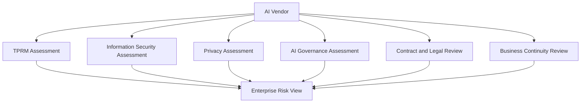
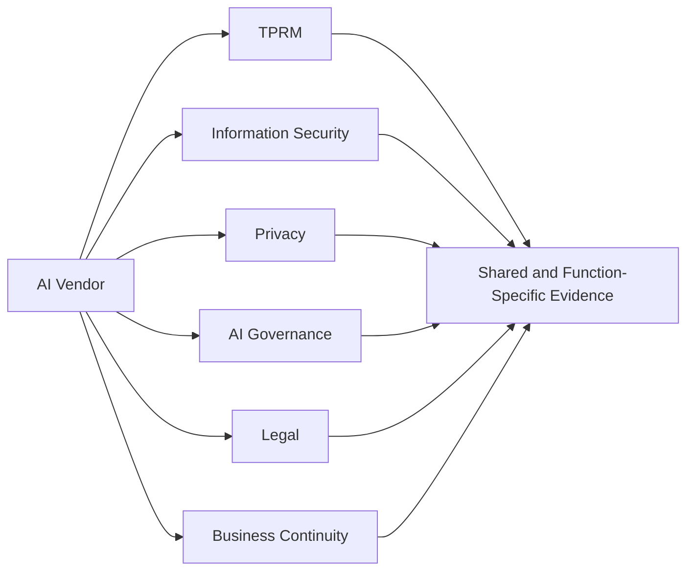
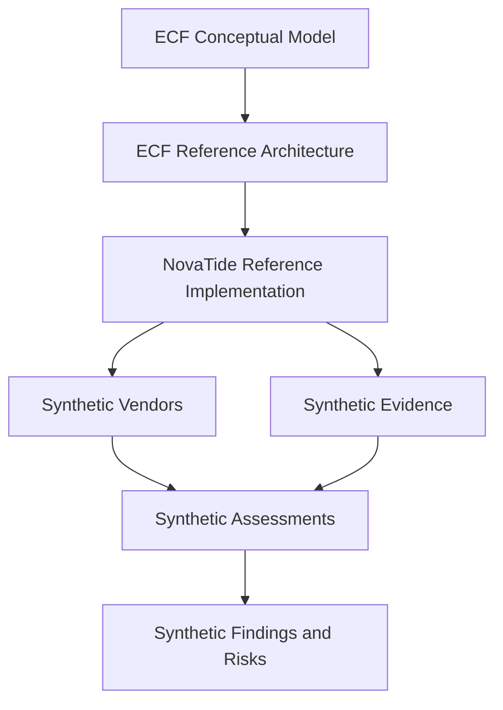
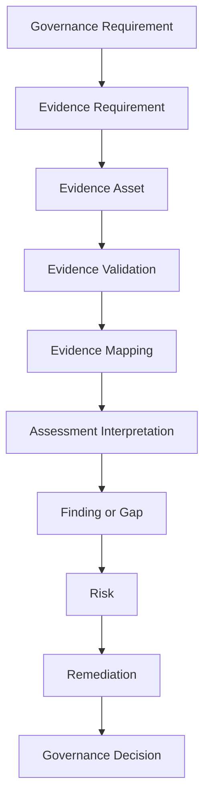

# Sample Organization

## NovaTide Logistics

> **Status:** Synthetic reference organization
> **Purpose:** ECF reference implementation
> **Industry:** Logistics and Supply Chain
> **Repository Context:** Evidence Convergence Framework (ECF)

---

## 1. Purpose

This document establishes the organizational context for the **NovaTide Logistics** reference implementation of the Evidence Convergence Framework (ECF).

NovaTide Logistics is a fictional mid-sized logistics and supply chain organization used to demonstrate how ECF concepts can operate within a realistic enterprise environment.

The organization provides the contextual foundation for subsequent implementation artifacts, including:

* AI Governance Program documentation
* Roles and responsibilities
* Vendor inventory
* AI vendor assessments
* Evidence requirements
* Evidence assets
* Evidence mappings
* Assessment findings
* Risk records
* Governance decisions

NovaTide is **not** intended to represent a real organization, regulatory filing, audited entity, or production implementation.

The purpose of the organization model is to demonstrate how an evidence-centric governance operating model can function within an enterprise that already has established risk, security, privacy, legal, compliance, procurement, and third-party governance processes.

---

## 2. Organization Profile

**NovaTide Logistics** is a fictional North American logistics and supply chain organization providing transportation, warehousing, shipment management, and related digital logistics services.

Its operating environment combines physical logistics operations with a technology-intensive service model.

### Illustrative Organization Profile

| Attribute                    | Illustrative Value                     |
| ---------------------------- | -------------------------------------- |
| Organization                 | NovaTide Logistics                     |
| Industry                     | Logistics and Supply Chain             |
| Operating Focus              | North America                          |
| Employees                    | Approximately 2,500                    |
| Annual Revenue               | Approximately $1.2 billion             |
| Major Business Functions     | Approximately 10                       |
| Critical Technology Services | Approximately 35                       |
| Material Third Parties       | Approximately 100                      |
| AI-Enabled Services          | Approximately 12                       |
| Higher-Risk AI Use Cases     | Approximately 4                        |
| Organizational Model         | Hybrid physical and digital operations |

All quantitative values in this document are synthetic and illustrative.

---

## 3. Business Context

NovaTide operates in an environment where operational continuity, shipment visibility, customer service, data availability, and third-party dependencies are important to business performance.

Illustrative business activities include:

* Freight transportation coordination
* Shipment management
* Warehouse operations
* Inventory coordination
* Route optimization
* Customer logistics services
* Supply chain analytics
* Carrier and supplier coordination
* Digital logistics operations
* Operational planning and forecasting

Technology is embedded throughout these activities. Business processes therefore depend on a combination of internally managed systems, cloud infrastructure, SaaS platforms, specialized logistics technologies, data providers, and managed services.

The resulting operating environment creates governance dependencies across:

* Information security
* Technology risk
* Third-party risk
* Privacy
* Legal and contractual obligations
* Business continuity
* AI governance
* Enterprise risk management

AI governance must therefore operate as part of the broader enterprise governance environment rather than as an isolated compliance function.

---

## 4. Organization Size

NovaTide is modeled as a **mid-sized enterprise** with sufficient organizational complexity to demonstrate cross-functional governance while remaining understandable as a portfolio reference implementation.

The illustrative organization includes:

* Approximately 2,500 employees
* Approximately $1.2 billion in annual revenue
* Approximately 10 major business functions
* Approximately 35 critical technology services
* Approximately 100 material third-party relationships

This scale creates realistic governance challenges without requiring the implementation to model every function, application, vendor, or control within a large multinational enterprise.

The reference implementation therefore uses representative examples rather than attempting to model NovaTide's entire enterprise.

---

## 5. Technology Environment

NovaTide operates a hybrid technology environment supporting both logistics operations and corporate functions.

### Illustrative Technology Domains

| Technology Domain                 | Illustrative Use                                             |
| --------------------------------- | ------------------------------------------------------------ |
| Cloud Infrastructure              | Hosting applications, workloads, analytics, and integrations |
| SaaS Applications                 | Business operations and corporate services                   |
| Transportation Management Systems | Shipment and transportation coordination                     |
| Warehouse Management Systems      | Warehouse operations and inventory processes                 |
| Customer-Facing Applications      | Customer interaction and shipment visibility                 |
| Data Analytics Platforms          | Operational and business analytics                           |
| Identity and Access Management    | Authentication and authorization                             |
| Security Monitoring               | Security detection, monitoring, and response                 |
| Collaboration Platforms           | Internal collaboration and communication                     |
| AI-Enabled Services               | Optimization, analytics, automation, and assistance          |
| Integration Platforms             | Data and system integration                                  |
| Managed Technology Services       | Outsourced infrastructure and technology operations          |

NovaTide's technology environment creates multiple points at which third-party services and AI capabilities may interact with organizational information and business processes.

---

## 6. AI Adoption Context

NovaTide is progressively adopting AI-enabled technologies across operational, customer-facing, analytical, and corporate functions.

Illustrative AI-enabled use cases include:

* Route and shipment optimization
* AI-assisted customer support
* Predictive demand and operational analytics
* Warehouse forecasting and optimization
* Fraud and anomaly detection
* Document classification and extraction
* Generative AI assistants
* AI-assisted software development
* Risk analysis and decision support

AI capabilities may be:

1. Developed internally.
2. Embedded within existing enterprise applications.
3. Procured as standalone SaaS capabilities.
4. Provided through external AI vendors.
5. Delivered through cloud or platform services.
6. Integrated through downstream applications or managed services.

This creates a need to understand not only the AI system itself, but also the surrounding service, data, vendor, infrastructure, and dependency relationships.

---

## 7. AI Risk Context

NovaTide recognizes that AI-related risk extends beyond traditional information security considerations.

Relevant risk dimensions may include:

| Risk Dimension          | Illustrative Concern                                             |
| ----------------------- | ---------------------------------------------------------------- |
| Information Security    | Unauthorized access, compromise, or insecure AI integration      |
| Data Privacy            | Processing or disclosure of personal information                 |
| Operational Risk        | AI failure affecting logistics or business operations            |
| Third-Party Risk        | Dependence on external AI providers                              |
| Model Risk              | Inaccurate, unstable, or inappropriate model behavior            |
| Output Reliability      | Incorrect or misleading AI-generated results                     |
| Bias and Fairness       | Potentially inappropriate or discriminatory outcomes             |
| Human Oversight         | Insufficient human review of consequential outputs               |
| Intellectual Property   | Use, retention, or disclosure of protected information           |
| Regulatory Risk         | Applicable legal or regulatory obligations                       |
| Customer Impact         | Harm arising from inaccurate or inappropriate AI outputs         |
| Business Continuity     | Dependency on AI services for critical operations                |
| Vendor Concentration    | Excessive dependency on a limited provider set                   |
| Fourth-Party Dependency | Risks arising from vendor subprocessors and downstream providers |

The significance of each risk dimension depends on the particular AI use case, service, data, business process, and third-party relationship.

ECF does not determine the risk of an AI system by itself. It provides an evidence operating model that supports the assessment and governance processes used to evaluate that risk.

---

## 8. Third-Party Dependency

NovaTide relies on third parties across its technology and business environment.

Illustrative third-party categories include:

* Cloud providers
* SaaS providers
* Logistics technology providers
* Data providers
* Security vendors
* Managed service providers
* AI vendors
* Consulting providers
* Infrastructure providers
* Specialized technology vendors
* Fourth-party and subprocessor dependencies

Third-party dependencies can introduce risk through:

* Access to organizational information
* Processing of customer information
* Reliance on external infrastructure
* Dependence on vendor personnel
* Subprocessor relationships
* Geographic data transfers
* Service availability
* Contractual limitations
* Concentration risk
* Changes to vendor technology or operating models

AI vendors may therefore require governance across multiple enterprise processes.

---

## 9. TPRM Context

NovaTide maintains a Third-Party Risk Management (TPRM) capability for evaluating material third parties.

Illustrative TPRM considerations include:

* Business criticality
* Data sensitivity
* Service criticality
* Information security risk
* Operational dependency
* Regulatory exposure
* Business continuity
* Subprocessor dependency
* Geographic considerations
* AI involvement

A material AI vendor may participate in multiple governance processes.

These assessments may require overlapping evidence.

However, similar evidence does not necessarily mean that the underlying requirements are equivalent.

For example, a vendor's security certification, privacy documentation, model documentation, contractual commitment, and operational testing may each provide different forms of assurance.

ECF is intended to help NovaTide identify legitimate evidence reuse while preserving the distinction between:

* Evidence
* Requirement
* Interpretation
* Assurance
* Risk
* Decision

---

## 10. Governance Environment

NovaTide's governance environment includes established enterprise functions responsible for different aspects of organizational risk.

Relevant functions include:

* Enterprise Risk Management
* Information Security
* Technology Risk
* Third-Party Risk Management
* Privacy
* Compliance
* Legal
* Procurement
* Internal Audit
* AI Governance
* Business Owners
* Technology Owners

AI governance is therefore designed to coordinate with existing governance capabilities rather than replace them.

The operating model assumes that different functions retain their respective mandates, expertise, and decision rights.

---

## 11. AI Governance Context

NovaTide is establishing a structured **AI Governance Program** to coordinate governance activities associated with AI systems and AI-enabled services.

The AI Governance Program provides an organizational mechanism for:

* Identifying AI use cases
* Maintaining an AI inventory
* Classifying AI risk
* Coordinating assessments
* Establishing governance requirements
* Monitoring AI-related risks
* Managing findings and remediation
* Escalating material issues
* Supporting governance decisions
* Coordinating evidence across governance functions

The AI Governance Program does **not** replace:

* Third-Party Risk Management
* Information Security
* Privacy
* Legal
* Compliance
* Enterprise Risk Management
* Internal Audit

Instead, the program establishes coordination mechanisms across these functions.

---

## 12. AI Governance Committee

NovaTide uses an **AI Governance Committee** for material AI-related governance decisions.

The committee provides cross-functional oversight for matters that exceed the authority or risk tolerance of individual operational functions.

Illustrative committee responsibilities include:

* Reviewing material AI use cases
* Reviewing higher-risk AI deployments
* Considering unresolved governance gaps
* Reviewing material exceptions
* Reviewing significant AI-related risks
* Evaluating risk acceptance recommendations
* Escalating matters requiring executive attention
* Providing cross-functional governance direction

The committee is a governance decision-making body. It is not the owner of every AI system, assessment, evidence asset, or risk.

Decision authority remains aligned to organizational delegation, risk appetite, legal requirements, and established enterprise governance structures.

---

## 13. AI Risk Tiering

NovaTide uses a conceptual AI risk-tiering model to determine the degree of governance attention appropriate for an AI use case.

| Tier   | Description                                | Illustrative Treatment                         |
| ------ | ------------------------------------------ | ---------------------------------------------- |
| Tier 1 | Low-impact AI use                          | Standard governance                            |
| Tier 2 | Moderate business or operational impact    | Enhanced assessment                            |
| Tier 3 | High-impact or material risk               | Comprehensive assessment and governance review |
| Tier 4 | Potentially unacceptable or prohibited use | Executive, legal, and risk review              |

Risk tiering is contextual.

The tier assigned to an AI use case may depend on factors such as:

* Intended purpose
* Business criticality
* Potential customer impact
* Data sensitivity
* Degree of automation
* Human oversight
* Regulatory exposure
* Vendor dependency
* Model characteristics
* Operational consequences

This document establishes the organizational context for risk tiering. Detailed scoring methodology and assessment mechanics are addressed in subsequent implementation artifacts.

---

## 14. Data Environment

NovaTide processes multiple categories of information across its business and technology environment.

Illustrative information categories include:

* Public information
* Internal business information
* Confidential business information
* Customer information
* Employee information
* Shipment information
* Operational information
* Financial information
* Authentication information
* Supplier and carrier information

AI vendor governance may therefore consider whether an AI service:

* Accesses sensitive information
* Stores organizational data
* Processes customer information
* Processes operational information
* Uses organizational information for model training
* Shares information with subprocessors
* Transfers information across jurisdictions
* Retains information after service termination

The presence of sensitive data is one factor in determining governance requirements. It does not by itself establish an AI risk classification.

---

## 15. AI Vendor Governance Challenge

NovaTide's AI adoption creates a practical governance challenge.

A single AI vendor may be evaluated by several functions, each requesting related evidence.

For example:

Without an evidence-centric operating model, this can lead to:

* Repeated evidence requests
* Multiple copies of the same document
* Inconsistent evidence versions
* Unclear evidence ownership
* Repeated validation activities
* Difficulty determining evidence currency
* Limited visibility into evidence limitations
* Manual cross-framework mapping
* Difficulty identifying genuine evidence gaps
* Weak traceability between evidence and decisions

The problem is therefore not simply the number of assessments.

It is the governance of the evidence supporting those assessments.

---

## 16. Target Governance Problem

NovaTide seeks to reduce unnecessary duplication while preserving assurance quality.

The target problem can be expressed as:

> How can NovaTide collect, validate, govern, map, and reuse AI governance evidence across applicable requirements without incorrectly treating different requirements or frameworks as equivalent?

The desired operating model should allow NovaTide to:

1. Identify governance requirements.
2. Determine the evidence required to evaluate those requirements.
3. Collect evidence assets.
4. Validate evidence.
5. Govern evidence metadata and lifecycle.
6. Map evidence to applicable requirements.
7. Reuse evidence where eligibility conditions are satisfied.
8. Identify framework-specific evidence gaps.
9. Interpret evidence within the relevant governance context.
10. Trace findings and risks to supporting evidence.
11. Support governance decisions with defensible lineage.

This is the organizational problem to which the ECF reference implementation is applied.

---

## 17. ECF Implementation Context

ECF provides the evidence operating model used to demonstrate a potential solution.

The implementation follows the established conceptual relationship:

NovaTide therefore demonstrates **one possible implementation of ECF**.

NovaTide does not define ECF itself.

The distinction is important because organizational implementation decisions may vary according to:

* Enterprise size
* Existing GRC tooling
* Regulatory environment
* Governance maturity
* Risk appetite
* Technology architecture
* Procurement model
* Evidence availability
* Organizational structure

---

## 18. Framework Context

The NovaTide reference implementation demonstrates evidence relationships across three governance contexts:

* NIST AI Risk Management Framework (AI RMF)
* ISO/IEC 42001
* EU AI Act

These are treated as distinct governance contexts.

ECF does not assert that the three frameworks or regulatory regimes contain equivalent requirements.

The implementation instead demonstrates how an evidence asset may be evaluated against multiple requirements while preserving the context of each requirement.

The implementation distinguishes between:

| Concept                       | Meaning                                                                                               |
| ----------------------------- | ----------------------------------------------------------------------------------------------------- |
| Framework Requirement         | The applicable requirement or expectation established by the relevant framework or regulatory context |
| ECF Interpretation            | The interpretation of how available evidence relates to that requirement                              |
| Implementation Recommendation | A proposed action or operating practice for NovaTide                                                  |
| Synthetic Example             | Illustrative evidence, assessment, finding, or decision created for the reference implementation      |

Where framework or regulatory claims require authoritative interpretation, the implementation should rely on the applicable authoritative source rather than treating the synthetic implementation as a source of regulatory authority.

---

## 19. Evidence Environment

NovaTide's evidence environment is assumed to contain evidence originating from multiple sources and governance processes.

Illustrative evidence sources include:

* Vendor documentation
* Security certifications
* Independent assessment reports
* Policies and procedures
* Contracts and contractual commitments
* Privacy documentation
* AI system documentation
* Model documentation
* Technical architecture documentation
* Data flow documentation
* Testing records
* Monitoring records
* Incident records
* Business continuity documentation
* Governance approvals
* Assessment responses
* Internal validation activities

Evidence may differ in:

* Scope
* Owner
* Provenance
* Currency
* Assurance level
* Confidentiality
* Applicability
* Reliability
* Intended purpose
* Review status

Consequently, evidence reuse requires evaluation rather than simple document duplication.

The reference implementation treats evidence as a governed enterprise asset rather than as an attachment associated with a single assessment.

---

## 20. Reference Implementation Boundaries

The NovaTide implementation is intentionally bounded.

It demonstrates:

* Organizational context
* AI governance operating structures
* Third-party relationships
* Evidence requirements
* Evidence assets
* Evidence metadata
* Evidence validation
* Evidence mapping
* Evidence reuse
* Framework-specific gaps
* Assessment interpretation
* Findings
* Risk relationships
* Governance decisions

It does not attempt to implement:

* A complete enterprise GRC platform
* A complete AI inventory for every NovaTide system
* Every possible regulatory jurisdiction
* Every AI governance framework
* Every control within the selected frameworks
* A production-grade evidence repository
* Automated legal interpretation
* Automated compliance certification
* A complete enterprise risk methodology

The implementation is a portfolio-quality reference implementation designed to demonstrate the operating model.

---

## 21. Organizational Assumptions

The reference implementation assumes that NovaTide:

1. Maintains established enterprise risk management processes.
2. Maintains a TPRM function.
3. Maintains information security governance.
4. Maintains privacy and legal review capabilities.
5. Has procurement processes for third-party services.
6. Has business and technology ownership structures.
7. Maintains or is developing an AI inventory.
8. Can identify material AI use cases.
9. Can assign accountable owners to AI systems and vendors.
10. Can maintain governance evidence in a controlled repository.
11. Can perform evidence validation activities.
12. Can identify applicable governance requirements.
13. Can record findings and risks.
14. Has an established mechanism for governance escalation.
15. Can convene a cross-functional AI Governance Committee for material matters.

These assumptions support the reference implementation but are not requirements for adopting ECF in another organization.

---

## 22. Organizational Constraints

The reference implementation also assumes practical organizational constraints.

NovaTide may encounter:

* Limited governance resources
* Distributed evidence ownership
* Multiple GRC processes
* Different evidence repositories
* Vendor documentation limitations
* Inconsistent evidence formats
* Legacy technology
* Rapid AI adoption
* Changing AI vendor capabilities
* Fourth-party dependencies
* Limited visibility into vendor models
* Regulatory uncertainty
* Competing business priorities
* Manual assessment processes

ECF is therefore demonstrated as an operating model that must function under imperfect conditions.

Evidence convergence is not expected to eliminate all duplication.

Instead, the objective is to distinguish:

* Legitimate evidence reuse
* Evidence that requires additional validation
* Evidence that has insufficient scope
* Evidence that is outdated
* Evidence that cannot support a requirement
* Requirements requiring framework-specific interpretation
* Requirements requiring additional evidence

---

## 23. Synthetic AI Vendor Context

NovaTide's reference implementation includes synthetic AI vendors that represent realistic categories of third-party AI dependency.

Potential vendor characteristics include:

* AI-enabled SaaS
* Generative AI services
* AI analytics platforms
* Optimization platforms
* Document processing services
* AI-enabled customer support
* Cloud AI services
* AI development platforms

Synthetic vendor records may include attributes such as:

* Vendor identity
* Service description
* Business owner
* Vendor owner
* Business criticality
* AI involvement
* Data sensitivity
* AI risk tier
* Regulatory relevance
* Subprocessor dependency
* Assessment status
* Evidence requirements

The vendor inventory and subsequent implementation artifacts will define the specific synthetic vendors used by the reference implementation.

---

## 24. Synthetic Data Disclaimer

All organizational, vendor, evidence, assessment, risk, and governance data associated with NovaTide Logistics is synthetic and illustrative.

NovaTide Logistics is not a real organization represented by this repository.

The implementation should not be interpreted as:

* A real organization's governance program
* An actual vendor assessment
* A regulatory submission
* An audit opinion
* A legal determination
* A certification
* Evidence of compliance for any real organization
* Evidence that a real vendor satisfies any requirement

Synthetic examples are used solely to demonstrate how ECF concepts can be operationalized.

---

## 25. Organizational Governance Principles

NovaTide's reference implementation is based on the following organizational governance principles.

### 25.1 Accountability

Every material AI use case, vendor relationship, evidence asset, assessment, finding, and risk should have an identifiable accountable party.

### 25.2 Proportionality

Governance effort should be proportionate to the potential impact and risk of the AI use case.

### 25.3 Evidence-Based Decision Making

Governance decisions should be supported by identifiable and appropriately validated evidence.

### 25.4 Traceability

Material governance conclusions should be traceable to the evidence and interpretation supporting them.

### 25.5 Evidence Reuse With Conditions

Evidence should be reused where its scope, currency, provenance, assurance, and intended purpose support the applicable requirement.

### 25.6 Separation of Evidence and Interpretation

Evidence should not be treated as equivalent to the conclusion drawn from that evidence.

### 25.7 Framework Context Preservation

Evidence relationships should preserve the context of the applicable governance requirement.

### 25.8 Explicit Gaps

Evidence limitations and framework-specific gaps should remain visible rather than being obscured by evidence reuse.

### 25.9 Risk-Based Governance

Governance attention should reflect the potential impact and risk associated with the AI use case and service.

### 25.10 Continuous Governance

AI governance should account for changes to systems, vendors, evidence, risks, and applicable requirements over time.

---

## 26. Relationship to Subsequent Artifacts

This document establishes the organizational context used by the remaining artifacts in `04_Organization/`.

The sequence is:

### Subsequent Artifacts

| Artifact                            | Primary Purpose                                                         |
| ----------------------------------- | ----------------------------------------------------------------------- |
| `AI-Governance-Program.md`          | Defines the AI Governance Program operating model                       |
| `Roles-and-Responsibilities.md`     | Defines organizational accountability and decision rights               |
| `vendor_inventory/`                 | Establishes the synthetic vendor population and associated attributes   |
| Subsequent implementation artifacts | Demonstrate evidence, assessment, mapping, risk, and decision processes |

The documents should complement one another rather than reproduce the same organizational context repeatedly.

---

## 27. Conceptual Model vs Reference Implementation

A fundamental boundary exists between the ECF conceptual model and the NovaTide implementation.

| Layer                             | Purpose                                                     |
| --------------------------------- | ----------------------------------------------------------- |
| ECF Conceptual Model              | Defines the underlying evidence-centric governance concepts |
| ECF Reference Architecture        | Defines how those concepts relate operationally             |
| NovaTide Reference Implementation | Demonstrates one organizational implementation              |
| Synthetic Vendors                 | Provide illustrative third-party scenarios                  |
| Synthetic Evidence                | Provides illustrative governance evidence                   |
| Synthetic Assessments             | Demonstrate assessment interpretation                       |
| Synthetic Findings and Risks      | Demonstrate downstream governance consequences              |

The implementation should therefore not be interpreted as redefining ECF.

For example, NovaTide may choose a particular governance committee structure, evidence repository approach, or ownership model. Those implementation choices are specific to NovaTide and do not become universal ECF requirements.

---

## 28. Implementation Objective

The objective of the NovaTide reference implementation is to demonstrate how an organization can apply ECF to an AI vendor governance scenario without weakening assurance.

The implementation should demonstrate the following progression:

The objective is not simply to show that the same document can appear in multiple assessments.

The implementation should demonstrate that evidence can be:

* Identified
* Governed
* Validated
* Mapped
* Reused conditionally
* Interpreted in context
* Connected to gaps
* Connected to risk
* Connected to remediation
* Connected to governance decisions

This creates an auditable chain from governance requirements to decisions.

---

## 29. Summary

NovaTide Logistics provides the synthetic organizational environment for demonstrating the Evidence Convergence Framework.

NovaTide represents a mid-sized logistics and supply chain organization with:

* A hybrid technology environment
* Significant third-party dependencies
* Multiple AI-enabled services
* Cross-functional governance requirements
* An established TPRM capability
* Enterprise risk, security, privacy, legal, compliance, and audit functions
* A developing AI Governance Program
* A cross-functional AI Governance Committee

The organizational challenge is to govern AI vendors and AI-enabled services without creating unnecessary duplication or weakening assurance.

ECF is applied to this challenge as an **evidence operating model**.

The intended relationship is:

> **Assessment → Evidence → Mapping → Reuse → Gap Identification → Risk → Decision**

The NovaTide implementation demonstrates how that relationship can operate within a realistic organizational context while preserving the distinction between:

* Evidence and requirements
* Evidence and interpretation
* Evidence reuse and requirement equivalence
* Framework convergence and requirement convergence
* Assessment ownership and evidence ownership
* Risk ownership and decision authority
* Conceptual ECF architecture and organizational implementation

NovaTide is therefore a reference implementation, not a definition of ECF and not a representation of a real organization.

All associated organizational, vendor, evidence, assessment, risk, and decision data is synthetic and illustrative.

