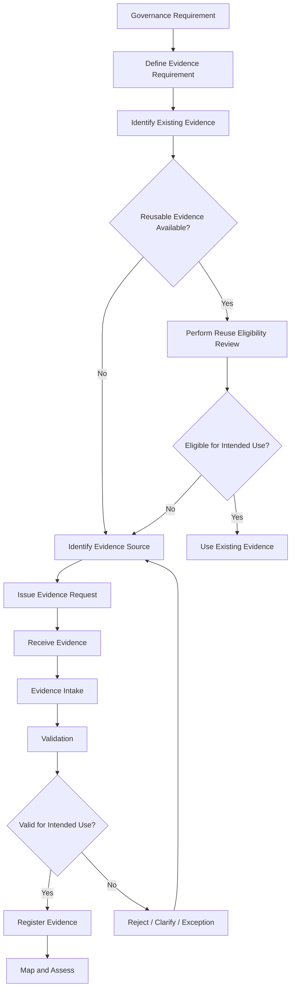
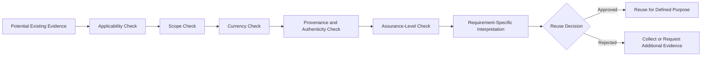

# Evidence Collection Guide

**Repository:** Evidence Convergence Framework (ECF)
**Folder:** `05_Evidence_Model`
**Artifact:** `Evidence-Collection_Guide.md`
**Organization:** NovaTide Logistics — Synthetic Reference Implementation
**Status:** Reference Implementation
**Document Type:** Operational Evidence Model

---

## 1. Purpose

The Evidence Collection Guide defines how NovaTide Logistics identifies, requests, receives, validates, and prepares governance evidence for use across AI vendor governance and related risk assessments.

The guide operationalizes the ECF evidence architecture by establishing a repeatable discipline for obtaining evidence without treating evidence collection as a checklist exercise.

The objective is to ensure that evidence is:

* Relevant to a defined governance requirement.
* Collected for a stated assessment purpose.
* Attributable to an identifiable source.
* Within a defined scope.
* Sufficiently current for its intended use.
* Subject to validation before assessment use.
* Classified according to its characteristics.
* Traceable to the requirements and assessments it supports.
* Reusable only when applicability and assurance conditions are satisfied.
* Explicit about limitations, exceptions, and unresolved uncertainty.

The collection process supports the ECF operating chain:

> **Assessment → Evidence → Mapping → Reuse → Gap Identification → Risk → Decision**

Evidence collection does not itself determine compliance, control effectiveness, risk acceptance, or governance disposition. Those conclusions remain part of assessment interpretation and governance decision-making.

---

## 2. Scope

This guide applies to governance evidence collected or maintained by NovaTide for:

* AI vendor assessments.
* Third-party risk management.
* Information security assessments.
* Privacy assessments.
* AI governance assessments.
* Regulatory and compliance assessments.
* Internal control reviews.
* Internal audit activities.
* Cross-framework evidence mapping.
* Periodic vendor reassessments.
* Ongoing monitoring activities.

Evidence may originate from:

* External vendors.
* NovaTide business functions.
* Technology teams.
* Security teams.
* Privacy and legal functions.
* Procurement.
* Enterprise Risk Management.
* AI Governance.
* Internal Audit.
* Automated systems.
* Authoritative third-party assurance sources.

This guide applies to both internally generated and externally supplied evidence.

It does not establish detailed framework requirements for NIST AI RMF, ISO/IEC 42001, EU AI Act, or other regulatory or control frameworks. Those requirements remain defined by their respective authoritative sources and applicable NovaTide governance processes.

---

## 3. Evidence Collection Principles

NovaTide applies the following principles when collecting governance evidence.

| Principle                | Operating Expectation                                                                                    |
| ------------------------ | -------------------------------------------------------------------------------------------------------- |
| Requirement-driven       | Evidence collection begins with a defined governance requirement or assessment objective.                |
| Purpose-specific         | Evidence is collected for an identifiable assessment or governance purpose.                              |
| Evidence-centric         | Evidence is treated as a governed asset rather than disposable assessment documentation.                 |
| Traceable                | Evidence can be traced to its source, scope, collection event, validation, mappings, and assessment use. |
| Attributable             | The source and responsible parties are identifiable.                                                     |
| Scope-aware              | Evidence scope is explicitly evaluated before use.                                                       |
| Currency-aware           | Evidence age and validity period are considered in relation to the requirement.                          |
| Quality-controlled       | Evidence is validated before being relied upon.                                                          |
| Reuse by eligibility     | Existing evidence is reused only after applicability and sufficiency checks.                             |
| Interpretation-separated | Evidence is maintained separately from the assessment conclusion drawn from it.                          |
| Limitation-aware         | Known limitations, exclusions, and uncertainties remain visible.                                         |
| Confidentiality-aware    | Evidence is handled according to its sensitivity and confidentiality requirements.                       |
| Risk-linked              | Evidence deficiencies can be traced to findings, risks, remediation, and decisions where applicable.     |

### 3.1 Evidence Is Not Compliance

The presence of evidence does not automatically establish:

* Compliance.
* Control effectiveness.
* Risk reduction.
* Regulatory conformity.
* Successful implementation.
* Absence of risk.

Evidence provides information that supports assessment and governance interpretation.

For example:

> A vendor provides an information security policy.

That evidence may demonstrate that a documented policy exists. It does not, by itself, demonstrate that the policy is implemented, operating effectively, applicable to the relevant service, or sufficient for a specific governance requirement.

---

## 4. Evidence Collection Roles

Evidence collection requires separation of accountability between the party providing evidence, the party governing the evidence, and the party interpreting it.

| Role                         | Primary Responsibility                                                                 |
| ---------------------------- | -------------------------------------------------------------------------------------- |
| Governance Requirement Owner | Defines the governance expectation that must be evaluated.                             |
| Evidence Requirement Owner   | Defines what evidence is needed to support evaluation of the requirement.              |
| Assessment Owner             | Determines how evidence will be evaluated within the assessment.                       |
| Evidence Owner               | Accountable for the evidence asset and its continued appropriateness for intended use. |
| Evidence Custodian           | Maintains the evidence asset, metadata, storage, access, and lifecycle records.        |
| Evidence Collector           | Coordinates evidence requests, intake, tracking, and follow-up.                        |
| Vendor Contact               | Provides external evidence and clarifications where applicable.                        |
| Subject Matter Expert        | Provides specialist validation or interpretation when required.                        |
| AI Governance                | Coordinates AI governance requirements and cross-functional governance activities.     |
| TPRM                         | Owns or coordinates third-party risk assessment activities.                            |
| Information Security         | Evaluates security-related requirements and evidence.                                  |
| Privacy                      | Evaluates privacy-related requirements and evidence.                                   |
| Legal / Compliance           | Evaluates legal, contractual, regulatory, or compliance considerations.                |
| Internal Audit               | Performs independent assurance activities where applicable.                            |
| Business / Technology Owner  | Provides operational context and validates business or service scope.                  |

### 4.1 Evidence Owner vs. Evidence Custodian

The roles should not be treated as interchangeable.

**Evidence Owner**

* Accountable for the evidence asset.
* Confirms that the evidence remains appropriate for its intended purpose.
* Supports decisions regarding refresh, replacement, or retirement.

**Evidence Custodian**

* Maintains the evidence asset.
* Controls storage and access.
* Maintains metadata and version information.
* Supports retrieval and auditability.

This separation allows accountability to remain with the appropriate business or governance function while operational evidence management may be delegated.

---

## 5. Evidence Requirement Definition

Evidence should not be requested merely because a questionnaire contains a question.

The collection process begins by defining an **Evidence Requirement**.

An Evidence Requirement should establish:

1. The governance requirement being evaluated.
2. The assessment purpose.
3. The evidence characteristic required.
4. The expected source.
5. The required scope.
6. The expected period or currency.
7. The minimum acceptable assurance level.
8. Any known framework-specific considerations.
9. Whether existing evidence may potentially be reused.

### 5.1 Evidence Requirement Structure

A practical Evidence Requirement may be expressed as:

> **Evidence is required to demonstrate [specific governance characteristic] for [defined scope] during [defined period], from [acceptable source], at [required assurance level].**

For example:

> Evidence is required to evaluate whether the AI vendor maintains documented information security governance applicable to the service provided to NovaTide.

This is materially different from:

> "Provide your information security policy."

The first defines the assessment need. The second merely requests a document.

---

## 6. Evidence Source Identification

Before requesting evidence, the collector should determine whether the required information already exists.

Potential sources include:

### 6.1 Existing NovaTide Evidence

* Prior TPRM assessments.
* Information security assessments.
* Privacy assessments.
* AI governance assessments.
* Contract records.
* Vendor onboarding records.
* Previous assurance reports.
* Internal control documentation.
* Architecture documentation.
* Security monitoring records.
* Incident records.
* Business continuity assessments.

### 6.2 Vendor-Supplied Evidence

Examples include:

* Policies.
* Standards.
* Procedures.
* Independent assurance reports.
* Certifications.
* Attestations.
* Security architecture documentation.
* AI governance documentation.
* Data-processing documentation.
* Model documentation.
* Risk assessments.
* Business continuity documentation.
* Penetration test summaries.
* Incident management evidence.
* Subprocessor information.

### 6.3 System-Generated Evidence

Examples include:

* Configuration records.
* Access logs.
* Monitoring records.
* Security reports.
* System inventories.
* Change records.
* Workflow records.
* Assessment platform outputs.

### 6.4 Independent Evidence Sources

Where appropriate:

* Independent audit reports.
* Certification records.
* Regulatory records.
* External assurance statements.
* Contractual attestations.

The reliability and applicability of each source must be evaluated rather than assumed.

---

## 7. Evidence Request Process

NovaTide uses a controlled evidence request process.



### 7.1 Request Preparation

Each evidence request should identify, where practical:

* Evidence requirement ID.
* Assessment ID.
* Request owner.
* Requested evidence.
* Required scope.
* Required period.
* Acceptable evidence types.
* Required format.
* Confidentiality handling instructions.
* Due date.
* Contact responsible for clarification.
* Whether equivalent evidence may be accepted.

### 7.2 Evidence Requests Should Avoid Over-Collection

The objective is not to collect the largest possible volume of documentation.

Collectors should ask:

> What information is necessary to evaluate the requirement?

rather than:

> What documents can the vendor provide?

Over-collection creates:

* Review burden.
* Storage burden.
* Increased confidentiality exposure.
* Duplicate evidence.
* Greater maintenance requirements.
* Reduced reviewer attention.
* Difficulty identifying authoritative evidence.

---

## 8. Vendor Evidence Collection

Vendor evidence collection should be risk-based and proportionate to the service and AI use case.

The requested evidence should reflect factors such as:

* AI risk tier.
* Service criticality.
* Data sensitivity.
* Customer impact.
* Regulatory exposure.
* Processing activities.
* Vendor access.
* Model characteristics.
* Subprocessor dependencies.
* Geographic scope.
* Assurance requirements.
* Materiality.

### 8.1 Vendor Evidence Collection Sequence

A typical collection sequence is:

1. Define the assessment scope.
2. Identify governance requirements.
3. Determine evidence requirements.
4. Search existing NovaTide evidence.
5. Determine whether reuse may be appropriate.
6. Prepare targeted vendor requests.
7. Issue request through an approved channel.
8. Receive evidence.
9. Record intake information.
10. Validate evidence.
11. Register accepted evidence.
12. Map evidence to requirements.
13. Record limitations.
14. Perform assessment interpretation.
15. Record findings or gaps where applicable.

### 8.2 Vendor Clarification

Additional clarification may be required where evidence:

* Is ambiguous.
* Covers multiple services.
* Has unclear applicability.
* Is outdated.
* Contains unexplained exclusions.
* Does not identify the relevant environment.
* References controls without demonstrating implementation.
* Contains inconsistent information across documents.

Clarification should be documented as part of the evidence lineage.

---

## 9. Internal Evidence Collection

Internal evidence collection follows the same evidence-centric principles as vendor evidence collection.

Internal sources may include:

* Policies.
* Standards.
* Procedures.
* Risk assessments.
* Architecture diagrams.
* System inventories.
* Access reviews.
* Configuration records.
* Security monitoring reports.
* Incident records.
* Change-management records.
* Vendor management records.
* Contract records.
* AI inventory records.
* AI impact assessments.
* Business continuity assessments.

Internal evidence should not receive automatic acceptance merely because it originates within NovaTide.

The same considerations apply:

* Relevance.
* Scope.
* Currency.
* Provenance.
* Authenticity.
* Completeness.
* Assurance.
* Limitations.

---

## 10. Evidence Collection Methods

Evidence may be collected through several mechanisms.

| Method                 | Typical Use                    | Primary Consideration                                              |
| ---------------------- | ------------------------------ | ------------------------------------------------------------------ |
| Document request       | Policies, reports, assessments | Confirm scope and currency                                         |
| Questionnaire response | Structured factual information | Validate supporting evidence                                       |
| Interview              | Context and clarification      | Record interpretation separately                                   |
| Demonstration          | System/process operation       | Determine whether demonstration is reproducible and attributable   |
| Configuration extract  | Technical controls             | Confirm extraction scope and timestamp                             |
| Automated collection   | System-generated evidence      | Validate source integrity and collection method                    |
| Independent report     | Assurance evidence             | Evaluate period, scope, exceptions, and assurance level            |
| Attestation            | Management representation      | Understand assurance limitations                                   |
| Contractual evidence   | Obligations and commitments    | Distinguish contractual commitment from operational implementation |
| Observation            | Operational verification       | Record observer, date, scope, and limitations                      |

No collection method is inherently sufficient for every requirement.

The method should be appropriate to the evidence requirement.

---

## 11. Evidence Intake

Evidence intake establishes the initial record of an evidence asset.

At minimum, intake should capture:

* Evidence ID.
* Evidence title.
* Source.
* Collection date.
* Collector.
* Vendor or organizational source.
* Scope.
* Evidence period.
* Version, where available.
* Confidentiality classification.
* Initial evidence type.
* Related assessment.
* Initial status.
* Known limitations.

The evidence should then be assigned to an evidence custodian or controlled evidence repository.

### 11.1 Intake Status

A practical status model is:

| Status                     | Meaning                                                                              |
| -------------------------- | ------------------------------------------------------------------------------------ |
| Received                   | Evidence has been submitted but not yet validated.                                   |
| Under Validation           | Evidence is undergoing review.                                                       |
| Validated                  | Evidence passed defined validation checks for its intended use.                      |
| Validated with Limitations | Evidence is usable for defined purposes but contains documented limitations.         |
| Rejected                   | Evidence is not acceptable for the intended use.                                     |
| Superseded                 | A newer or otherwise authoritative version has replaced the evidence.                |
| Retired                    | Evidence is no longer used but remains subject to applicable retention requirements. |

---

## 12. Evidence Validation

Evidence validation determines whether an evidence asset is sufficiently reliable for its intended assessment use.

Validation should consider:

### 12.1 Authenticity

Can the source and origin of the evidence reasonably be established?

### 12.2 Attribution

Can the responsible organization, function, individual, or system be identified?

### 12.3 Relevance

Does the evidence address the Evidence Requirement?

### 12.4 Scope

Does the evidence cover the relevant:

* Vendor?
* Service?
* System?
* Business process?
* Data?
* Geographic environment?
* AI system?
* Organizational entity?

### 12.5 Currency

Is the evidence sufficiently current for the intended requirement and risk context?

### 12.6 Completeness

Does the evidence contain the information necessary for the intended assessment use?

### 12.7 Assurance

What level of confidence does the evidence provide?

For example:

* Management representation.
* Internal documentation.
* Operational record.
* Independent assessment.
* Independent audit or certification.

### 12.8 Consistency

Is the evidence consistent with other available information?

Conflicting evidence should not simply be ignored. The conflict should be investigated and recorded.

---

## 13. Evidence Quality

Evidence quality should be evaluated in relation to intended use rather than treated as an absolute characteristic.

A useful quality assessment considers:

| Dimension    | Question                                                        |
| ------------ | --------------------------------------------------------------- |
| Authenticity | Can the evidence reasonably be attributed to its stated source? |
| Relevance    | Does it address the requirement?                                |
| Scope        | Does it cover the assessed environment?                         |
| Currency     | Is it sufficiently current?                                     |
| Completeness | Is necessary information present?                               |
| Reliability  | Can the information reasonably be relied upon?                  |
| Assurance    | What level of independent or management assurance exists?       |
| Consistency  | Does it align with other evidence?                              |
| Traceability | Can its origin and use be reconstructed?                        |
| Limitations  | Are restrictions and uncertainties documented?                  |

Evidence quality should not be collapsed into a single score where doing so obscures material limitations.

A high-quality document may still be insufficient for a specific requirement if its scope does not align with the assessment.

---

## 14. Evidence Scope

Scope must be explicitly evaluated before evidence is reused or mapped.

Scope may include:

* Organization.
* Vendor entity.
* Product.
* AI service.
* Model.
* Infrastructure.
* Business process.
* Geographic region.
* Data category.
* Customer population.
* Time period.
* Subprocessor.
* Deployment environment.

### Example

A vendor's enterprise-wide security policy may be relevant to NovaTide's AI vendor assessment.

However, if the evidence does not establish whether the AI service operates under the stated governance environment, additional evidence may be required.

Therefore:

> **Enterprise-level evidence does not automatically establish service-level applicability.**

---

## 15. Evidence Currency

Evidence currency should be assessed relative to:

* Requirement expectations.
* Risk tier.
* Service criticality.
* Rate of environmental change.
* Regulatory context.
* Material changes.
* Evidence type.

There should not be a universal rule that every evidence asset expires after a fixed period.

For example:

* A governance policy may remain valid until materially changed.
* A penetration test may have a defined assessment period.
* A system configuration may become stale quickly.
* A vendor organizational chart may change independently of technical controls.

The Evidence Owner should establish an appropriate review or refresh expectation.

---

## 16. Evidence Provenance

Evidence provenance describes where evidence originated and how it entered the evidence repository.

Provenance should establish, where practical:

* Original source.
* Source organization.
* Source system or repository.
* Provider.
* Collection method.
* Collection date.
* Transfer mechanism.
* Relevant version.
* Transformation or modification history.
* Validation activity.

Provenance becomes particularly important when evidence is:

* Reused.
* Transformed.
* Extracted from another system.
* Provided through a third party.
* Used across multiple assessments.
* Relied upon for material decisions.

---

## 17. Evidence Confidentiality

Evidence may contain sensitive information such as:

* Security architecture.
* Vulnerability information.
* Customer information.
* Employee information.
* Authentication-related information.
* Contractual terms.
* Confidential vendor information.
* Proprietary AI system information.
* Model information.
* Data-processing details.

Evidence should therefore be stored and shared according to its confidentiality classification.

Collectors should apply data minimization principles and avoid requesting information that is not necessary for the assessment.

### 17.1 Evidence Access

Access should be based on:

* Business need.
* Assessment responsibility.
* Confidentiality classification.
* Legal or contractual restrictions.
* Regulatory requirements.
* Security requirements.

Evidence access should itself be auditable where appropriate.

---

## 18. Evidence Limitations

Evidence limitations must remain visible throughout the evidence lifecycle.

Common limitations include:

* Incomplete scope.
* Expired evidence.
* Self-attestation.
* Lack of independent assurance.
* Aggregated reporting.
* Service-level ambiguity.
* Geographic exclusions.
* Subprocessor exclusions.
* Model-specific exclusions.
* Missing implementation evidence.
* Reliance on management representation.
* Inability to independently verify a statement.

A limitation does not necessarily mean evidence must be rejected.

Instead, the limitation should influence:

* Evidence usability.
* Mapping strength.
* Assessment interpretation.
* Residual uncertainty.
* Need for supplemental evidence.
* Risk treatment.

---

## 19. Evidence Rejection

Evidence may be rejected when it cannot reasonably support the intended assessment purpose.

Examples include:

* Evidence is unrelated to the requirement.
* Evidence is outside the assessment scope.
* Authenticity cannot reasonably be established.
* Evidence is materially outdated.
* Evidence is incomplete to the point of being unusable.
* Evidence belongs to a different service or environment.
* Evidence contains material unexplained inconsistencies.
* Evidence does not provide the required assurance level.
* The source cannot provide sufficient attribution.

Rejected evidence should not simply be deleted.

The rejection decision and rationale should remain traceable.

### 19.1 Rejection Outcomes

A rejected evidence request may result in:

1. Clarification request.
2. Supplemental evidence request.
3. Alternative evidence request.
4. Evidence exception.
5. Assessment finding.
6. Risk escalation.

---

## 20. Evidence Exceptions

An evidence exception may be used when the required evidence cannot be obtained or does not fully meet the expected evidence requirement.

An exception should document:

* Evidence Requirement.
* Missing or deficient evidence.
* Reason.
* Business impact.
* Risk implications.
* Compensating evidence or controls.
* Exception owner.
* Approval authority.
* Expiration or review date.
* Remediation requirement, if applicable.

An evidence exception is not equivalent to acceptance of the underlying governance risk.

The associated assessment and risk processes determine whether the condition is acceptable.

---

## 21. Evidence Reuse

Existing evidence should be considered before requesting duplicate evidence.

However, reuse is conditional.

The ECF reuse discipline is:



### 21.1 Reuse Eligibility Questions

Before reusing evidence, determine:

1. Does it address the new requirement?
2. Does its scope match the intended assessment?
3. Is it sufficiently current?
4. Can its provenance be established?
5. Is its authenticity established?
6. Is its assurance level appropriate?
7. Are there known limitations?
8. Does the new assessment require a different interpretation?
9. Does the relevant framework impose additional evidence expectations?
10. Is supplemental evidence required?

### 21.2 Reuse Does Not Mean Equivalence

The following relationship must remain explicit:

> **Evidence overlap ≠ requirement equivalence**

One evidence asset may support several assessments while producing different assessment interpretations.

---

## 22. Evidence Mapping

Evidence mapping documents the relationship between an Evidence Asset and a Governance Requirement.

A mapping should identify:

* Evidence ID.
* Requirement ID.
* Assessment ID.
* Mapping strength.
* Mapping rationale.
* Scope considerations.
* Limitations.
* Supplemental evidence requirements.

### 22.1 Mapping Strength

Mapping strength describes how directly the evidence supports the requirement.

A practical model is:

| Mapping Strength | Meaning                                                                                        |
| ---------------- | ---------------------------------------------------------------------------------------------- |
| Strong           | Evidence directly addresses the requirement within appropriate scope and assurance conditions. |
| Moderate         | Evidence provides useful support but additional interpretation or evidence may be necessary.   |
| Limited          | Evidence has some relevance but does not adequately address the requirement by itself.         |
| Not Applicable   | Evidence does not support the requirement for the intended assessment.                         |

Mapping strength is not a compliance score.

It describes the relationship between evidence and requirement.

---

## 23. Evidence Collection for Multiple Assessments

An AI vendor may participate in multiple governance assessments.

For NovaTide, these may include:

```text
AI Vendor
   │
   ├── TPRM Assessment
   ├── Information Security Assessment
   ├── Privacy Assessment
   ├── AI Governance Assessment
   ├── Legal / Contract Review
   └── Business Continuity Review
```

Evidence may therefore be collected once and potentially reused.

However, each assessment retains its own:

* Requirement.
* Scope.
* Assessment purpose.
* Interpretation.
* Finding criteria.
* Risk implications.

### 23.1 Example

A vendor's independent security assurance report may be useful to:

* TPRM.
* Information Security.
* AI Governance.

However, the report may not address:

* AI-specific governance.
* Model risk.
* Data-processing requirements.
* Human oversight.
* Regulatory applicability.

The report may therefore reduce duplicate collection without eliminating framework- or assessment-specific evidence requirements.

---

## 24. Framework-Specific Evidence

ECF supports evidence convergence across governance frameworks, but it does not eliminate framework-specific evidence requirements.

The three reference frameworks for the implementation are:

* NIST AI RMF.
* ISO/IEC 42001.
* EU AI Act.

Where evidence is mapped to these frameworks, NovaTide should distinguish between:

| Layer                     | Meaning                                                                           |
| ------------------------- | --------------------------------------------------------------------------------- |
| Framework Requirement     | Requirement or expectation originating from the relevant framework or regulation. |
| Evidence Requirement      | Evidence needed to evaluate that requirement.                                     |
| Evidence Asset            | Actual evidence collected.                                                        |
| ECF Mapping               | Documented relationship between evidence and requirement.                         |
| Assessment Interpretation | Assessment-specific conclusion.                                                   |
| Finding / Gap             | Identified deficiency or uncertainty.                                             |

This separation prevents the evidence register from becoming a misleading compliance-equivalence matrix.

---

## 25. Evidence Refresh

Evidence should be refreshed when its continued validity is uncertain or when a defined refresh trigger occurs.

Potential triggers include:

* Evidence reaches its review date.
* Vendor materially changes the service.
* AI model changes materially.
* Deployment architecture changes.
* Data-processing activities change.
* Subprocessors change.
* Geographic processing changes.
* Material security incident occurs.
* Regulatory requirements change.
* Contract terms change materially.
* Control environment changes.
* Prior evidence becomes unreliable.
* Assessment risk tier changes.
* A finding indicates evidence is insufficient.
* An assurance report expires.

### 25.1 Material Change

A material change should trigger an evidence review even if the evidence has not formally expired.

This prevents a technically "current" document from being treated as valid when the environment it describes has materially changed.

---

## 26. Evidence Escalation

Evidence issues should be escalated according to impact.

| Condition                              | Typical Escalation                            |
| -------------------------------------- | --------------------------------------------- |
| Minor documentation ambiguity          | Evidence Collector / Owner                    |
| Missing clarification                  | Assessment Owner                              |
| Scope uncertainty                      | Assessment Owner + SME                        |
| Material evidence deficiency           | Risk / Governance Function                    |
| Repeated vendor refusal                | TPRM / Procurement                            |
| Significant AI governance evidence gap | AI Governance                                 |
| Legal or regulatory uncertainty        | Legal / Compliance                            |
| High-impact unresolved evidence gap    | Appropriate Risk or Executive Governance Body |

Escalation should be proportionate to the potential business and governance impact.

---

## 27. Minimum Evidence Package

The minimum evidence package should be risk-based rather than a universal document checklist.

For a typical AI vendor assessment, the package may include evidence covering:

| Evidence Area          | Illustrative Evidence                                 |
| ---------------------- | ----------------------------------------------------- |
| Organization           | Organizational governance information                 |
| Service                | Service description and scope                         |
| AI System              | AI system or model description                        |
| Governance             | Relevant governance policies or procedures            |
| Security               | Security assurance or control evidence                |
| Privacy                | Data-processing and privacy evidence                  |
| Risk                   | Relevant risk assessment documentation                |
| Data                   | Data governance or processing information             |
| Resilience             | Business continuity / resilience evidence             |
| Third Parties          | Subprocessor information                              |
| Assurance              | Independent assurance where appropriate               |
| Incidents              | Relevant incident or notification evidence            |
| AI-Specific Governance | Documentation appropriate to the AI use case and risk |

The exact package should depend on:

* AI risk tier.
* Vendor criticality.
* Data sensitivity.
* Service scope.
* Regulatory exposure.
* Assessment objective.

---

## 28. Mature Evidence Collection Model

A mature implementation moves beyond periodic document requests.

### 28.1 Minimum Viable Model

A minimum viable ECF implementation should establish:

* Defined Evidence Requirements.
* Controlled evidence repository.
* Evidence IDs.
* Evidence ownership.
* Evidence custody.
* Basic metadata.
* Validation status.
* Scope.
* Currency.
* Provenance.
* Evidence mapping.
* Limitations.
* Basic reuse controls.
* Traceability to assessments.

### 28.2 Mature Model

A mature enterprise implementation may additionally support:

* Centralized evidence registry.
* Automated evidence intake.
* Integration with GRC platforms.
* Automated refresh monitoring.
* Evidence expiration alerts.
* Vendor portal integration.
* Evidence deduplication.
* Machine-assisted classification.
* Framework mapping.
* Assessment inheritance.
* Evidence lineage.
* Change detection.
* Automated evidence quality checks.
* Continuous control monitoring.
* Workflow-based approvals.
* Evidence analytics.
* Risk-based collection prioritization.

Automation should support governance discipline rather than replace human judgment.

---

## 29. Practical Example — Synthetic NovaTide AI Vendor

The following example is synthetic and illustrative.

Assume NovaTide uses an AI-enabled logistics optimization service provided by a fictional vendor, **OrionRoute AI**.

The service:

* Supports shipment route optimization.
* Processes operational shipment information.
* Integrates with NovaTide's transportation management environment.
* Is classified as a material AI service.
* Has dependencies on cloud infrastructure and subprocessors.

### 29.1 Initial Evidence Requirement

NovaTide requires evidence to evaluate the vendor's information security governance and controls relevant to the service.

The Evidence Requirement might state:

> Evidence is required to evaluate the governance and security controls applicable to OrionRoute AI's service environment used to process NovaTide operational information.

### 29.2 Existing Evidence Search

NovaTide identifies an existing independent security assurance report received during the TPRM process.

Instead of immediately requesting another report, the assessment team evaluates whether the existing evidence can be reused.

### 29.3 Reuse Evaluation

| Dimension      | Assessment                                                             |
| -------------- | ---------------------------------------------------------------------- |
| Applicability  | Relevant to the vendor's security environment.                         |
| Scope          | Covers the relevant service environment, subject to stated exclusions. |
| Currency       | Within the defined assessment period.                                  |
| Provenance     | Issued by an identifiable independent assurance provider.              |
| Authenticity   | Source and report integrity established.                               |
| Assurance      | Provides independent assurance within its stated scope.                |
| Limitations    | Does not address AI governance-specific requirements.                  |
| Reuse Decision | Reuse permitted for defined security-related assessment purposes.      |

### 29.4 Assessment Interpretation

The report may support the conclusion that certain security governance and control expectations are addressed within its stated scope.

It does **not** automatically establish:

* AI governance effectiveness.
* Compliance with the EU AI Act.
* Conformity with ISO/IEC 42001.
* Fulfillment of all NIST AI RMF expectations.
* Absence of operational or model risk.

Additional evidence may therefore be required.

### 29.5 ECF Traceability

The relationship can be represented as:

```text
Governance Requirement
        │
        ▼
Evidence Requirement
        │
        ▼
Independent Security Assurance Report
        │
        ▼
Evidence Validation
        │
        ▼
Evidence Mapping
        │
        ├── TPRM Requirement
        ├── Security Requirement
        └── Potential AI Governance Support
                 │
                 ▼
       Requirement-Specific Interpretation
                 │
                 ▼
          Finding / Gap, if applicable
                 │
                 ▼
                Risk
                 │
                 ▼
          Governance Decision
```

This demonstrates evidence convergence without implying requirement convergence.

---

## 30. ECF Integration

Evidence collection is the entry point into the broader ECF evidence operating model.

The collection process aligns with the established Evidence Architecture:

```text
Governance Requirement
        ↓
Evidence Requirement
        ↓
Evidence Asset
        ↓
Evidence Validation
        ↓
Evidence Mapping
        ↓
Assessment Interpretation
        ↓
Finding / Gap
        ↓
Risk
        ↓
Remediation
        ↓
Governance Decision
```

The Evidence Collection Guide primarily addresses the transition from:

> **Governance Requirement → Evidence Requirement → Evidence Asset → Evidence Validation**

Subsequent artifacts in the Evidence Model folder govern:

* Evidence lifecycle.
* Evidence metadata.
* Evidence classification.
* Evidence registration.

The guide therefore does not redefine the architecture. It provides the operational discipline required to populate and maintain it.

---

## 31. Evidence Collection Decision Rules

The following rules provide practical operating guidance.

### Rule 1 — Start With the Requirement

Do not collect evidence without knowing what governance requirement the evidence is intended to support.

### Rule 2 — Search Before Requesting

Determine whether suitable existing evidence already exists.

### Rule 3 — Validate Before Reusing

Existing evidence is not automatically reusable.

### Rule 4 — Evaluate Scope Explicitly

Evidence must cover the relevant service, system, organization, period, and other applicable dimensions.

### Rule 5 — Consider Currency in Context

Do not rely solely on document age. Consider material changes and the nature of the evidence.

### Rule 6 — Preserve Provenance

The origin and handling history of evidence should remain traceable.

### Rule 7 — Record Limitations

Evidence limitations should remain visible rather than being removed during assessment processing.

### Rule 8 — Separate Evidence From Interpretation

The evidence asset should not contain the assessment conclusion as though the conclusion were itself evidence.

### Rule 9 — Do Not Equate Evidence With Compliance

Evidence supports assessment. It does not independently establish compliance or control effectiveness.

### Rule 10 — Reuse Conditionally

Evidence convergence should reduce unnecessary duplicate collection without weakening assurance.

### Rule 11 — Preserve Framework-Specific Requirements

Cross-framework reuse should not obscure requirements that require separate evidence or interpretation.

### Rule 12 — Escalate Material Gaps

Where evidence deficiencies create material uncertainty or risk, the issue should move into the appropriate governance and risk processes.

---

## 32. Collection Quality Controls

NovaTide should periodically review the evidence collection process itself.

Quality reviews should consider:

* Duplicate evidence requests.
* Repeated requests for evidence already available.
* Excessive evidence volumes.
* Evidence rejected due to avoidable collection errors.
* Missing metadata.
* Unclear evidence ownership.
* Unclear scope.
* Expired evidence being reused.
* Unsupported evidence mappings.
* Unrecorded limitations.
* Unresolved evidence exceptions.
* Inconsistent evidence classification.

Process performance should be evaluated based on evidence usefulness and governance outcomes, not merely the number of documents collected.

---

## 33. Evidence Collection Metrics

Metrics may be used to identify process weaknesses.

Potential metrics include:

| Metric                               | Purpose                                                 |
| ------------------------------------ | ------------------------------------------------------- |
| Evidence reuse rate                  | Identifies potential reduction in duplicate collection. |
| Evidence validation turnaround       | Measures operational efficiency.                        |
| Evidence rejection rate              | Identifies quality problems in requests or submissions. |
| Evidence with complete metadata      | Measures registry quality.                              |
| Evidence approaching refresh date    | Supports proactive lifecycle management.                |
| Evidence with documented limitations | Measures transparency of evidence quality.              |
| Duplicate evidence requests          | Identifies process fragmentation.                       |
| Evidence mapping coverage            | Identifies requirements lacking supporting evidence.    |
| Framework-specific evidence gaps     | Identifies areas where convergence is insufficient.     |
| Evidence exception aging             | Identifies unresolved evidence weaknesses.              |

Metrics should not be optimized in isolation.

For example, increasing evidence reuse without appropriate validation could improve an efficiency metric while reducing assurance quality.

---

## 34. Evidence Collection Anti-Patterns

The following practices are inconsistent with the ECF operating model.

### 34.1 Checklist-Only Collection

> "Ask every vendor the same 100 questions."

**Problem:** Requirements and evidence needs vary by risk, scope, service, and purpose.

### 34.2 Document Volume as Assurance

> "More documents means better evidence."

**Problem:** Additional documents may create noise without increasing assurance.

### 34.3 Automatic Cross-Framework Reuse

> "This document satisfies three frameworks."

**Problem:** Evidence usefulness does not establish requirement equivalence.

### 34.4 Evidence Without Scope

> "The vendor provided a security report."

**Problem:** Without scope, the assessment cannot determine what the report actually covers.

### 34.5 Evidence Without Currency

> "The document exists."

**Problem:** Existence does not establish current applicability.

### 34.6 Evidence Without Provenance

> "Someone uploaded the document."

**Problem:** The source and authenticity cannot be established reliably.

### 34.7 Interpretation Embedded in Evidence

> "This policy proves compliance."

**Problem:** The statement is an assessment interpretation, not evidence.

### 34.8 Permanent Evidence

> "Once collected, evidence can always be reused."

**Problem:** Systems, vendors, models, regulations, and control environments change.

---

## 35. Summary

The ECF Evidence Collection Guide establishes a controlled approach for collecting governance evidence as an enterprise asset.

The model emphasizes:

* Requirement-driven collection.
* Risk-based evidence requests.
* Controlled intake.
* Evidence validation.
* Scope and currency assessment.
* Provenance and authenticity.
* Confidentiality management.
* Explicit limitations.
* Conditional evidence reuse.
* Documented evidence mapping.
* Framework-specific evaluation.
* Evidence refresh.
* Traceability.
* Separation of evidence from interpretation and decision-making.

The intended outcome is not simply a larger evidence repository.

The intended outcome is a more disciplined governance process in which evidence can be:

> **Collected once where appropriate, governed continuously, mapped deliberately, reused conditionally, supplemented where necessary, and traced through assessment, risk, remediation, and governance decision-making.**

This is the operational role of the Evidence Model within the Evidence Convergence Framework.

---

## Document Control

| Field                | Value                                                           |
| -------------------- | --------------------------------------------------------------- |
| Document             | Evidence Collection Guide                                       |
| ECF Folder           | `05_Evidence_Model`                                             |
| Organization         | NovaTide Logistics                                              |
| Document Status      | Reference Implementation                                        |
| Classification       | Synthetic / Illustrative                                        |
| Evidence Owner       | NovaTide AI Governance / Relevant Governance Function           |
| Review Frequency     | Risk-based                                                      |
| Related Architecture | `03_Reference_Architecture/Evidence-Architecture.md`            |
| Related Flow         | `03_Reference_Architecture/Evidence-Flow.md`                    |
| Related Components   | `03_Reference_Architecture/ECF-Components.md`                   |
| Related Artifacts    | Evidence Lifecycle, Metadata Model, Taxonomy, Evidence Register |

