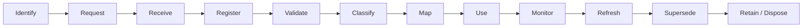

# Evidence Lifecycle

**Repository:** Evidence Convergence Framework (ECF)
**Folder:** `05_Evidence_Model`
**Artifact:** `Evidence-Lifecycle.md`
**Organization:** NovaTide Logistics — Synthetic Reference Implementation
**Status:** Reference Implementation

---

## 1. Purpose

The Evidence Lifecycle defines how NovaTide governs an Evidence Asset from identification through collection, validation, use, refresh, supersession, and retention or disposal.

The lifecycle ensures that evidence remains:

* Traceable
* Attributable
* Current
* Appropriately scoped
* Validated
* Governed throughout its useful life

The lifecycle operationalizes the Evidence Architecture established in the Reference Architecture.

It does not redefine the ECF evidence model.

---

## 2. Lifecycle Overview

The ECF evidence lifecycle is:



The lifecycle is not necessarily linear.

An evidence asset may return to an earlier stage when:

* Validation identifies a deficiency.
* Scope changes.
* A material change occurs.
* Additional evidence is required.
* A previously rejected asset is replaced.
* A new assessment requires reassessment of applicability.

---

## 3. Lifecycle Stages

| Stage                | Objective                                                          | Key Output                  |
| -------------------- | ------------------------------------------------------------------ | --------------------------- |
| **Identify**         | Determine what evidence is needed.                                 | Evidence Requirement        |
| **Request**          | Obtain evidence from an appropriate source.                        | Evidence Request            |
| **Receive**          | Capture submitted evidence.                                        | Evidence Intake             |
| **Register**         | Establish evidence identity and metadata.                          | Evidence Record             |
| **Validate**         | Determine whether evidence is suitable for intended use.           | Validation Result           |
| **Classify**         | Assign appropriate evidence category and type.                     | Evidence Classification     |
| **Map**              | Establish relationships to requirements and assessments.           | Evidence Mapping            |
| **Use**              | Apply evidence within an assessment.                               | Assessment Input            |
| **Monitor**          | Track currency, changes, limitations, and continued applicability. | Monitoring Record           |
| **Refresh**          | Obtain updated or supplemental evidence when necessary.            | Updated Evidence            |
| **Supersede**        | Replace an evidence asset with a newer authoritative version.      | Evidence Lineage            |
| **Retain / Dispose** | Apply applicable retention and disposal requirements.              | Retention / Disposal Record |

---

## 4. Stage Controls

### 4.1 Identify

Evidence should originate from a defined **Evidence Requirement**.

**Entry criteria:**

* Governance requirement identified.
* Assessment purpose established.
* Evidence need defined.

**Exit criteria:**

* Evidence requirement is documented.
* Appropriate evidence source or collection method is identified.

---

### 4.2 Request

Evidence is requested from an appropriate source using a controlled process.

The request should define, where relevant:

* Required evidence.
* Scope.
* Evidence period.
* Expected format.
* Due date.
* Confidentiality considerations.

Requests should be proportionate to the vendor's risk and assessment scope.

---

### 4.3 Receive

Submitted evidence enters a controlled intake process.

The collector records:

* Source.
* Collection date.
* Initial scope.
* Version, if available.
* Related assessment.
* Initial status.

Receipt does not mean the evidence has been validated.

---

### 4.4 Register

Each Evidence Asset receives a unique identity and associated metadata.

At minimum, the register should allow NovaTide to determine:

> **What is this evidence, where did it come from, what does it cover, who owns it, and where is it being used?**

The detailed metadata model is defined separately in:

`Evidence-Metadata-Model.md`

---

### 4.5 Validate

Validation determines whether the evidence is suitable for its intended use.

Validation considers:

* Authenticity
* Provenance
* Relevance
* Scope
* Currency
* Completeness
* Assurance
* Known limitations

Possible outcomes include:

| Outcome                        | Meaning                                                  |
| ------------------------------ | -------------------------------------------------------- |
| **Validated**                  | Suitable for intended use.                               |
| **Validated with Limitations** | Usable for defined purposes with documented limitations. |
| **Requires Clarification**     | Additional information is needed.                        |
| **Rejected**                   | Not suitable for the intended use.                       |

Validation is purpose-specific. Evidence validated for one assessment may require additional validation before reuse elsewhere.

---

### 4.6 Classify

Validated evidence is classified using the ECF Evidence Taxonomy.

Classification supports:

* Searchability.
* Consistent reporting.
* Evidence reuse.
* Evidence analytics.
* Appropriate handling.

The taxonomy is defined separately in:

`Evidence-Taxonomy.md`

---

### 4.7 Map

Evidence is mapped to relevant:

* Governance Requirements.
* Evidence Requirements.
* Assessments.
* Framework contexts.

Each mapping should include an appropriate **mapping strength** and rationale.

Mapping does not establish compliance. It documents how the evidence supports assessment of the requirement.

---

### 4.8 Use

The evidence may be used by the relevant assessment team.

The assessment team interprets what the evidence demonstrates within the context of the specific requirement.

This preserves the separation:

```text
Evidence Asset
      ↓
Evidence Mapping
      ↓
Assessment Interpretation
      ↓
Finding / Gap
      ↓
Risk
      ↓
Decision
```

The Evidence Owner does not determine the assessment conclusion merely by owning the evidence.

---

### 4.9 Monitor

Evidence should be monitored for continued applicability.

Monitoring should consider:

* Review or expiration dates.
* Material changes.
* Scope changes.
* Vendor changes.
* AI model or service changes.
* New regulatory or governance requirements.
* Identified evidence limitations.
* Changes in risk tier.

Monitoring does not necessarily require re-collecting evidence on a fixed schedule.

---

### 4.10 Refresh

Evidence should be refreshed when it is no longer sufficiently current or applicable.

Typical refresh triggers include:

* Expiration or review date reached.
* Material service change.
* Material AI model change.
* Change in data processing.
* New subprocessors.
* Significant security or operational event.
* Change in assessment scope.
* New governance requirement.
* Evidence limitation requiring resolution.

A refreshed asset may retain a relationship to the previous version.

---

### 4.11 Supersede

When a new authoritative evidence asset replaces an existing asset, the previous asset should be marked **Superseded** rather than silently overwritten.

Example:

```text
EVID-001
Security Assurance Report — 2025
       │
       │ superseded by
       ▼
EVID-014
Security Assurance Report — 2026
```

This preserves evidence lineage and allows reviewers to understand what evidence supported historical assessments.

---

### 4.12 Retain / Dispose

Evidence should be retained or disposed of according to:

* Applicable retention requirements.
* Contractual requirements.
* Legal requirements.
* Regulatory requirements.
* Assessment needs.
* Internal records-management policy.

Disposal should be controlled and, where required, auditable.

Evidence should not be retained indefinitely merely because it was once used.

---

## 5. Evidence States

Lifecycle state and validation status should remain conceptually distinct.

A practical lifecycle state model is:

| Lifecycle State  | Meaning                                                              |
| ---------------- | -------------------------------------------------------------------- |
| **Active**       | Current evidence available for defined use.                          |
| **Under Review** | Evidence is being reassessed or refreshed.                           |
| **Superseded**   | Replaced by a newer evidence asset.                                  |
| **Retained**     | No longer active but retained for historical or regulatory purposes. |
| **Disposed**     | Removed in accordance with applicable requirements.                  |

For example, an evidence asset may be:

> **Active + Validated with Limitations**

This is more informative than using a single status field for every aspect of evidence governance.

---

## 6. Ownership and Custody

The lifecycle maintains the distinction between **Evidence Owner** and **Evidence Custodian**.

| Responsibility              | Evidence Owner | Evidence Custodian |
| --------------------------- | -------------: | -----------------: |
| Accountability for evidence |              ✓ |                    |
| Determine appropriate use   |              ✓ |                    |
| Maintain evidence record    |                |                  ✓ |
| Maintain storage            |                |                  ✓ |
| Maintain metadata           |                |                  ✓ |
| Manage access               |                |                  ✓ |
| Support refresh decisions   |              ✓ |                  ✓ |
| Maintain lineage            |                |                  ✓ |

Assessment teams may use the evidence without becoming its owner.

---

## 7. Versioning and Lineage

Evidence should be version-controlled where multiple versions can exist.

The register should preserve relationships such as:

```text
Evidence Asset A
      │
      ├── Used by Assessment 001
      ├── Used by Assessment 004
      │
      └── Superseded by
              │
              ▼
        Evidence Asset B
              │
              └── Used by Assessment 009
```

This allows NovaTide to answer:

* Which evidence supported an assessment?
* Which version was used?
* When was it collected?
* What evidence replaced it?
* Which assessments may need reconsideration following a material change?

---

## 8. Currency and Expiration

Currency should be evaluated according to evidence type and intended use.

There is no universal evidence expiration period.

For example:

| Evidence Type              | Typical Currency Consideration      |
| -------------------------- | ----------------------------------- |
| Policy                     | Material change or formal review    |
| Assurance report           | Defined reporting period            |
| Configuration evidence     | Potentially short-lived             |
| Architecture documentation | Material architecture change        |
| Vendor assessment          | Assessment cycle or material change |
| AI model documentation     | Model or deployment change          |

The relevant Evidence Owner should establish appropriate review expectations.

---

## 9. Material Change Management

A material change may require evidence reassessment even when the existing evidence has not formally expired.

Examples include:

* New AI model.
* Significant model version change.
* New processing location.
* New subprocessor.
* Significant architecture change.
* New data category.
* Major service functionality change.
* Significant security incident.
* Change in vendor ownership.
* Change in risk classification.

The principle is:

> **Current date does not by itself establish current applicability.**

---

## 10. Exceptions

Lifecycle exceptions should be recorded when normal lifecycle controls cannot be followed.

Examples:

* Evidence cannot be obtained.
* Evidence cannot be refreshed on time.
* Required metadata is unavailable.
* Vendor cannot provide expected assurance.
* Retention requirements conflict with normal disposal timelines.

An exception should identify:

* Issue.
* Reason.
* Impact.
* Compensating measures, if any.
* Owner.
* Approval.
* Review or expiration date.

---

## 11. Minimum Viable Lifecycle

A minimum viable ECF implementation should establish:

1. Evidence ID.
2. Evidence owner and custodian.
3. Controlled intake.
4. Validation.
5. Classification.
6. Requirement mapping.
7. Lifecycle status.
8. Scope.
9. Currency.
10. Provenance.
11. Version or supersession tracking.
12. Retention handling.

This is sufficient to demonstrate the core ECF lifecycle without requiring sophisticated automation.

---

## 12. Mature Lifecycle

A mature implementation may add:

* Automated evidence expiration monitoring.
* GRC platform integration.
* Vendor portal integration.
* Automated refresh workflows.
* Change detection.
* Evidence deduplication.
* Automated metadata validation.
* Evidence lineage visualization.
* Continuous monitoring.
* Automated framework mapping.
* Evidence reuse recommendations.
* Workflow-based approvals.

Automation should identify potential reuse or refresh opportunities; it should not automatically determine that evidence is sufficient for a new governance requirement.

---

## 13. NovaTide Example

A fictional AI vendor, **OrionRoute AI**, provides NovaTide with an independent security assurance report.

The lifecycle could operate as follows:

```text
Identify
  ↓
Security evidence requirement defined
  ↓
Request
  ↓
Vendor provides assurance report
  ↓
Receive
  ↓
Register
  ↓
Validate
  ↓
Classify
  ↓
Map to applicable security / TPRM requirements
  ↓
Use in assessment
  ↓
Monitor
  ↓
New report or material change
  ↓
Refresh
  ↓
Supersede previous report
  ↓
Retain historical version
```

The previous report remains traceable to the assessments that relied upon it.

If the vendor subsequently changes its AI architecture, NovaTide may need to reassess applicability even if the report has not formally expired.

---

## 14. ECF Integration

The Evidence Lifecycle supports the established ECF architecture:

```text
Governance Requirement
        ↓
Evidence Requirement
        ↓
Evidence Asset
        ↓
Evidence Validation
        ↓
Evidence Mapping
        ↓
Assessment Interpretation
        ↓
Finding / Gap
        ↓
Risk
        ↓
Remediation
        ↓
Governance Decision
```

The lifecycle governs what happens to the **Evidence Asset over time**.

It does not replace the assessment, risk, or governance decision processes.

---

## 15. Summary

The ECF Evidence Lifecycle ensures that evidence is treated as a governed enterprise asset rather than a static document collected for a single assessment.

The lifecycle provides:

* Controlled evidence intake.
* Validation before use.
* Classification and mapping.
* Ongoing monitoring.
* Controlled refresh.
* Versioning and supersession.
* Evidence lineage.
* Retention and disposal.
* Explicit exception management.

The central operating principle is:

> **Evidence remains trustworthy only when its identity, provenance, scope, currency, ownership, lifecycle, and intended use remain controlled.**

