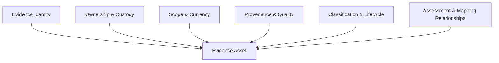
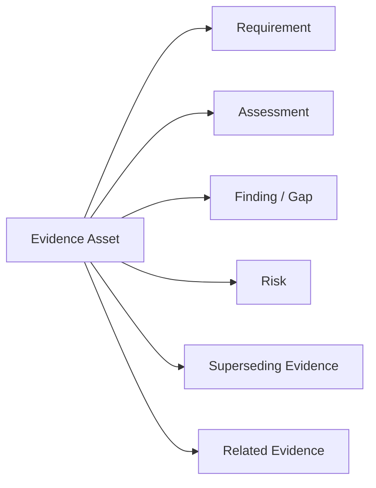

# Evidence Metadata Model

**Repository:** Evidence Convergence Framework (ECF)
**Folder:** `05_Evidence_Model`
**Artifact:** `Evidence-Metadata-Model.md`
**Organization:** NovaTide Logistics — Synthetic Reference Implementation
**Status:** Reference Implementation

---

## 1. Purpose

The Evidence Metadata Model defines the information NovaTide maintains about an **Evidence Asset** throughout its lifecycle.

Metadata enables NovaTide to determine:

* What the evidence is.
* Where it came from.
* Who owns and maintains it.
* What it covers.
* When it was collected and validated.
* Where it may be used.
* What limitations apply.
* Which requirements, assessments, findings, and risks are related to it.
* Whether it may be reused.

Metadata supports evidence traceability and reuse.

It does **not**, by itself, establish that evidence is sufficient, that a control is effective, or that a requirement has been satisfied.

---

## 2. Metadata Model

The ECF metadata model can be viewed as six logical dimensions:



These dimensions collectively provide the context required to govern an Evidence Asset.

---

## 3. Required Metadata

The following metadata should normally be maintained for every Evidence Asset.

| Field                     | Purpose                                                                                    |
| ------------------------- | ------------------------------------------------------------------------------------------ |
| **Evidence ID**           | Provides a unique identity for the asset.                                                  |
| **Evidence Title**        | Provides a human-readable identifier.                                                      |
| **Evidence Type**         | Identifies the form or nature of the evidence.                                             |
| **Description**           | Explains what the evidence contains or demonstrates.                                       |
| **Source**                | Identifies where the evidence originated.                                                  |
| **Evidence Owner**        | Identifies the accountable owner.                                                          |
| **Evidence Custodian**    | Identifies who maintains the asset and its metadata.                                       |
| **Vendor / Organization** | Identifies the relevant external vendor or internal entity.                                |
| **Scope**                 | Defines the environment, service, process, system, or population covered.                  |
| **Collection Date**       | Establishes when NovaTide obtained the evidence.                                           |
| **Evidence Period**       | Identifies the period represented by the evidence where applicable.                        |
| **Validation Date**       | Records when the evidence was last validated.                                              |
| **Provenance**            | Records the origin and acquisition context.                                                |
| **Confidentiality**       | Defines appropriate handling requirements.                                                 |
| **Version**               | Identifies the specific version of the asset.                                              |
| **Lifecycle Status**      | Indicates whether the evidence is active, under review, superseded, retained, or disposed. |
| **Validation Status**     | Records the outcome of evidence validation.                                                |
| **Limitations**           | Records material restrictions or uncertainties.                                            |

These fields establish the minimum context needed to identify, govern, and trace an evidence asset.

---

## 4. Recommended Metadata

The following fields strengthen evidence reuse, analysis, and lineage.

| Field                          | Purpose                                                                      |
| ------------------------------ | ---------------------------------------------------------------------------- |
| **Effective Date**             | Identifies when the evidence became applicable.                              |
| **Review / Expiration Date**   | Supports proactive currency management.                                      |
| **Evidence Category**          | Groups evidence using the ECF taxonomy.                                      |
| **Evidence Quality**           | Records the assessed quality of the evidence.                                |
| **Authenticity**               | Records whether authenticity has been established.                           |
| **Data Sensitivity**           | Provides additional information about sensitivity of the underlying content. |
| **Mapping Strength**           | Describes the strength of the evidence-to-requirement relationship.          |
| **Mapping Rationale**          | Explains why the evidence supports the mapped requirement.                   |
| **Applicable Framework**       | Identifies relevant framework contexts.                                      |
| **Related Requirement IDs**    | Links evidence to governance or evidence requirements.                       |
| **Related Assessment IDs**     | Identifies assessments using the evidence.                                   |
| **Related Finding IDs**        | Links evidence to relevant findings or gaps.                                 |
| **Related Risk IDs**           | Links evidence to associated risk records.                                   |
| **Supersedes / Superseded By** | Maintains version and lineage relationships.                                 |
| **Retention Requirement**      | Identifies applicable retention conditions.                                  |
| **Related Evidence**           | Links supporting, supplemental, or dependent evidence.                       |

Recommended metadata should be implemented where it provides meaningful operational value.

---

## 5. Context-Dependent Metadata

Some metadata is relevant only to particular evidence types or use cases.

Examples include:

| Field                  | Example Use                                               |
| ---------------------- | --------------------------------------------------------- |
| **System / Service**   | Technical or application evidence                         |
| **Model / AI System**  | AI model or AI system evidence                            |
| **Geographic Scope**   | Regulatory or data-processing assessments                 |
| **Data Category**      | Privacy and data governance evidence                      |
| **Subprocessor**       | Vendor and fourth-party assessments                       |
| **Assessment Method**  | Audit, interview, observation, testing, etc.              |
| **Assurance Provider** | Independent assurance reports                             |
| **Control Reference**  | Security or control assessments                           |
| **Exception Status**   | Evidence subject to an approved exception                 |
| **Collection Method**  | Portal, API, document submission, system extraction, etc. |

Context-dependent metadata should not be forced onto every Evidence Asset.

---

## 6. Evidence Identity

Every Evidence Asset should have a unique **Evidence ID**.

Example:

```text
EVID-0001
EVID-0002
EVID-0003
```

The ID should remain stable throughout the asset's lifecycle.

If the evidence changes materially and a new version becomes the authoritative asset, the relationship should be recorded rather than simply overwriting the original record.

Example:

```text
EVID-0012
    │
    └── Superseded by → EVID-0028
```

This preserves evidence lineage.

---

## 7. Scope Metadata

Scope is one of the most important metadata dimensions because evidence cannot be evaluated independently of what it covers.

Scope may include:

* Organization.
* Vendor.
* Product.
* AI service.
* Model.
* System.
* Business process.
* Geographic region.
* Data category.
* Assessment period.
* Subprocessor.

For example:

> **Vendor:** OrionRoute AI
> **Service:** Route Optimization Platform
> **Environment:** Production SaaS service
> **Geography:** North America
> **Data:** Operational shipment information

This provides considerably more assessment value than a generic description such as "vendor security documentation."

---

## 8. Currency Metadata

Currency metadata allows reviewers to determine whether evidence remains appropriate for its intended use.

Relevant fields include:

* Evidence Period.
* Effective Date.
* Collection Date.
* Validation Date.
* Review Date.
* Expiration Date.

Currency should be interpreted according to the evidence type and assessment context.

An expiration date should not be treated as the sole indicator of evidence validity.

Material changes may require reassessment even when the recorded expiration date has not been reached.

---

## 9. Provenance Metadata

Provenance should allow a reviewer to reconstruct where evidence came from and how it entered the evidence repository.

Where applicable, provenance should capture:

```text
Source
  ↓
Collection Method
  ↓
Collection Date
  ↓
Evidence Version
  ↓
Validation
  ↓
Repository / Custody
```

For externally supplied evidence, this may include:

* Vendor.
* Source document.
* Assurance provider.
* Submission channel.
* Collection date.

For system-generated evidence, it may include:

* Source system.
* Extraction method.
* Timestamp.
* Responsible system owner.

---

## 10. Quality and Validation Metadata

Evidence quality and validation status should be recorded separately.

### Validation Status

Examples:

* Not Validated
* Under Validation
* Validated
* Validated with Limitations
* Rejected

### Evidence Quality

A practical qualitative model may be:

| Rating        | Meaning                                                                       |
| ------------- | ----------------------------------------------------------------------------- |
| **High**      | Strong relevance, scope, provenance, currency, and assurance characteristics. |
| **Moderate**  | Generally useful but has limitations or requires supporting evidence.         |
| **Low**       | Limited usefulness for the intended assessment.                               |
| **Not Rated** | Quality has not yet been assessed.                                            |

Quality ratings should not replace the underlying validation rationale.

---

## 11. Mapping Metadata

Metadata should capture how an Evidence Asset relates to governance requirements.

At minimum:

* Requirement ID.
* Assessment ID.
* Applicable Framework.
* Mapping Strength.
* Mapping Rationale.

Example:

```text
Evidence ID: EVID-0012
Requirement ID: SEC-REQ-004
Assessment ID: TPRM-2026-017
Mapping Strength: Strong
Rationale: Evidence directly addresses security governance for the assessed service within the stated reporting scope.
```

A separate mapping record may be preferable in a mature implementation when one Evidence Asset has many relationships.

---

## 12. Relationship Metadata

Evidence should support traceability across the ECF operating model.

A simplified relationship structure is:



These relationships allow NovaTide to determine how evidence contributes to governance activity without embedding assessment conclusions directly into the evidence itself.

---

## 13. Metadata and Evidence Reuse

Metadata supports evidence reuse by providing the information needed for an applicability assessment.

Before reusing an Evidence Asset, reviewers should be able to determine:

1. What does it cover?
2. Who produced it?
3. When was it collected?
4. What period does it represent?
5. Has it been validated?
6. What assurance does it provide?
7. What limitations exist?
8. Which requirements has it previously supported?
9. Does its scope match the new assessment?
10. Does the new requirement require additional evidence?

Metadata therefore enables reuse decisions.

It does not automatically authorize reuse.

---

## 14. Metadata Quality Controls

The Evidence Custodian should periodically review metadata for:

* Missing required fields.
* Invalid status values.
* Missing owners.
* Unclear scope.
* Stale review dates.
* Broken requirement relationships.
* Missing lineage.
* Unsupported mappings.
* Inconsistent classifications.

Metadata quality should be treated as a component of evidence governance.

Poor metadata can make otherwise useful evidence difficult to find, evaluate, or safely reuse.

---

## 15. Minimum vs. Mature Implementation

### Minimum Viable Implementation

NovaTide's initial implementation should prioritize:

* Evidence ID.
* Title.
* Type.
* Source.
* Owner.
* Custodian.
* Scope.
* Collection date.
* Evidence period.
* Validation status.
* Provenance.
* Lifecycle status.
* Limitations.
* Requirement / assessment relationships.

### Mature Implementation

A mature ECF implementation may additionally support:

* Automated metadata population.
* GRC integration.
* Evidence lineage visualization.
* Automated expiration monitoring.
* Relationship management.
* Evidence quality analytics.
* Automated classification.
* Change detection.
* Machine-assisted reuse recommendations.

Automation should assist metadata management without treating metadata as proof of evidence sufficiency.

---

## 16. NovaTide Example

The following synthetic record illustrates how metadata can describe an Evidence Asset.

| Field              | Example                                               |
| ------------------ | ----------------------------------------------------- |
| Evidence ID        | `EVID-0012`                                           |
| Title              | OrionRoute AI — Independent Security Assurance Report |
| Category           | Assurance / Independent Validation                    |
| Type               | Independent Assurance Report                          |
| Source             | OrionRoute AI                                         |
| Vendor             | OrionRoute AI                                         |
| Service            | Route Optimization Platform                           |
| Owner              | NovaTide TPRM                                         |
| Custodian          | NovaTide GRC Operations                               |
| Scope              | Production service supporting NovaTide                |
| Evidence Period    | 2026 reporting period                                 |
| Collection Date    | 2026-08-15                                            |
| Validation Date    | 2026-08-18                                            |
| Provenance         | Vendor-provided independent assurance report          |
| Validation Status  | Validated with Limitations                            |
| Evidence Quality   | High                                                  |
| Confidentiality    | Confidential                                          |
| Lifecycle Status   | Active                                                |
| Mapping Strength   | Strong for defined security requirements              |
| Limitations        | Does not address AI governance-specific requirements  |
| Related Assessment | `TPRM-2026-017`                                       |

This is a **synthetic example** and does not represent a real vendor or real assurance report.

---

## 17. ECF Integration

The metadata model supports the Evidence Architecture by providing the information needed to identify, govern, validate, map, and trace Evidence Assets.

```text
Governance Requirement
        ↓
Evidence Requirement
        ↓
Evidence Asset
        │
        └── Metadata
             ├── Identity
             ├── Ownership
             ├── Scope
             ├── Provenance
             ├── Currency
             ├── Quality
             ├── Classification
             ├── Lifecycle
             └── Relationships
        ↓
Evidence Validation
        ↓
Evidence Mapping
        ↓
Assessment Interpretation
        ↓
Finding / Gap
        ↓
Risk
        ↓
Decision
```

The metadata model therefore acts as the information layer around the Evidence Asset.

---

## 18. Summary

The ECF Evidence Metadata Model provides the minimum information required to govern evidence as an enterprise asset.

The model emphasizes:

* Unique identity.
* Ownership and custody.
* Scope.
* Currency.
* Provenance.
* Validation.
* Quality.
* Classification.
* Mapping.
* Relationships.
* Limitations.
* Lifecycle and lineage.

The central principle is:

> **Metadata provides the context necessary to evaluate and govern evidence; metadata itself does not prove evidence sufficiency.**

