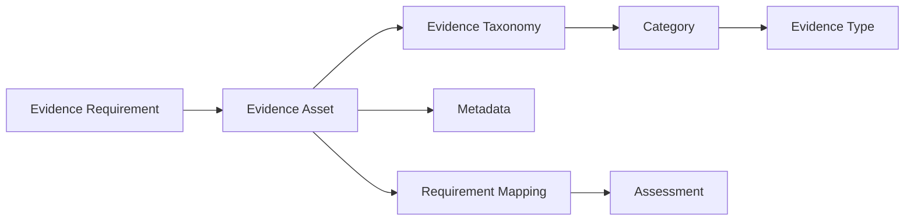

# Evidence Taxonomy

**Repository:** Evidence Convergence Framework (ECF)
**Folder:** `05_Evidence_Model`
**Artifact:** `Evidence-Taxonomy.md`
**Organization:** NovaTide Logistics — Synthetic Reference Implementation
**Status:** Reference Implementation

---

## 1. Purpose

The ECF Evidence Taxonomy provides a consistent method for classifying Evidence Assets.

A taxonomy helps NovaTide:

* Organize evidence consistently.
* Improve evidence discovery and retrieval.
* Identify evidence coverage and gaps.
* Support evidence reuse.
* Enable cross-assessment analysis.
* Support reporting and metrics.
* Distinguish evidence domains without treating them as equivalent requirements.

The taxonomy is a classification model. It does not determine whether evidence satisfies a requirement.

---

## 2. Taxonomy Structure

ECF uses three related concepts:

```text
Evidence Category
      ↓
Evidence Type
      ↓
Evidence Asset
```

### Evidence Category

A broad domain describing the subject matter of evidence.

Example:

> Security

### Evidence Type

A more specific class of evidence within the category.

Example:

> Vulnerability Assessment Report

### Evidence Asset

The actual controlled evidence object.

Example:

> `EVID-0024 — OrionRoute AI 2026 Vulnerability Assessment Report`

This distinction prevents the taxonomy from becoming confused with the Evidence Register.

---

## 3. Core Evidence Categories

The following categories provide the baseline taxonomy for NovaTide's AI vendor governance and broader GRC activities.

| Category                               | Purpose                                                                                              |
| -------------------------------------- | ---------------------------------------------------------------------------------------------------- |
| **Governance & Policy**                | Evidence of governance structures, policies, standards, and formal direction.                        |
| **Organizational**                     | Evidence concerning roles, responsibilities, accountability, and organizational structures.          |
| **Risk Management**                    | Evidence supporting risk identification, analysis, treatment, and monitoring.                        |
| **Security**                           | Evidence addressing information and cybersecurity controls and practices.                            |
| **Privacy**                            | Evidence concerning personal data protection, privacy controls, and processing practices.            |
| **AI Governance**                      | Evidence addressing AI-specific governance, oversight, accountability, and risk management.          |
| **Model / AI System**                  | Evidence concerning AI models, system characteristics, development, testing, and operation.          |
| **Data Governance**                    | Evidence concerning data sources, quality, classification, lineage, retention, and use.              |
| **Technical Architecture**             | Evidence describing system architecture, integrations, infrastructure, and technical boundaries.     |
| **Operational**                        | Evidence demonstrating operational processes and control execution.                                  |
| **Resilience & Continuity**            | Evidence concerning availability, continuity, disaster recovery, and resilience.                     |
| **Third-Party / Vendor**               | Evidence concerning vendor governance, dependencies, subprocessors, and supplier management.         |
| **Legal & Contractual**                | Evidence concerning contracts, legal obligations, rights, restrictions, and contractual commitments. |
| **Assurance / Independent Validation** | Evidence produced through audits, assessments, certifications, or independent validation.            |
| **Monitoring / Performance**           | Evidence demonstrating ongoing monitoring, service performance, or control performance.              |
| **Incident / Issue**                   | Evidence relating to incidents, deficiencies, corrective actions, or identified issues.              |
| **Training & Awareness**               | Evidence demonstrating relevant training, competency, and awareness activities.                      |

The categories are intended to be reusable across multiple governance functions.

---

## 4. Evidence Type Examples

Each category may contain multiple Evidence Types.

| Category                           | Example Evidence Types                                                        |
| ---------------------------------- | ----------------------------------------------------------------------------- |
| Governance & Policy                | Policy, Standard, Procedure, Governance Charter                               |
| Organizational                     | Organization Chart, RACI, Role Description, Committee Record                  |
| Risk Management                    | Risk Assessment, Risk Register, Risk Treatment Record                         |
| Security                           | Security Policy, Penetration Test, Vulnerability Report, Access Review        |
| Privacy                            | Privacy Assessment, Data Processing Record, Privacy Impact Assessment         |
| AI Governance                      | AI Policy, AI Risk Assessment, AI Inventory Record, Human Oversight Procedure |
| Model / AI System                  | Model Card, System Documentation, Model Validation Report, Test Results       |
| Data Governance                    | Data Inventory, Data Flow, Data Quality Report, Retention Record              |
| Technical Architecture             | Architecture Diagram, Network Diagram, Integration Specification              |
| Operational                        | Operating Procedure, Control Record, Operational Log                          |
| Resilience & Continuity            | BCP, DR Plan, Recovery Test, Resilience Assessment                            |
| Third-Party / Vendor               | Vendor Questionnaire, Subprocessor List, TPRM Assessment                      |
| Legal & Contractual                | Contract, DPA, SLA, Security Addendum                                         |
| Assurance / Independent Validation | SOC Report, ISO Certificate, Independent Assessment, Audit Report             |
| Monitoring / Performance           | KPI Report, Control Monitoring Record, Service Review                         |
| Incident / Issue                   | Incident Report, Corrective Action Plan, Issue Record                         |
| Training & Awareness               | Training Record, Completion Report, Awareness Material                        |

These are examples rather than mandatory evidence requests.

---

## 5. Classification Rules

NovaTide should apply the following rules when classifying evidence.

### Rule 1 — Classify the Evidence Asset, Not the Requirement

Classification should describe **what the evidence is**.

For example:

> A SOC 2 report is classified as **Assurance / Independent Validation → SOC Report**.

It should not be classified as "NIST evidence" simply because a particular assessment uses it.

---

### Rule 2 — Use the Primary Category

Each Evidence Asset should normally have one primary category.

Secondary classifications may be used when an asset genuinely spans multiple domains.

Example:

> An AI privacy impact assessment may be classified primarily as **Privacy**, with **AI Governance** as a secondary classification.

---

### Rule 3 — Do Not Create Categories for Individual Frameworks

Frameworks and regulations should generally be represented through **mapping metadata**, not through evidence categories.

For example:

```text
Evidence Category:
Security

Evidence Type:
Independent Security Assessment

Applicable Framework:
NIST AI RMF

Related Requirement:
SEC-REQ-014
```

This allows the same Evidence Asset to be considered in different assessment contexts without creating duplicate taxonomy structures.

---

### Rule 4 — Separate Evidence Type from Evidence Status

Terms such as:

* Validated
* Rejected
* Superseded
* Expired
* Under Review

describe evidence **status**, not evidence type.

A "superseded SOC report" remains an **Assurance / Independent Validation → SOC Report**.

---

### Rule 5 — Avoid Excessive Granularity

The taxonomy should be sufficiently detailed to support retrieval and analysis but not so detailed that every evidence document becomes its own category.

If a classification does not materially improve:

* Retrieval,
* Mapping,
* Reuse,
* Reporting, or
* Governance,

it probably does not need to become a new Evidence Type.

---

## 6. Multi-Domain Evidence

Some Evidence Assets legitimately span multiple governance domains.

For example, an AI vendor's model governance assessment may address:

* AI governance.
* Security.
* Privacy.
* Data governance.
* Model risk.

The taxonomy should preserve the primary identity of the asset while allowing secondary classifications.

```text
Primary Category
    ↓
AI Governance
    │
    ├── Secondary: Security
    ├── Secondary: Privacy
    └── Secondary: Data Governance
```

Multiple classifications do **not** mean that every requirement in those domains is satisfied.

The assessment must still evaluate the asset against each applicable requirement.

---

## 7. Taxonomy and Evidence Convergence

Taxonomy supports **Evidence Convergence** by making similar evidence easier to identify across assessments.

For example, NovaTide may use:

> OrionRoute AI Independent Security Assessment

in:

* TPRM assessment.
* Security assessment.
* AI vendor assessment.
* Internal audit activity.

The taxonomy helps identify the evidence as an assurance/security asset.

The assessment-specific mapping determines whether and how it can be reused.

Therefore:

```text
Same Evidence Asset
        ↓
Different Requirements
        ↓
Different Mapping
        ↓
Different Assessment Interpretation
```

Taxonomy enables discovery; it does not establish equivalence.

---

## 8. NovaTide Example

The following synthetic Evidence Assets demonstrate the taxonomy.

| Evidence ID | Evidence Asset                         | Primary Category                   | Evidence Type           |
| ----------- | -------------------------------------- | ---------------------------------- | ----------------------- |
| `EVID-0001` | OrionRoute AI Security Policy          | Security                           | Security Policy         |
| `EVID-0002` | OrionRoute AI SOC 2 Report             | Assurance / Independent Validation | SOC Report              |
| `EVID-0003` | OrionRoute AI Data Processing Addendum | Legal & Contractual                | DPA                     |
| `EVID-0004` | OrionRoute AI AI Risk Assessment       | AI Governance                      | AI Risk Assessment      |
| `EVID-0005` | OrionRoute AI Architecture Diagram     | Technical Architecture             | Architecture Diagram    |
| `EVID-0006` | OrionRoute AI Subprocessor Register    | Third-Party / Vendor               | Subprocessor List       |
| `EVID-0007` | OrionRoute AI Model Validation Report  | Model / AI System                  | Model Validation Report |
| `EVID-0008` | OrionRoute AI Business Continuity Test | Resilience & Continuity            | Recovery Test           |

These records are illustrative synthetic examples for the NovaTide reference implementation.

---

## 9. Taxonomy Governance

The taxonomy itself should be governed as a controlled reference model.

Changes should consider:

* New governance domains.
* New evidence types.
* Emerging AI use cases.
* Regulatory requirements.
* Operational experience.
* Duplicate or overlapping classifications.
* Reporting and retrieval requirements.

A new category or evidence type should have a defined purpose before being added.

### Suggested Governance Roles

| Role                           | Responsibility                                                |
| ------------------------------ | ------------------------------------------------------------- |
| **ECF / GRC Owner**            | Owns the taxonomy structure.                                  |
| **Evidence Custodian**         | Applies classifications during evidence registration.         |
| **Assessment Owner**           | Identifies whether classification supports assessment needs.  |
| **Domain Owner**               | Advises on specialized evidence types.                        |
| **Internal Audit / Assurance** | Provides feedback on traceability and classification quality. |

---

## 10. Taxonomy Quality Controls

NovaTide should periodically review the taxonomy for:

* Duplicate evidence types.
* Ambiguous classifications.
* Excessive granularity.
* Inconsistent naming.
* Unused categories.
* Evidence assets with missing classifications.
* Evidence assets classified only by assessment or framework.
* Incorrect use of lifecycle status as evidence type.

A controlled taxonomy should evolve based on operational use rather than theoretical completeness.

---

## 11. Minimum Viable Taxonomy

A practical initial implementation can use:

```text
Category
Evidence Type
Evidence ID
Evidence Title
Primary / Secondary Classification
```

This is sufficient to support basic evidence discovery and registration.

A mature implementation may additionally support:

* Controlled taxonomy identifiers.
* Hierarchical classification.
* Multiple secondary categories.
* Automated classification suggestions.
* GRC integration.
* Evidence search and filtering.
* Taxonomy versioning.
* Classification analytics.

---

## 12. ECF Integration

The Evidence Taxonomy connects the Evidence Model to the broader ECF operating model.



The taxonomy provides the **classification layer**.

Metadata provides the **context and governance layer**.

Mapping provides the **relationship to requirements**.

Assessment interpretation provides the **assessment conclusion**.

Keeping these layers separate is necessary for reliable evidence reuse and traceability.

---

## 13. Summary

The ECF Evidence Taxonomy provides a controlled classification model for Evidence Assets.

Its primary objectives are to:

1. Make evidence easier to identify and retrieve.
2. Establish consistent evidence classification.
3. Support evidence reuse across assessments.
4. Improve evidence coverage analysis.
5. Support reporting and governance analytics.
6. Enable evidence convergence without implying requirement convergence.

The taxonomy should remain **stable enough to support consistency and flexible enough to reflect operational reality**.

> **Classify the evidence by what it is; determine its applicability through metadata, mapping, and assessment interpretation.**

